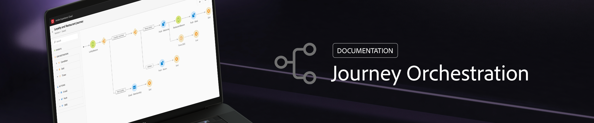

# Centro risorse {#journeys-documentation}

## Introduzione

* **[Cos’è Journey Orchestration?](using/about/about-journey-orchestration.md)** Ulteriori informazioni su Journey Orchestration.

* **[Crea il tuo primo viaggio](using/about/get-started.md)** 
Scopri i passaggi principali per configurare Journey Orchestration e creare il tuo primo percorso.

* **[Configurare un evento](using/event/about-events.md#section_tbk_5qt_pgb)** 
Scopri come configurare gli eventi a cui i tuoi percorsi faranno da listener.

* **[Scopri le novità](using/release-notes/release-notes.md)** 
Approfondisci i dettagli sulle ultime versioni.

## Pagine principali

<table style="table-layout:fixed">
<tr>
    <td valign="top">
        
    

    <a href="using/about/troubleshooting.md"><strong>Risoluzione dei problemi</strong></a>
    

    <em>Scopri tutti gli strumenti che puoi usare per risolvere gli errori nei tuoi percorsi.</em>
     
  </td>
  <td valign="top">
    
    

    <a href="using/usecase/building-the-journey.md"><strong>Caso d’uso</strong></a>
    

    <em>Scopri come creare un percorso avanzato passo dopo passo.</em>
     
  </td>
  <td valign="top">
    
    

    <a href="using/expression/expressionadvanced.md"><strong>Creazione di espressioni avanzate</strong></a>
    

    <em>Scopri come generare espressioni complesse utilizzando i dati provenienti da eventi e origini dati. </em>
     
  </td>
</tr>
</table>

## Risorse aggiuntive

* [Pagina prodotto di Journey Orchestration](https://www.adobe.com/it/experience-platform/journey-orchestration.html)
* [Documentazione di Experience Platform](https://www.adobe.com/it/experience-platform/documentation-and-developer-resources.html)
* [Documentazione del Profilo cliente in tempo reale](https://docs.adobe.com/content/help/it-IT/experience-platform/profile/home.html)
* [Definizione del campo XDM di Experience Cloud](https://docs.adobe.com/content/help/it-IT/experience-platform/xdm/home.html)
* [Documentazione spazio dei nomi di identità](https://docs.adobe.com/content/help/it-IT/experience-platform/identity/home.html)
* [API Streaming Ingestion](https://docs.adobe.com/content/help/it-IT/experience-platform/ingestion/streaming/overview.html)
* [Documentazione sulla messaggistica transazionale di Campaign Standard](https://docs.adobe.com/content/help/it-IT/campaign-standard/using/communication-channels/transactional-messaging/about-transactional-messaging.translate.html)

## Tutorial tecnici

* [Configurazione di Journey Orchestration](https://experienceleague.adobe.com/docs/platform-learn/comprehensive-technical-tutorial/module6/journey-orchestration-create-account.html?mt=false&amp;lang=it#6.-journey-orchestration)
* [API meteo esterna, SMS e altro](https://experienceleague.adobe.com/docs/platform-learn/comprehensive-technical-tutorial/module12/journey-orchestration-external-weather-api-sms.html?lang=it#module12)
* [Creare un contatto in Dynamics 365 tramite Journey Orchestration](https://experienceleague.adobe.com/docs/platform-learn/comprehensive-technical-tutorial/module17/ex3.html?lang=it#module17)
* [Utilizzare Journey Orchestration per inviare una mail di follow-up](https://experienceleague.adobe.com/docs/platform-learn/comprehensive-technical-tutorial/module20/ex4.html?lang=it#module20)
