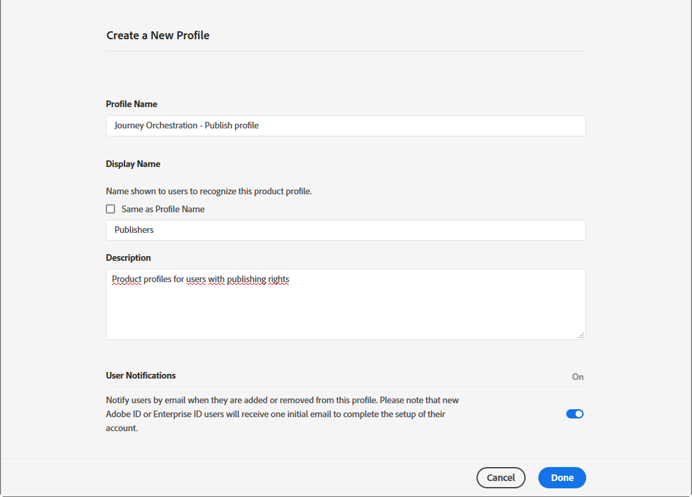
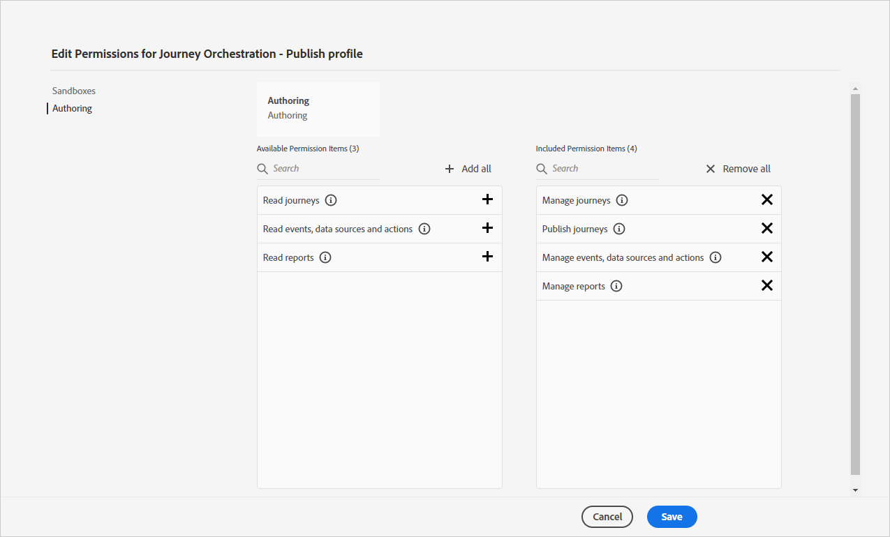

# Gestione degli accessi{#concept_rfj_wpt_52b}

## Informazioni sulla gestione degli accessi {#about-access-management}

[!DNL Journey Orchestration] ti consente di assegnare agli utenti un set di autorizzazioni per definire a quale parte dell’interfaccia possono accedere.

Possono essere gestiti dagli amministratori che hanno accesso all’Admin Console. Per ulteriori informazioni su Admin Console, consulta questa [documentazione](https://helpx.adobe.com/it/enterprise/managing/user-guide.html).

Per poter accedere a [!DNL Journey Orchestration], un utente deve essere:

* parte di un **[!UICONTROL product profile]** di [!DNL Journey Orchestration] associato alle autorizzazioni di [!DNL Journey Orchestration].
* parte di un **[!UICONTROL product profile]** di [!DNL Adobe Experience Platform]. Non c’è alcuna autorizzazione obbligatoria da possedere. L’utente deve disporre dell’autorizzazione **[!UICONTROL profile management]** per creare e modificare i segmenti di Platform dall’interfaccia di [!DNL Journey Orchestration]. Per ulteriori informazioni, consulta questa [pagina](https://docs.adobe.com/content/help/it-IT/experience-platform/access-control/home.html#adobe-admin-console).

All’interno di Admin Console, puoi assegnare agli utenti uno dei seguenti profili di prodotto pronti all’uso:

* **[!UICONTROL Limited Access User]**: utente con accesso in sola lettura ai percorsi e ai rapporti. Questo profilo di prodotto include le seguenti autorizzazioni:
   * Lettura dei percorsi
   * Lettura dei rapporti

* **[!UICONTROL Administrators]**: utente con accesso ai menu di amministrazione con la possibilità di gestire percorsi, eventi e rapporti. Questo profilo di prodotto include le seguenti autorizzazioni:
   * Gestione dei percorsi
   * Pubblicazione dei percorsi
   * Gestione di eventi, origini dati e azioni
   * Gestione dei rapporti

   >[!NOTE]
   >
   >**[!UICONTROL Administrators]** è l’unico profilo di prodotto che consente la creazione, la modifica e la pubblicazione di messaggi transazionali (o modelli di messaggistica) all’interno di Adobe Campaign Standard. Questo profilo di prodotto è necessario se utilizzi Adobe Campaign Standard per l’invio di messaggi durante i tuoi percorsi.

* **[!UICONTROL Standard User]**: utente con accesso di base, ad esempio gestione del percorso. Questo profilo di prodotto include le seguenti autorizzazioni:
   * Gestione dei percorsi
   * Pubblicazione dei percorsi
   * Gestione dei rapporti

Puoi anche creare profili di prodotto personalizzati, se i profili forniti non sono sufficienti per la gestione dei tuoi utenti.
Gli utenti devono essere sempre collegati a un profilo di prodotto che consenta loro di assegnare autorizzazioni incorporate specifiche, ad esempio:

* **[!UICONTROL Read journeys]**
* **[!UICONTROL Read reports]**
* **[!UICONTROL Manage events, data sources and actions]**
* **[!UICONTROL Read events, data sources and actions]**
* **[!UICONTROL Manage journeys]**
* **[!UICONTROL Publish journeys]**
* **[!UICONTROL Manage reports]**

Di seguito è riportata la compatibilità tra le autorizzazioni e le diverse funzionalità di [!DNL Journey Orchestration].

## Creazione di un profilo di prodotto {#create-product-profile}

[!DNL Journey Orchestration] consente di creare profili di prodotto personalizzati e di assegnare agli utenti un set di autorizzazioni e sandbox. Con i profili di prodotto, puoi autorizzare o negare l’accesso a determinate funzionalità o oggetti all’interno dell’interfaccia.

Per ulteriori informazioni sulla modalità di creazione e di gestione delle sandbox, consulta la [documentazione di Adobe Experience Platform](https://docs.adobe.com/content/help/it-IT/experience-platform/sandbox/ui/user-guide.html).

Per creare un profilo di prodotto e assegnare un set di autorizzazioni e sandbox:

1. All’interno di Admin Console, seleziona **[!UICONTROL Journey Orchestration]**. Dalla scheda **[!UICONTROL Product profile]**, fai clic su **[!UICONTROL New Profile]**.

   

1. Aggiungi **[!UICONTROL Profile Name]** e **[!UICONTROL Description]** per il tuo nuovo profilo di prodotto. Se desideri che il tuo profilo sia **[!UICONTROL Display name]** diverso, deseleziona **[!UICONTROL Same as Profile Name]** e digita il tuo **[!UICONTROL Display name]**.

1. Nella categoria **[!UICONTROL User Notifications]**, scegli di informare gli utenti via e-mail, quando verranno aggiunti o rimossi da questo profilo di prodotto.

1. Al termine, fai clic su **[!UICONTROL Done]**. È stato creato il tuo nuovo profilo di prodotto.

   

1. Seleziona il nuovo profilo di prodotto per iniziare a gestire le autorizzazioni. Nella scheda **[!UICONTROL Users]**, aggiungi gli utenti al tuo profilo di prodotto. Per ulteriori informazioni, consulta questa [pagina](../about/access-management.md#assigning-product-profile).

1. Effettua gli stessi passaggi descritti in precedenza per aggiungere **[!UICONTROL Admin]** al tuo profilo di prodotto.

1. Dalla scheda **[!UICONTROL Permissions]**, seleziona una delle due categorie **[!UICONTROL Sandbox]** o **[!UICONTROL Authoring]** per aprire la pagina **[!UICONTROL Edit Permissions]** e aggiungere o rimuovere le autorizzazioni per il profilo di prodotto.

   

1. Nella categoria di autorizzazioni **[!UICONTROL Sandboxes]**, seleziona le sandbox da assegnare al tuo profilo di prodotto. Nella sezione **[!UICONTROL Available Permissions Items]**, fai clic sull’icona più (+) per assegnare le sandbox al profilo. Per ulteriori informazioni sulle sandbox, consulta questa [sezione](../about/access-management.md#sandboxes).

   

1. Se necessario, in **[!UICONTROL Included Permission Items]**, fai clic sull’icona X adiacente alla rimozione delle autorizzazioni dal tuo profilo di prodotto.

   

1. Dalla categoria di autorizzazioni **[!UICONTROL Authoring]**, esegui gli stessi passaggi indicati sopra per aggiungere le autorizzazioni al tuo profilo di prodotto.
    Per ulteriori informazioni sulle autorizzazioni e sulla compatibilità tra le autorizzazioni e le diverse funzionalità di [!DNL Journey Orchestration], consulta questa [sezione](../about/access-management.md#about-access-management).

   

1. Al termine, fai clic su **[!UICONTROL Save]**.

Adesso il tuo profilo di prodotto è stato creato e configurato. Gli utenti collegati a questo profilo ora possono connettersi a [!DNL Journey Orchestration].

## Assegnazione di un profilo di prodotto {#assigning-product-profile}

I profili di prodotto sono assegnati a un set di utenti che condividono le medesime autorizzazioni all’interno dell’organizzazione.
L’elenco di tutti i profili di prodotto forniti con autorizzazioni assegnate è disponibile all’interno di questa sezione.

Per assegnare un profilo di prodotto a un utente perché possa accedere a [!DNL Journey Orchestration]:

1. All’interno di Admin Console, seleziona **[!UICONTROL Journey Orchestration]**.

   

1. Scegli il profilo di prodotto a cui verrà collegato il nuovo utente.

   

1. Clic **[!UICONTROL Add user]**.

   Puoi anche aggiungere il nuovo utente a un gruppo di utenti per ottimizzare il set di autorizzazioni condiviso. Per ulteriori informazioni, consulta questa [pagina](https://helpx.adobe.com/it/enterprise/using/user-groups.html).

   

1. Digita l’indirizzo e-mail del nuovo utente e fai clic su **[!UICONTROL Save]**.

   

L’utente dovrebbe quindi ricevere un messaggio e-mail di reindirizzamento all’istanza [!DNL Journey Orchestration].

## Utilizzo delle sandbox {#sandboxes}

[!DNL Journey Orchestration] consente di suddividere l’istanza in ambienti virtuali separati, denominati sandbox.
Le sandbox vengono assegnate tramite i profili di prodotto nella Admin Console. Per ulteriori informazioni su come assegnare le sandbox, consulta questa [sezione](../about/access-management.md#create-product-profile).

[!DNL Journey Orchestration] riflette le sandbox di Adobe Experience Platform che sono state create per una determinata organizzazione.
Le sandbox di Adobe Experience Platform possono essere create o reimpostate dall’istanza Adobe Experience Platform. Per conoscere i passaggi dettagliati, fai riferimento alla [guida utente sulle sandbox](https://docs.adobe.com/content/help/it-IT/experience-platform/sandbox/ui/user-guide.html).

Il controllo del commutatore sandbox è disponibile in alto a sinistra sullo schermo. Per passare da una sandbox all’altra, fai clic sulla sandbox attualmente attiva nel commutatore e selezionane un’altra dall’elenco a discesa.
