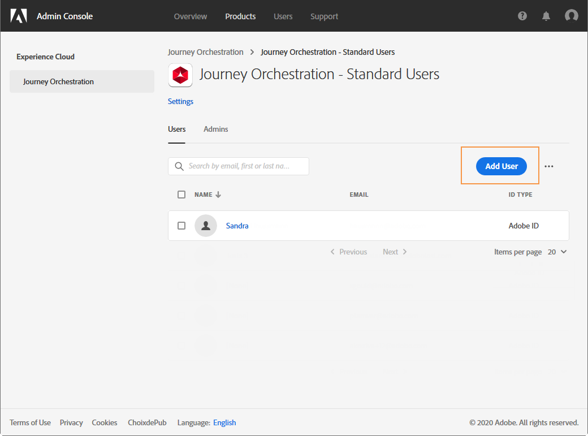

# Gestione degli accessi{#concept_rfj_wpt_52b}

## Informazioni sulla gestione degli accessi {#about-access-management}

[!DNL Journey Orchestration] consente di assegnare agli utenti un set di autorizzazioni per definire a quale parte dell’interfaccia possono accedere.

Possono essere gestiti dagli amministratori che hanno accesso alla console di amministrazione. Per ulteriori informazioni su Admin Console, consulta questa [documentazione](https://helpx.adobe.com/enterprise/managing/user-guide.html).

Per poter accedere a [!DNL Journey Orchestration]un utente deve essere:

* parte di una [!DNL Journey Orchestration]**[!UICONTROL product profile]** associata alle [!DNL Journey Orchestration] autorizzazioni.
* parte di un [!DNL Adobe Experience Platform]**[!UICONTROL product profile]**. Non c&#39;è alcun permesso obbligatorio da avere. L&#39;utente deve disporre dell&#39; **[!UICONTROL profile management]** autorizzazione necessaria per creare e modificare segmenti di piattaforma dall&#39; [!DNL Journey Orchestration] interfaccia. For more on this, refer to this [page](https://docs.adobe.com/content/help/en/experience-platform/access-control/home.html#adobe-admin-console).

In Admin Console, puoi assegnare agli utenti uno dei seguenti profili di prodotto out-of-the-box:

* **[!UICONTROL Limited Access User]**: utente con accesso in sola lettura ai viaggi e ai rapporti. Questo profilo di prodotto include le seguenti autorizzazioni:
   * Lettura dei viaggi
   * Lettura dei rapporti

* **[!UICONTROL Administrators]**: utente con accesso ai menu di amministrazione con la possibilità di gestire viaggi, eventi e rapporti. Questo profilo di prodotto include le seguenti autorizzazioni:
   * Gestione dei viaggi
   * Pubblicare i viaggi
   * Gestione di eventi, origini dati e azioni
   * Gestire i rapporti

   >[!NOTE]
   >
   >**[!UICONTROL Administrators]** è l&#39;unico profilo di prodotto che consente la creazione, l&#39;edizione e la pubblicazione di messaggi transazionali (o modelli di messaggistica) in  Adobe Campaign Standard. Questo profilo di prodotto è necessario se utilizzi  Adobe Campaign Standard per inviare messaggi durante i tuoi viaggi.

* **[!UICONTROL Standard User]**: utente con accesso di base, ad esempio gestione del percorso. Questo profilo di prodotto include le seguenti autorizzazioni:
   * Gestione dei viaggi
   * Pubblicare i viaggi
   * Gestire i rapporti

Potete anche creare profili di prodotto personalizzati se i profili forniti non sono sufficienti per gestire i vostri utenti.
Gli utenti devono sempre essere collegati a un profilo di prodotto che consenta loro di assegnare autorizzazioni di compilazione specifiche, ad esempio:

* **[!UICONTROL Read journeys]**
* **[!UICONTROL Read reports]**
* **[!UICONTROL Manage events, data sources and actions]**
* **[!UICONTROL Read events, data sources and actions]**
* **[!UICONTROL Manage journeys]**
* **[!UICONTROL Publish journeys]**
* **[!UICONTROL Manage reports]**

Di seguito è riportata la compatibilità tra le autorizzazioni e le [!DNL Journey Orchestration]diverse funzionalità.

## Creazione di un profilo di prodotto {#create-product-profile}

[!DNL Journey Orchestration] consente di creare profili di prodotto personalizzati e di assegnare agli utenti un set di autorizzazioni e sandbox. Con i profili di prodotto, puoi autorizzare o negare l&#39;accesso a determinate funzionalità o oggetti nell&#39;interfaccia.

Per ulteriori informazioni su come creare e gestire le sandbox, consultate [documentazione](https://docs.adobe.com/content/help/en/experience-platform/sandbox/ui/user-guide.html)di Adobe Experience Platform.

Per creare un profilo di prodotto e assegnare un set di autorizzazioni e sandbox:

1. Nell&#39;Admin Console , selezionare **[!UICONTROL Journey Orchestration]**. Dalla **[!UICONTROL Product profile]** scheda, fare clic su **[!UICONTROL New Profile]**.

   

1. Aggiungi un **[!UICONTROL Profile Name]** e **[!UICONTROL Description]** per il nuovo profilo di prodotto. Se desiderate che il vostro profilo sia **[!UICONTROL Display name]** diverso, deselezionate **[!UICONTROL Same as Profile Name]** e digitate **[!UICONTROL Display name]**.

1. Nella **[!UICONTROL User Notifications]** categoria, scegliete se gli utenti verranno informati via e-mail quando verranno aggiunti o rimossi da questo profilo di prodotto.

1. Al termine, fate clic **[!UICONTROL Done]**. È stato creato il nuovo profilo di prodotto.

   

1. Seleziona il nuovo profilo di prodotto per iniziare a gestire le autorizzazioni. Nella **[!UICONTROL Users]** scheda, aggiungi gli utenti al tuo profilo di prodotto. For more on this, refer to this [page](../about/access-management.md#assigning-product-profile).

1. Effettua gli stessi passaggi descritti in precedenza per aggiungere **[!UICONTROL Admin]** il tuo profilo di prodotto.

1. Dalla **[!UICONTROL Permissions]** scheda, seleziona una delle due categorie **[!UICONTROL Sandbox]** o **[!UICONTROL Authoring]** per aprire la **[!UICONTROL Edit Permissions]** pagina e aggiungere o rimuovere le autorizzazioni per il profilo di prodotto.

   

1. Nella categoria di **[!UICONTROL Sandboxes]** autorizzazioni, scegliete le sandbox da assegnare al profilo di prodotto. In **[!UICONTROL Available Permissions Items]** questa sezione, fate clic sull&#39;icona più (+) per assegnare le sandbox al profilo. Per ulteriori informazioni sulle sandbox, consultate questa [sezione](../about/access-management.md#sandboxes).

   

1. Se necessario, in **[!UICONTROL Included Permission Items]**, fai clic sull&#39;icona X accanto per rimuovere le autorizzazioni dal profilo di prodotto.

   

1. Dalla categoria di **[!UICONTROL Authoring]** autorizzazioni, eseguite gli stessi passaggi indicati sopra per aggiungere le autorizzazioni al profilo di prodotto.
    Per ulteriori informazioni sulle autorizzazioni e sulla compatibilità tra le autorizzazioni e le diverse funzionalità [!DNL Journey Orchestration]di, consulta questa [sezione](../about/access-management.md#about-access-management).

   

1. Al termine, fate clic **[!UICONTROL Save]**.

Il tuo profilo di prodotto ora è stato creato e configurato. Gli utenti collegati a questo profilo ora possono connettersi a [!DNL Journey Orchestration].

## Assegnazione di un profilo di prodotto {#assigning-product-profile}

I profili di prodotto sono assegnati a un set di utenti che condividono le stesse autorizzazioni all&#39;interno dell&#39;organizzazione.
L&#39;elenco di tutti i profili di prodotto forniti con autorizzazioni assegnate è disponibile in questa sezione.

Per assegnare un profilo di prodotto a cui un utente può accedere [!DNL Journey Orchestration]:

1. Nell&#39;Admin Console , selezionare **[!UICONTROL Journey Orchestration]**.

   

1. Selezionate il profilo di prodotto a cui verrà collegato il nuovo utente.

   

1. Clic **[!UICONTROL Add user]**.

   Potete anche aggiungere il nuovo utente a un gruppo di utenti per ottimizzare il set di autorizzazioni condiviso. For more on this, refer to this [page](https://helpx.adobe.com/enterprise/using/user-groups.html).

   

1. Digitate l&#39;indirizzo e-mail del nuovo utente e fate clic su **[!UICONTROL Save]**.

   

L’utente deve quindi ricevere un messaggio e-mail di reindirizzamento all’ [!DNL Journey Orchestration] istanza.

## Utilizzo delle sandbox {#sandboxes}

[!DNL Journey Orchestration] consente di suddividere l&#39;istanza in ambienti virtuali separati, denominati sandbox.
Le sandbox vengono assegnate tramite i profili di prodotto nella console di amministrazione. Per ulteriori informazioni su come assegnare le sandbox, consultate questa [sezione](../about/access-management.md#create-product-profile).

[!DNL Journey Orchestration] riflette le sandbox  Adobe Experience Platform create per una determinata organizzazione.
 sandbox di Adobe Experience Platform possono essere create o reimpostate dall’istanza del Adobe Experience Platform . Fate riferimento alla guida [utente per la](https://docs.adobe.com/content/help/en/experience-platform/sandbox/ui/user-guide.html) sandbox per i passaggi dettagliati.

Il controllo dello switcher sandbox è disponibile in alto a sinistra sullo schermo. Per passare da una sandbox all’altra, fate clic sulla sandbox attualmente attiva nello switcher e selezionate un’altra sandbox dall’elenco a discesa.
