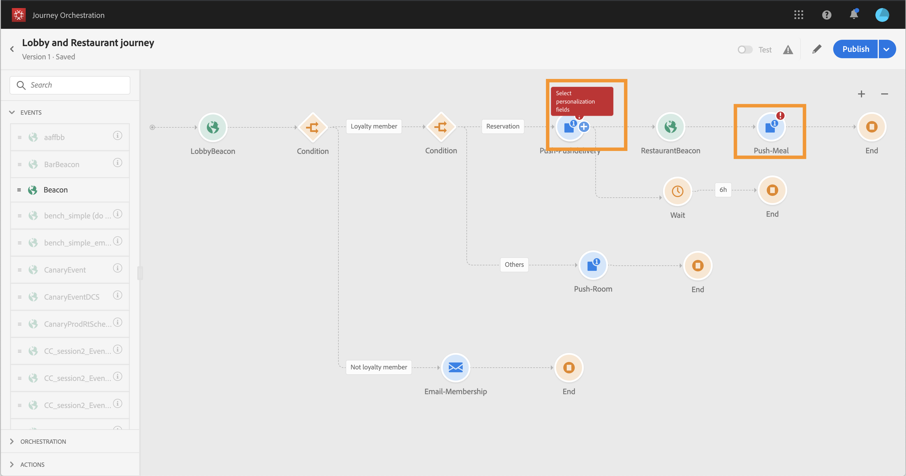

# Risoluzione dei problemi{#concept_nlv_bcv_2fb}


>[!CAUTION]
>
>**Ricerca di Adobe Journey Optimizer**? Fai clic [qui](https://experienceleague.adobe.com/it/docs/journey-optimizer/using/ajo-home){target="_blank"} per la documentazione di Journey Optimizer.
>
>
>_Questa documentazione fa riferimento ai materiali Journey Orchestration legacy che sono stati sostituiti da Journey Optimizer. Contatta il team del tuo account in caso di domande sull&#39;accesso a Journey Orchestration o Journey Optimizer._


In questa sezione viene descritto come risolvere i problemi dei percorsi prima di eseguire i test o di pubblicare. Tutti i controlli elencati di seguito possono essere effettuati quando il percorso è in modalità di test o quando è live. Ti consigliamo di eseguire tutti i controlli riportati di seguito in modalità di test, quindi di procedere alla pubblicazione. Consulta [questa pagina](../building-journeys/testing-the-journey.md).

## Verifica degli errori prima del test{#section_h3q_kqk_fhb}

Prima di testare e pubblicare il percorso, controlla che tutte le attività siano state configurate correttamente. Non è possibile eseguire test o pubblicazioni se il sistema rileva ancora degli errori.

Gli errori vengono visualizzati con un simbolo di avviso visualizzato sulle attività stesse all’interno dell’area di lavoro. Per visualizzare il messaggio di errore, posiziona il cursore sul punto esclamativo. Se fai clic sull’attività, la riga dovrebbe essere visualizzata in errore con un avviso. Ad esempio, se un campo obbligatorio è vuoto, viene visualizzato un errore.



Ad esempio, nell’area di lavoro, quando due attività sono disconnesse, viene visualizzato un avviso.


Accanto all’interruttore **[!UICONTROL Test]** e al pulsante **[!UICONTROL Publish]**, è possibile visualizzare un segnale di avviso. Questo segnale di avviso riporta gli errori rilevati dal sistema e impedisce l’attivazione della modalità di test o la pubblicazione del percorso. Nella maggior parte dei casi, gli errori rilevati dal sistema sono collegati a errori visibili sulle attività, ma a volte sono collegati ad altri problemi. In questo caso, puoi visualizzare gli errori e cercare di identificare il problema utilizzando la relativa descrizione. Se non riesci a identificare il problema, puoi copiare i dettagli e inviarli all’amministratore o al supporto tecnico. Gli errori che bloccano il test e quelli che impediscono la pubblicazione sono simili.

Il sistema rileva due tipi di problemi: errori e avvisi. Gli errori bloccano la pubblicazione e l’attivazione di test. Gli avvisi indicano i potenziali problemi che non impediscono l’attivazione del test o la pubblicazione. Vedrai una descrizione del problema e un ID di registro del problema del tipo ERR_XXX_XXX. Questo aiuterà il supporto tecnico a identificare il problema.

Sul segno accanto all’interruttore **[!UICONTROL Test]** e al pulsante **[!UICONTROL Publish]** possono essere visualizzati due colori diversi. In caso di errori, il segno viene visualizzato in rosso. In caso di avvisi, viene visualizzato in arancione.


Gli errori e gli avvisi globali relativi al percorso vengono visualizzati per primi nell’elenco. Gli errori e gli avvisi relativi ad attività specifiche sono elencati successivamente per ordine di attività o per visualizzazione nel percorso da sinistra a destra. Il pulsante **[!UICONTROL Copy details]** consente di copiare le informazioni tecniche sul percorso che il team di supporto può utilizzare per la risoluzione dei problemi.

Quando si verifica un errore in un’azione o in una condizione, il percorso di un singolo utente si arresta. L’unico modo per far sì che continui è selezionare la casella **[!UICONTROL Add an alternative path in case of a timeout or an error]** (Aggiungi percorso alternativo in caso di errore o timeout). Consulta [questa sezione](../building-journeys/using-the-journey-designer.md#paths).

## Controllo dell’invio corretto degli eventi{#section_rqz_11t_dgb}

Il punto di partenza di un percorso è sempre un evento. Puoi eseguire i test utilizzando strumenti come Postman.

Puoi verificare se la chiamata API inviata tramite questi strumenti viene inviata correttamente o meno. Se ricevi nuovamente un errore, significa che la chiamata presenta un problema. Controlla di nuovo il payload, l’intestazione (e in particolare l’ID organizzazione) e l’URL di destinazione. Puoi chiedere all’amministratore qual è l’URL corretto da utilizzare.

Gli eventi non vengono inviati direttamente dall’origine a [!DNL Journey Orchestration]. [!DNL Journey Orchestration] si basa sulle API Streaming Ingestion di Adobe Experience Platform. Di conseguenza, in caso di problemi relativi agli eventi, puoi fare riferimento a [questa pagina](https://experienceleague.adobe.com/docs/experience-platform/ingestion/streaming/troubleshooting.html) per la risoluzione dei problemi relativi alle API Streaming Ingestion.

## Verifica dell&#39;accesso al percorso da parte delle persone{#section_x4v_zzs_dgb}

Il reporting di [!DNL Journey Orchestration] misura le entrate delle persone in un percorso in tempo reale.

Se l’invio dell’evento è stato completato con successo ma non viene visualizzato alcuna entrata nel percorso, significa che si sono verificati errori tra l’invio dell’evento e la ricezione dell’evento nel percorso.

Di seguito sono riportati alcuni elementi che l’amministratore deve controllare:

* Hai la certezza che il percorso in cui prevedevi che arrivasse l’evento fosse in modalità di test o live?
* Hai salvato l’evento prima di copiare il payload dall’anteprima del payload?
* Il payload dell’evento contiene un ID evento?
* Hai raggiunto l’URL giusto?
* Hai seguito la struttura del payload delle API di Streaming Ingestion utilizzando l’anteprima della struttura del payload nel riquadro di configurazione dell’evento? Consulta [questa pagina](../event/previewing-the-payload.md).
* Hai usato le coppie chiave/valore corrette nell’intestazione dell’evento?

  ```
  X-gw-ims-org-id - your ORGID
  Content-type - application/json
  ```

## Controllo della modalità di navigazione delle persone nel percorso{#section_l5y_yzs_dgb}

Il reporting di [!DNL Journey Orchestration] misura il progresso delle persone durante un percorso. È facile identificare in che punto una persona si è fermata e per quale motivo.

Di seguito sono riportati alcuni elementi da verificare:

* È dovuto a una condizione che esclude la persona? Ad esempio, la condizione è “gender = male” e la persona in oggetto è una donna. Questo controllo può essere eseguito da un utente aziendale, se la condizione non è troppo complessa.
* È dovuto a una chiamata a un’origine dati che non risponde? Quando il percorso è in modalità di test, queste informazioni possono essere visualizzate nei registri in modalità di test. Quando il percorso è live, un amministratore può testare le chiamate dirette all’origine dati e verificare la risposta ricevuta. Un amministratore può anche duplicare il percorso e testarlo.

## Controllo dell’invio dei messaggi{#section_qb1_yzs_dgb}

Se gli individui si spostano nel modo giusto durante il percorso ma non ricevono i messaggi che dovrebbero ricevere, puoi verificare se:

* La messaggistica transazionale ha tenuto correttamente conto della richiesta di invio del messaggio. Un utente aziendale può accedere al messaggio transazionale che doveva essere stato essere inviato e verificare se l’ora dell’esecuzione più recente corrisponde all’orario di esecuzione del percorso. Può inoltre controllare le ultime chiamate/eventi API ricevuti tramite la messaggistica transazionale.
* La messaggistica transazionale ha inviato correttamente il messaggio. Nei registri di invio del messaggio transazionale, puoi vedere lo stato di ogni esecuzione. Puoi vedere se è verde, rosso e qual era il problema. Un utente aziendale può accedere a questa schermata e inviare i registri a un amministratore per ulteriori indagini.

Nel caso di un messaggio inviato tramite un’azione personalizzata, l’unica cosa che è possibile controllare durante il test di percorso è il fatto che la chiamata del sistema dell’azione personalizzata conduca o meno a un errore. Se la chiamata al sistema esterno associata all’azione personalizzata non genera un errore ma non causa l’invio di un messaggio, è necessario eseguire alcune indagini sul lato del sistema esterno.
