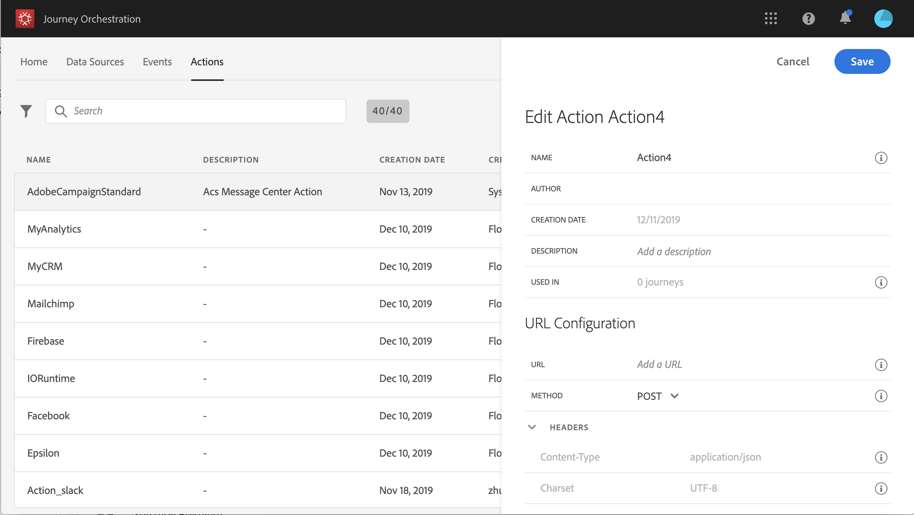

# Informazioni sulla configurazione delle azioni personalizzata {#concept_sxy_bzs_dgb}

>[!CAUTION]
>
>**Stai cercando Adobe Journey Optimizer**? Fai clic [qui](https://experienceleague.adobe.com/it/docs/journey-optimizer/using/ajo-home){target="_blank"} per la documentazione di Journey Optimizer.
>
>
>_Questa documentazione fa riferimento ai precedenti materiali su Journey Orchestration, che è stato sostituito da Journey Optimizer. In caso di domande sull’accesso a Journey Orchestration o Journey Optimizer, contatta il team del tuo account._

Se si utilizza un sistema di terze parti per l&#39;invio di messaggi o se si desidera che [!DNL Journey Orchestration] invii chiamate API a un sistema di terze parti, è qui che si configura la connessione a [!DNL Journey Orchestration]. L&#39;azione personalizzata definita dagli utenti tecnici sarà quindi disponibile nella palette a sinistra del percorso, nella categoria **[!UICONTROL Action]** (vedi [questa pagina](../building-journeys/about-action-activities.md). Di seguito sono riportati alcuni esempi di sistemi a cui è possibile connettersi con azioni personalizzate: Epsilon, Facebook, Adobe.io, Firebase, ecc.

Le limitazioni sono elencate in [questa pagina](../about/limitations.md).

Nei parametri delle azioni personalizzati, puoi trasmettere una semplice raccolta e un insieme di oggetti. Per informazioni sulle limitazioni, consulta [questa pagina](../usecase/collections.md#limitations). Inoltre, i parametri hanno un formato previsto (ad esempio, stringa, decimale e così via). Devi fare attenzione a rispettare questi formati previsti. Consulta questo [caso d&#39;uso](../usecase/collections.md).

Di seguito sono riportati i passaggi principali necessari per configurare un’azione personalizzata:

1. Dall&#39;elenco **[!UICONTROL Actions]**, fare clic su **[!UICONTROL Add]** per creare una nuova azione. Il riquadro di configurazione delle azioni si apre sul lato destro dello schermo.

   

1. Immetti un nome per l&#39;azione.

   >[!NOTE]
   >
   >Non utilizzare spazi o caratteri speciali. Non usare più di 30 caratteri.

1. Aggiungi una descrizione all’azione. Questo passaggio è facoltativo.
1. Il numero di percorsi che utilizzano questa azione viene visualizzato nel campo **[!UICONTROL Used in]**. È possibile fare clic sul pulsante **[!UICONTROL View journeys]** per visualizzare l&#39;elenco dei percorsi che utilizzano questa azione.
1. Definisci i diversi **[!UICONTROL URL Configuration]** parametri. Consulta [questa pagina](../action/url-configuration.md).
1. Configurare la sezione **[!UICONTROL Authentication]**. Questa configurazione è la stessa delle origini dati.  Vedi [questa sezione](../datasource/external-data-sources.md#section_wjp_nl5_nhb).
1. Definisci **[!UICONTROL Action parameters]**. Consulta [questa pagina](../action/defining-the-message-parameters.md).
1. Fai clic su **[!UICONTROL Save]**.

   L’azione personalizzata è ora configurata ed è pronta per essere utilizzata nei percorsi. Consulta [questa pagina](../building-journeys/about-action-activities.md).

   >[!NOTE]
   >
   >Quando un’azione personalizzata viene utilizzata in un percorso, la maggior parte dei parametri è di sola lettura. È possibile modificare solo i campi **[!UICONTROL Name]**, **[!UICONTROL Description]**, **[!UICONTROL URL]** e la sezione **[!UICONTROL Authentication]**.
