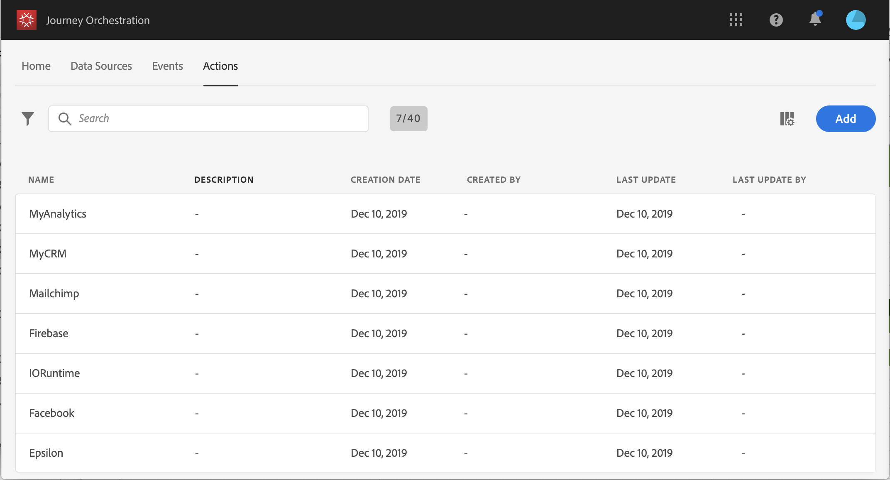

# Informazioni sulle azioni {#about_actions}

>[!CAUTION]
>
>**Stai cercando Adobe Journey Optimizer**? Fai clic [qui](https://experienceleague.adobe.com/it/docs/journey-optimizer/using/ajo-home){target="_blank"} per la documentazione di Journey Optimizer.
>
>
>_Questa documentazione fa riferimento ai precedenti materiali su Journey Orchestration, che è stato sostituito da Journey Optimizer. In caso di domande sull’accesso a Journey Orchestration o Journey Optimizer, contatta il team del tuo account._

>[!CONTEXTUALHELP]
>id="jo_actions"
>title="Informazioni sulle azioni"
>abstract="In questa sezione è possibile definire la connessione al sistema che invierà i messaggi. Le azioni qui configurate saranno quindi disponibili nella palette a sinistra del percorso, nella categoria Azione. "

Le azioni rappresentano le connessioni attraverso le quali puoi offrire esperienze personalizzate in tempo reale ai clienti, ad esempio notifiche push, e-mail, SMS o qualsiasi altro strumento di coinvolgimento digitale che utilizzi nella tua azienda.

Le azioni personalizzate consentono di configurare la connessione di un sistema di terze parti per consentire l’invio di messaggi o chiamate API. Per ciascun provider è possibile configurare un’azione che può essere attivata tramite un’API REST con un payload in formato JSON.

Le azioni sono disponibili nella palette a sinistra del percorso, nella categoria **[!UICONTROL Action]**. Consulta [questa pagina](../building-journeys/about-action-activities.md).

>[!NOTE]
>
>La configurazione delle azioni personalizzate viene sempre eseguita da un **utente tecnico**.

Nell’elenco **Azioni**, puoi premere c per creare un nuovo percorso, azione, origine dati o evento. Per ulteriori informazioni sui collegamenti in [!DNL Journey Orchestration], vedere [questa sezione](../about/user-interface.md#section_ksq_zr1_ffb).

Per visualizzare l’elenco delle azioni o configurarne una nuova, fai clic su **[!UICONTROL Actions]** nei menu principali. Viene visualizzato l’elenco delle azioni. Per ulteriori informazioni sull&#39;interfaccia, vedere [questa pagina](../about/user-interface.md).

Se disponi di Adobe Campaign Standard, devi configurare l’azione predefinita affinché esegua l’invio di e-mail, notifiche push e SMS tramite le funzionalità di messaggistica transazionale di Adobe Campaign Standard. Consulta [questa pagina](../action/working-with-adobe-campaign.md).

Se disponi di Adobe Campaign v7 o v8, su richiesta è disponibile un’integrazione. Consulta [questa pagina](../action/acc-action.md).

Se utilizzi un sistema di terze parti per l’invio di messaggi come Epsilon, Facebook, Adobe.io, Firebase e così via, devi aggiungere e configurare un’azione personalizzata. Consulta [questa pagina](../action/about-custom-action-configuration.md).

