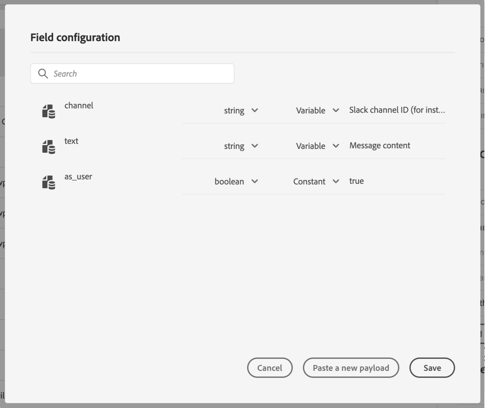

# Definizione dei parametri dell’azione {#concept_wy4_bf1_2gb}

>[!CAUTION]
>
>**Stai cercando Adobe Journey Optimizer**? Fai clic [qui](https://experienceleague.adobe.com/it/docs/journey-optimizer/using/ajo-home){target="_blank"} per la documentazione di Journey Optimizer.
>
>
>_Questa documentazione fa riferimento ai precedenti materiali su Journey Orchestration, che è stato sostituito da Journey Optimizer. In caso di domande sull’accesso a Journey Orchestration o Journey Optimizer, contatta il team del tuo account._

Nella sezione **[!UICONTROL Action parameters]**, incolla un esempio del payload JSON da inviare al servizio esterno.

>[!NOTE]
>
>I nomi dei campi nel payload non possono contenere un &quot;.&quot; carattere. Non possono iniziare con il carattere &quot;$&quot;.

Potrai definire il tipo di parametro (ad esempio stringa, numero intero e così via).

Puoi anche scegliere se specificare se un parametro è una costante o una variabile:

* Costante significa che il valore del parametro è definito nel riquadro di configurazione dell’azione da un utente tecnico. Il valore sarà sempre lo stesso tra i percorsi. Non varia e l’addetto marketing non la vede quando utilizza l’azione personalizzata nel percorso. Potrebbe essere ad esempio un ID previsto dal sistema di terze parti. In tal caso, il campo a destra della costante/variabile di attivazione è il valore passato.
* Variabile significa che il valore del parametro varia. L’addetto marketing che utilizza questa azione personalizzata in un percorso sarà libero di trasmettere il valore desiderato o di specificare dove recuperare il valore per questo parametro (ad esempio dall’evento, dal Adobe Experience Platform, ecc.). In tal caso, il campo a destra della costante/variabile di attivazione è l’etichetta che l’addetto marketing vedrà nel percorso per denominare questo parametro.

