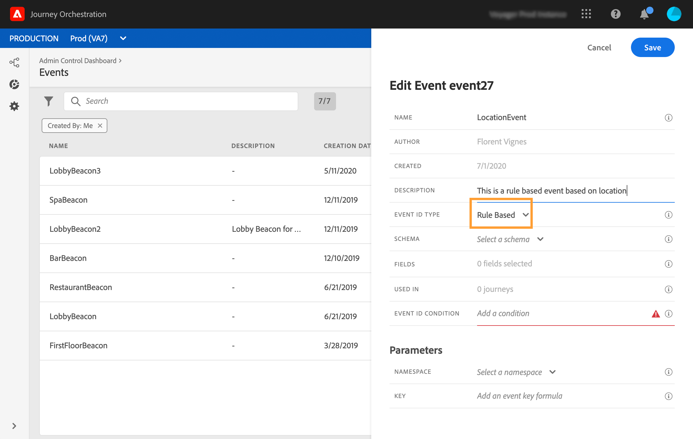

# Eventi basati su regole{#simplified-events}

Abbiamo semplificato la configurazione degli eventi di esperienza. Stiamo introducendo un nuovo metodo che non richiede l’uso di un ID evento. Ora quando configuri l’evento in Journey Orchestration puoi definire un evento basato su regole.

Questo nuovo tipo di evento non genera un eventID. Utilizzando l&#39;editor di espressioni semplici, ora è sufficiente definire una regola che verrà utilizzata dal sistema per identificare gli eventi rilevanti che attiveranno i vostri viaggi. Questa regola può essere basata su qualsiasi campo disponibile nel payload dell&#39;evento, ad esempio la posizione del profilo o il numero di elementi aggiunti al carrello del profilo.

Questo nuovo metodo è per lo più trasparente per gli utenti. L’unica modifica è un nuovo campo nella schermata di definizione dell’evento.

>[!CAUTION]
>
>Per gli eventi basati su regole viene definita una regola di capping. Limita il numero di eventi qualificati che un viaggio può elaborare a 400 k al minuto. Per maggiori informazioni, contattare il punto di contatto del programma Alfa.

## Utilizzo  dati Adobe Analytics{#analytics-data}

>[!NOTE]
>
>Questa sezione è valida solo per i clienti che devono utilizzare  dati Adobe Analytics.

Potete sfruttare tutti i dati evento comportamentali  Adobe Analytics già acquisiti e in streaming nella piattaforma per attivare i viaggi e automatizzare le esperienze per i vostri clienti.

Affinché questo funzioni, è necessario attivare, in Adobe Experience Platform, la suite di rapporti che si desidera sfruttare:

1. In Adobe Experience Platform, selezionate **[!UICONTROL Sources]** quindi **[!UICONTROL Add data]** nella sezione  Adobe Analytics. Viene visualizzato l&#39;elenco  suite di rapporti Adobe Analytics disponibili.

1. Selezionate la suite di rapporti da attivare, fate clic su **[!UICONTROL Next]** e fate clic su **[!UICONTROL Finish]**.

1. Condividi l&#39;ID dati di origine con il tuo punto di contatto del programma Alfa.

Questo abilita il connettore di origine Analytics per la suite di rapporti. Ogni volta che i dati entrano, vengono trasformati in un evento Experience e inviati in Adobe Experience Platform.

Per ulteriori informazioni sul connettore  sorgente Adobe Analytics, consultare la [documentazione](https://docs.adobe.com/help/en/experience-platform/sources/connectors/adobe-applications/analytics.html) e l&#39; [esercitazione](https://docs.adobe.com/content/help/en/experience-platform/sources/ui-tutorials/create/adobe-applications/analytics.html).

## Configurazione di un evento basato su regole{#configuring-rule-based}

1. Dal menu a sinistra, fate clic sull&#39; **[!UICONTROL Admin]** icona, quindi fate clic su **[!UICONTROL Events]**. Viene visualizzato l’elenco degli eventi.

   

1. Per creare un nuovo evento, fai clic su **[!UICONTROL Add]**. Il riquadro di configurazione dell’evento si apre sul lato destro dello schermo.

   

1. Immettete il nome dell’evento. Potete anche aggiungere una descrizione.

   

1. In the new **[!UICONTROL Event ID type]** field, select **[!UICONTROL Rule Based]**.

   

   >[!NOTE]
   >
   >Il **[!UICONTROL System Generated]** tipo è il metodo esistente che richiede un eventID. Vedi [questa sezione](../event/about-events.md).

1. Definire il **[!UICONTROL Schema]** e il payload **[!UICONTROL Fields]**. Vedi [questa sezione](../event/defining-the-payload-fields.md).

   

   >[!NOTE]
   >
   >Quando selezionate l&#39; **[!UICONTROL System Generated type]**, sono disponibili solo gli schemi che hanno il tipo eventID mixin. Quando selezionate il **[!UICONTROL Rule Based]** tipo, sono disponibili tutti gli schemi di eventi esperienza.

1. Fare clic all&#39;interno del **[!UICONTROL Event ID condition]** campo. Utilizzando l&#39;editor di espressioni semplici, definire la condizione che verrà utilizzata dal sistema per identificare gli eventi che attiveranno il percorso.

   

   Nel nostro esempio, abbiamo scritto una condizione basata sulla città del profilo. Ciò significa che ogni volta che il sistema riceve un evento che corrisponde a questa condizione (**[!UICONTROL City]** campo e **[!UICONTROL Paris]** valore), lo trasmette al Journey Orchestration.

1. Definite il **[!UICONTROL Namespace]** e **[!UICONTROL Key]**. Consultate [Selezione dello spazio dei nomi](../event/selecting-the-namespace.md) e [Definizione della chiave](../event/defining-the-event-key.md)evento.

   

Gli altri passaggi per la configurazione degli eventi e la creazione del percorso restano invariati.

L&#39;evento è ora configurato e pronto per essere rilasciato come qualsiasi altro evento. Ogni volta che un evento corrispondente alla regola viene inviato al sistema, viene passato al Journey Orchestration per attivare i viaggi.

## Modalità di test per gli eventi basati su regole{#test-rule-based}

La modalità di prova è disponibile anche per i viaggi che utilizzano un evento basato su regole.

Quando si attiva un evento, la schermata di configurazione **dell&#39;** evento consente di definire i parametri dell&#39;evento da trasmettere nel test. Per visualizzare la condizione ID evento, fate clic sull&#39;icona della descrizione comando nell&#39;angolo superiore destro. Accanto a ciascun campo che fa parte della valutazione delle regole è disponibile una descrizione comandi.

Per ulteriori informazioni su come utilizzare la modalità di prova, consultate [questa pagina](../building-journeys/testing-the-journey.md).
