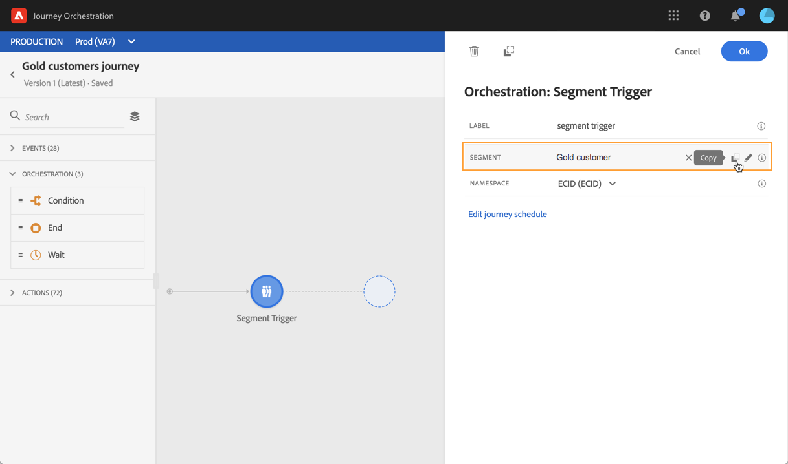

# Attività Lettura segmento {#segment-trigger-activity}

## Informazioni sull&#39;attività Leggi segmento {#about-segment-trigger-actvitiy}

>[!NOTE]
>
>Se  un’attività di Adobe Campaign Standard out-of-the-box è presente nell’area di lavoro al momento della pubblicazione o al momento dell’attivazione della modalità di prova, il viaggio sarà limitato a 13 ingressi al secondo. In caso contrario, il viaggio sarà limitato a 1000 eventi al secondo.

L’attività Leggi segmento consente di fare in modo che tutti gli individui appartenenti a un segmento Adobe Experience Platform entrino in un percorso. L&#39;ingresso in un viaggio può essere eseguito una volta o su base regolare.

Supponiamo che tu abbia un segmento di clienti Gold su Adobe Experience Platform. Con l&#39;attività Leggi segmento, puoi fare in modo che tutti gli individui appartenenti al segmento di clienti Gold intraprendano un viaggio e li facciano scorrere in percorsi personalizzati che sfruttino tutte le funzionalità di viaggio: condizioni, orari, eventi, azioni.

## Configurazione dell&#39;attività {#configuring-segment-trigger-activity}

>[!NOTE]
>
>A causa delle latenze di esportazione del segmento, non è possibile attivare un percorso basato su segmenti in un intervallo di tempo più breve di 1 ora.

1. Spiegate la **[!UICONTROL Orchestration]** categoria e rilasciate un&#39; **[!UICONTROL Read Segment]** attività nel quadro.

   L&#39;attività deve essere posizionata come primo passo di un viaggio.

1. Aggiungete un elemento **[!UICONTROL Label]** all&#39;attività (facoltativo).

1. Nel **[!UICONTROL Segment]** campo, scegliete il segmento Adobe Experience Platform che verrà inserito nel percorso, quindi fate clic su **[!UICONTROL Save]**.

   >[!NOTE]
   >
   >È possibile personalizzare le colonne visualizzate nell&#39;elenco e ordinarle.

   

   Una volta aggiunto il segmento, il **[!UICONTROL Copy]** pulsante consente di copiarne il nome e l’ID:

   `{"name":"Gold customers,”id":"8597c5dc-70e3-4b05-8fb9-7e938f5c07a3"}`

   

1. Nel **[!UICONTROL Namespace]** campo, scegliete lo spazio dei nomi da utilizzare per identificare gli individui. For more on namespaces, refer to [this section](../event/selecting-the-namespace.md).

   >[!NOTE]
   >
   >Gli individui appartenenti a un segmento che non ha l&#39;identità selezionata (spazio dei nomi) tra le loro diverse identità non possono entrare nel percorso.

1. L&#39; **[!UICONTROL Read Segment]** attività consente di specificare l&#39;ora in cui il segmento entrerà nel percorso. A tal fine, fai clic sul **[!UICONTROL Edit journey schedule]** collegamento per accedere alle proprietà del viaggio, quindi configura il **[!UICONTROL Scheduler type]** campo.

   

   Per impostazione predefinita, i segmenti entrano nel percorso, **[!UICONTROL As soon as possible]** ovvero 1 ora dopo la pubblicazione del percorso. Se si desidera che il segmento entri nel percorso in una data/ora specifica o su base periodica, selezionare il valore desiderato dall&#39;elenco.

   >[!NOTE]
   >
   >La **[!UICONTROL Schedule]** sezione è disponibile solo quando un&#39; **[!UICONTROL Read Segment]** attività è stata eliminata nell&#39;area di lavoro.

   

## Verifica e pubblicazione del percorso {#testing-publishing}

L&#39; **[!UICONTROL Read Segment]** attività consente di testare il viaggio su un profilo unitario o su 100 profili di test casuali selezionati tra i profili idonei per il segmento.

A questo scopo, attivate la modalità di prova, quindi selezionate l’opzione desiderata nel riquadro a sinistra.

Potete quindi configurare la modalità di prova come di consueto. In [questa sezione](../building-journeys/testing-the-journey.md)sono illustrati i passaggi dettagliati su come verificare il percorso.

Tieni presente che il test del percorso con un massimo di 100 profili contemporaneamente non consente di monitorare l’avanzamento degli individui durante il viaggio utilizzando il flusso visivo.

Una volta completati i test, potete pubblicare il viaggio (consultate [Pubblicazione del percorso](../building-journeys/publishing-the-journey.md)). Gli individui appartenenti al segmento entreranno nel percorso nella data/ora specificata nella sezione delle proprietà del viaggio **[!UICONTROL Scheduler]** .

>[!IMPORTANT]
>
>I segmenti Adobe Experience Platform vengono calcolati una volta al giorno (segmenti **batch** ) o in tempo reale (segmenti **in streaming** ).
>
>Se il segmento selezionato viene trasmesso in streaming, gli utenti appartenenti a questo segmento possono potenzialmente entrare nel percorso in tempo reale. Se il segmento è batch, le persone appena qualificate per questo segmento potranno potenzialmente entrare nel percorso quando il calcolo del segmento viene eseguito sull&#39;Adobe Experience Platform.
