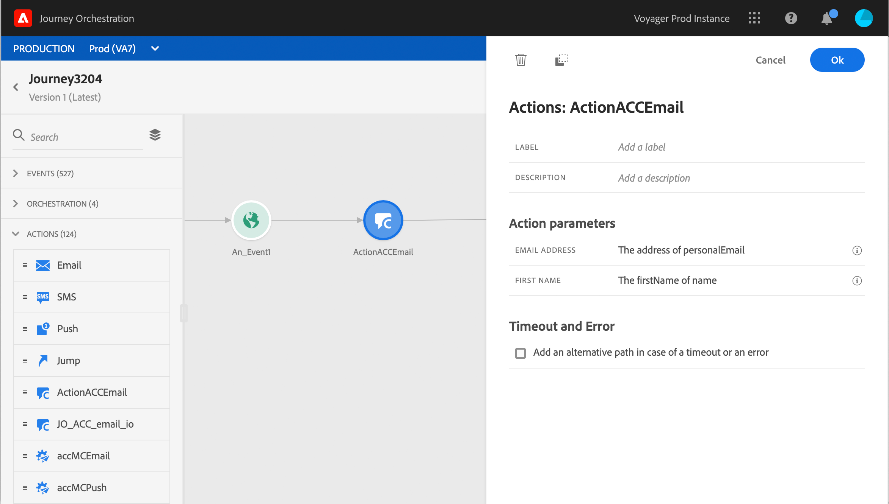

# Integrazione con Adobe Campaign Classic {#integrating-with-adobe-campaign-classic}

Questa integrazione ti consente di inviare e-mail, notifiche push e SMS utilizzando le funzionalità di messaggistica transazionale di Adobe Campaign Classic.

La connessione tra le istanze Journey Orchestration e Campaign Classic viene impostata per Adobe al momento del provisioning.

>[!CAUTION]
>
> Questa integrazione viene rilasciata come versione beta privata. Non è disponibile per tutti i clienti del Journey Orchestration.

## Note importanti

* I messaggi non sono soggetti a limitazione. Il numero massimo di messaggi che possono essere inviati a 50.000/ora in base al nostro attuale SLA Campaign Classic. Per questo motivo, l’orchestrazione dei Percorsi deve essere utilizzata solo in casi d’uso unitari (eventi individuali, non segmenti).

* È necessario configurare un’azione sull’area di lavoro per modello da utilizzare.

* È consigliabile utilizzare un’istanza del Centro messaggi dedicata ospitata per questa integrazione per evitare di influire su altre operazioni di Campaign Classic in corso. Il server di marketing può essere ospitato o on-premise. La build richiesta è 21.1 Release Candidate.

* Non esiste una convalida che attesti che il payload o il messaggio Campaign Classic è corretto.

* Non è possibile utilizzare un’azione Campaign Classic con una qualifica per i segmenti.

## Prerequisiti

In Campaign Classic, devi creare e pubblicare un messaggio transazionale e il relativo evento associato. Consulta la [documentazione Adobe Campaign Classic](https://experienceleague.adobe.com/docs/campaign-classic/using/transactional-messaging/introduction/about-transactional-messaging.html#transactional-messaging).

Contatta l’Adobe per ottenere il payload JSON corrispondente a ciascun messaggio. Quindi incolla questo payload durante la configurazione dell’azione nel Journey Orchestration (vedi di seguito).

Ecco un esempio:

```
{
    "channel": "email",
    "eventType": "welcome",
    "email": "example@adobe.com",
    "ctx": {
        "firstName": "John"
    }
}
```

## Configurazione dell’azione

Al Journey Orchestration, devi configurare un’azione per messaggio transazionale. Segui questi passaggi:

1. Crea una nuova azione. Fare riferimento a questa sezione [sezione](../action/action.md).
1. Immetti un nome e una descrizione.
1. Nel campo **Tipo azione**, seleziona **Adobe Campaign Classic**.
1. Fai clic sul campo **Payload** e incolla un esempio del payload JSON corrispondente al messaggio Campaign Classic. Per ottenere questo payload, contatta l’Adobe .
1. Regola i diversi campi. Alcuni campi, come i parametri del canale e i campi di personalizzazione (ctx), devono essere definiti come variabili.
1. Fai clic su **Salva**.


Per ogni azione configurata, nella palette Progettazione percorsi è disponibile un’attività di azione.

## Aggiunta di un messaggio in un percorso

1. Progetta il tuo percorso, a partire da un evento. Vedere questa sezione [](../building-journeys/journey.md).
1. Nella sezione **Azione** della palette, seleziona un’azione Campaign Classic e aggiungilo al percorso.
1. Nei **Parametri azione** vengono visualizzati tutti i campi previsti nel payload del messaggio. Devi mappare ciascuno di questi campi con il campo che desideri utilizzare, dall’evento o dall’origine dati. È simile alle azioni personalizzate. Fare riferimento a questa sezione [sezione](../building-journeys/using-custom-actions.md).



