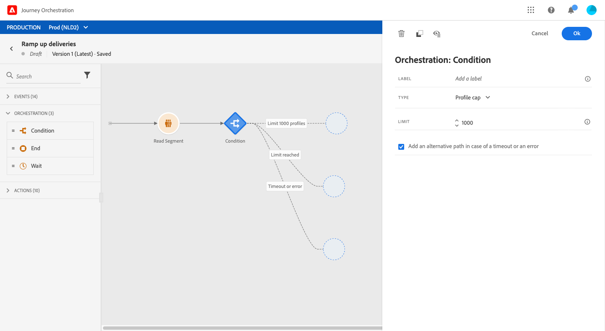

# Attività Condizione{#section_e2n_pft_dgb}

>[!CAUTION]
>
>**Cerchi Adobe Systems Journey Optimizer**? Fai clic [qui](https://experienceleague.adobe.com/it/docs/journey-optimizer/using/ajo-home){target="_blank"} per la documentazione di Journey Optimizer.
>
>
>_Questa documentazione fa riferimento ai materiali Journey Orchestration legacy sostituiti da Journey Optimizer. Contatta il tuo team account se hai domande sulle accesso a Journey Orchestration o Journey Optimizer._

Sono disponibili quattro tipi di condizioni:

* [Condizione Origine dati](#data_source_condition)
* [Condizioni temporali](#time_condition)
* [Ripartizione percentuale](#percentage_split)
* [Condizione data](#date_condition)

## Informazioni sull’attività Condizione {#about_condition}

Quando utilizzi più condizioni in un percorso, puoi definire le etichette per ciascuna di esse in modo da identificarle più facilmente.

Fare clic se **[!UICONTROL Add a path]** si desidera definire diverse condizioni. Per ogni condizione, dopo l&#39;attività viene aggiunto un nuovo tracciato.

Si noti che la progettazione dei viaggi ha un impatto funzionale. Quando vengono definiti più percorsi dopo una condizione, viene eseguito solo il primo percorso idoneo. Significa che è possibile variare la prioritizzazione dei percorsi posizionandoli uno sopra o sotto l&#39;altro.

Ad esempio, prendiamo l&#39;esempio della condizione di un primo percorso &quot;La persona è un VIP&quot; e la condizione di un secondo percorso &quot;La persona è un maschio&quot;. Se una persona che soddisfa entrambe le condizioni (un maschio che è un VIP) supera questo passaggio, verrà scelto il primo percorso lineare se è idoneo anche al secondo, perché il primo percorso è &quot;sopra&quot;. Per modificare questa priorità, sposta le attività in un altro ordine verticale.

Puoi creare un altro percorso per i tipi di pubblico non idonei alle condizioni definite selezionando **[!UICONTROL Show path for other cases than the one(s) above]**. Questa opzione non è disponibile in condizioni suddivise. Vedere [Suddivisione percentuale](#percentage_split).

La modalità semplice consente di eseguire query semplici basate su una combinazione di campi. Tutti i campi disponibili sono visualizzati a sinistra. Trascina i campi nell’area principale. Per combinare i diversi elementi, puoi unirli per creare diversi gruppi e/o livelli di gruppo. Puoi quindi selezionare un operatore logico per combinare elementi sullo stesso livello:

* E: un&#39;intersezione di due criteri. Vengono presi in considerazione solo gli elementi che rispondono a tutti i criteri account.
* OPPURE: unione di due criteri. Vengono considerati gli elementi che corrispondono ad almeno uno dei due criteri.

Se utilizzi il [servizio](https://experienceleague.adobe.com/docs/experience-platform/segmentation/home.html?lang=it) di segmentazione Adobe Experience Platform per creare i segmenti, puoi sfruttare in base alle tue condizioni di viaggio. Fare riferimento a [Utilizzo dei segmenti nelle condizioni](../segment/using-a-segment.md).

>[!NOTE]
>
>Non è possibile eseguire query su serie temporali (ad esempio un elenco di acquisti, clic passati sui messaggi) con il semplice editor. Per questo è necessario utilizzare il editor avanzato. Consulta [questa pagina](../expression/expressionadvanced.md).

Quando si verifica un errore in un’azione o in una condizione, il percorso di un singolo utente si arresta. L’unico modo per far sì che continui è selezionare la casella **[!UICONTROL Add an alternative path in case of a timeout or an error]** (Aggiungi percorso alternativo in caso di errore o timeout). Consulta [questa sezione](../building-journeys/using-the-journey-designer.md#paths).

Nell’editor semplice, trovi anche la categoria Proprietà Percorso, sotto le categorie evento e origine dati. Questa categoria contiene campi tecnici relativi al percorso per un determinato profilo. Si tratta delle informazioni che il sistema recupera dai percorsi in tempo reale, ad esempio l’ID percorso o specifici errori rilevati. Per ulteriori informazioni, vedere [questa pagina](../expression/journey-properties.md)

## Condizione Origine dati {#data_source_condition}

Ciò consente di definire una condizione in base ai campi delle origini dati o agli eventi precedentemente posizionati nel percorso. Per informazioni su come utilizzare l&#39;espressione editor, consulta [questa pagina](../expression/expressionadvanced.md). Utilizzando l&#39;espressione avanzata editor, è possibile impostare condizioni più avanzate, manipolare raccolte o utilizzare origini dati che richiedono il passaggio di parametri. Consulta [questa pagina](../datasource/external-data-sources.md).

## Condizioni temporali{#time_condition}

Ciò consente di eseguire azioni diverse a seconda dell&#39;ora del giorno e/o del giorno della settimana. Ad esempio, puoi decidere di inviare messaggi SMS durante il giorno e e-mail di notte durante i giorni feriali.

>[!NOTE]
>
>Il fuso orario non è più specifico di una condizione ed è ora definito a livello di percorso nelle proprietà del viaggio. Consulta [questa pagina](../building-journeys/timezone-management.md).

## Ripartizione percentuale {#percentage_split}

Questa opzione consente di dividere casualmente il pubblico per definire un&#39;azione diversa per ciascun gruppo. Definire il numero di divisioni e la ripartizione per ogni percorso. Il calcolo della suddivisione è statistico in quanto il sistema non può prevedere quante persone affluiranno in questa attività del viaggio. Di conseguenza, la suddivisione ha un margine di errore molto basso. Questa funzione si basa su un meccanismo casuale Java (vedi questa [pagina](https://docs.oracle.com/javase/7/docs/api/java/util/Random.html)).

In modalità test, quando si raggiunge una divisione, viene sempre scelto il ramo superiore. È possibile riorganizzare la posizione dei rami divisi se si desidera che il test scelga un percorso diverso. Consulta [questa pagina](../building-journeys/testing-the-journey.md)

>[!NOTE]
>
>Non vi è alcun pulsante per aggiungere un percorso nella condizione di ripartizione percentuale. Il numero di percorsi dipende dal numero di divisioni. In condizioni di suddivisione, non è possibile aggiungere un percorso per altri casi in quanto ciò non può accadere. Le persone andranno sempre in uno dei percorsi divisi.

## Condizione data {#date_condition}

Ciò consente di definire un flusso diverso in base alla data. Ad esempio, se la persona inserisce il passaggio durante il periodo di &quot;vendita&quot;, le invierai un messaggio specifico. Il resto dell&#39;anno, invierai un altro messaggio.

>[!NOTE]
>
>Il fuso orario non è più specifico di una condizione ed è ora definito a livello di percorso nelle proprietà del viaggio. Consulta [questa pagina](../building-journeys/timezone-management.md).

<!--
## Profile cap {#profile_cap}

Use this condition type to set a maximum number of profiles for a journey path. When this limit is reached, the selected profiles take a second path.

You can use this condition type to ramp up the volume of your deliveries. For example, you might have recently moved to another email service provider, IP address, or email domain or subdomain. Using this feature, you can establish your reputation as a sender and avoid that your deliveries be blocked or moved to the spam folder of the recipients' mailbox. Learn how to increase your email reputation with IP warming in the [Deliverability Best Practice Guide](https://experienceleague.adobe.com/docs/deliverability-learn/deliverability-best-practice-guide/additional-resources/generic-resources/increase-reputation-with-ip-warming.html){target="_blank"}.

The default cap is 1000. You must set an integer value that is greater than or equal to 1.

The counter applies only to the selected journey version. By default, the counter is reset to zero after 180 days. After a reset, the selected profiles take the first path again until the counter limit is reached. You can gradually increase this limit up to the total number of your subscribers. After your IP has warmed up, you can remove this condition.

The first path always has priority over the second path, even if you move the second path above the first path on the journey canvas.

-->