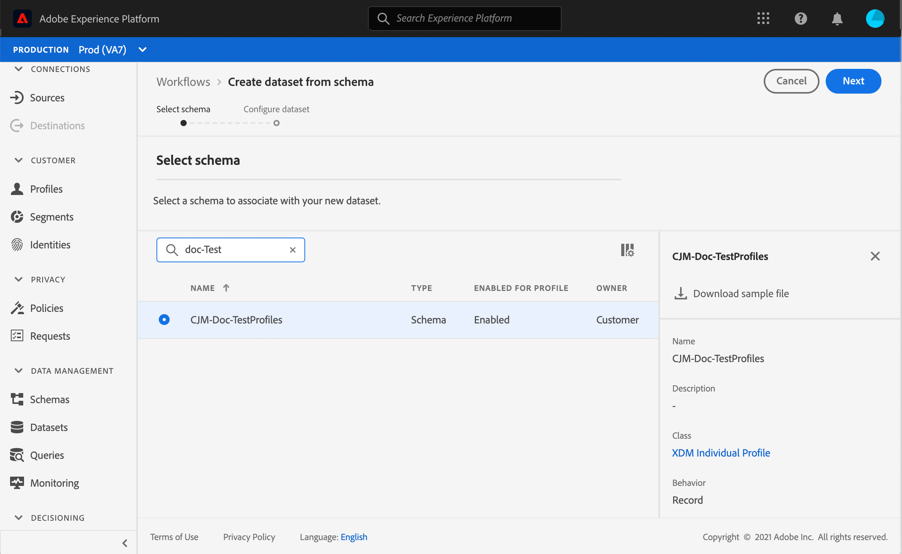

# Creare profili di test {#create-test-profiles}

I profili di test sono necessari quando si utilizza la modalità di test in un percorso. Per informazioni su come utilizzare la modalità di test, consulta [questa sezione](../building-journeys/testing-the-journey.md).

Esistono diversi modi per creare un profilo di test in Adobe Experience Platform. In questa documentazione sono disponibili due metodi: caricamento di un [file csv](../building-journeys/creating-test-profiles.md#create-test-profiles-csv) e utilizzo di [chiamate API](../building-journeys/creating-test-profiles.md#create-test-profiles-api). Puoi anche caricare un file json in un set di dati, consulta la [documentazione sull’acquisizione dei dati](https://experienceleague.adobe.com/docs/experience-platform/ingestion/tutorials/ingest-batch-data.html#add-data-to-dataset).

Questi metodi di importazione ti consentono inoltre di aggiornare gli attributi del profilo. In questo modo, puoi trasformare un profilo esistente in un profilo di test. Utilizza semplicemente un file o una chiamata API simile e includi solo il campo &quot;testProfile&quot; con il valore &quot;true&quot;.

La creazione di un profilo di test è simile alla creazione di profili normali in Adobe Experience Platform. Per ulteriori informazioni, consulta la [documentazione Profilo cliente in tempo reale](https://experienceleague.adobe.com/docs/experience-platform/profile/home.html).

## Prerequisiti{#test-profile-prerequisites}

Per poter creare profili, devi innanzitutto creare uno schema e un set di dati in Adobe Experience Platform.

Innanzitutto, devi **creare uno schema**. Segui questi passaggi:

1. In Adobe Experience Platform, fai clic su **[!UICONTROL Schemas]** nel menu a sinistra.
   
1. Fai clic su **[!UICONTROL Create schema]**, in alto a destra, quindi seleziona un tipo di schema, ad esempio **[!UICONTROL XDM Individual Profile]**.
   
1. Scegli un nome per lo schema.
1. Nella sezione **[!UICONTROL Mixins]**, fai clic su **[!UICONTROL Add]**.
   
1. Selezionare i mixin appropriati. Assicurati di aggiungere il mixin **[!UICONTROL Profile test details]**. Fai clic su **[!UICONTROL Add mixin]**.
   
L’elenco dei mixin viene visualizzato nella schermata di panoramica dello schema.

   
1. Nell’elenco dei campi, fai clic sul campo da definire come identità principale.
   
1. Nel pannello a destra **[!UICONTROL Field properties]**, seleziona le opzioni **[!UICONTROL Identity]** e **[!UICONTROL Primary Identity]** e seleziona uno spazio dei nomi. Se desideri che l’identità principale sia un indirizzo e-mail, scegli lo spazio dei nomi **[!UICONTROL Email]** . Fai clic su **[!UICONTROL Apply]**.
   
1. Seleziona lo schema e abilita l&#39;opzione **[!UICONTROL Profile]** in **[!UICONTROL Schema properties]**.
   
1. Fai clic su **[!UICONTROL Save]**.

>[!NOTE]
>
>Per ulteriori informazioni sulla creazione dello schema, consulta la [documentazione XDM](https://experienceleague.adobe.com/docs/experience-platform/xdm/ui/resources/schemas.html#prerequisites).

Quindi devi **creare il set di dati** in cui i profili verranno importati. Segui questi passaggi:

1. In Adobe Experience Platform, fai clic su **[!UICONTROL Datasets]**, nel menu di sinistra, quindi fai clic su **[!UICONTROL Create dataset]**.
   
1. Scegli **[!UICONTROL Create dataset from schema]**.
   
1. Seleziona lo schema creato in precedenza e fai clic su **[!UICONTROL Next]**.
   
1. Scegli un nome e fai clic su **[!UICONTROL Finish]**.
   
1. Abilita l’opzione **[!UICONTROL Profile]** .
   

>[!NOTE]
>
> Per ulteriori informazioni sulla creazione dei set di dati, consulta la [documentazione Servizio catalogo](https://experienceleague.adobe.com/docs/experience-platform/catalog/datasets/user-guide.html#getting-started).

## Creazione di un profilo di test tramite un file csv{#create-test-profiles-csv}

In Adobe Experience Platform, puoi creare profili caricando un file csv contenente i diversi campi di profilo nel set di dati. Questo è il metodo più semplice.

1. Crea un file csv semplice utilizzando un foglio di calcolo.
1. Aggiungi una colonna per ogni campo necessario. Assicurati di aggiungere il campo di identità principale (&quot;personID&quot; nel nostro esempio sopra) e il campo &quot;testProfile&quot; impostato su &quot;true&quot;.
   
1. Aggiungi una riga per profilo e compila i valori per ciascun campo.
   
1. Salva il foglio di calcolo come file csv. Assicurati che le virgole siano utilizzate come separatori.
1. In Adobe Experience Platform, fai clic su **[!UICONTROL Workflows]** nel menu a sinistra.
   
1. Scegli **[!UICONTROL Map CSV to XDM schema]**, quindi fai clic su **[!UICONTROL Launch]**.
   
1. Seleziona il set di dati in cui desideri importare i profili. Fai clic su **[!UICONTROL Next]**.
   
1. Fai clic su **[!UICONTROL Choose files]** e seleziona il file csv . Quando il file viene caricato, fai clic su **[!UICONTROL Next]**.
   
1. Mappa i campi csv di origine ai campi dello schema, quindi fai clic su **[!UICONTROL Finish]**.
   
1. Inizia l’importazione dei dati. Lo stato verrà spostato da **[!UICONTROL Processing]** a **[!UICONTROL Success]**. Fai clic su **[!UICONTROL Preview data set]** in alto a destra.
   
1. Verifica che i profili di test siano stati aggiunti correttamente.
   

I profili di test vengono aggiunti e possono ora essere utilizzati durante il test di un percorso. Fai riferimento a [questa sezione](../building-journeys/testing-the-journey.md).
>[!NOTE]
>
> Per ulteriori informazioni sulle importazioni CSV, consulta la [documentazione sull’ acquisizione dei dati](https://experienceleague.adobe.com/docs/experience-platform/ingestion/tutorials/map-a-csv-file.html#tutorials).

## Creazione di profili di test utilizzando le chiamate API{#create-test-profiles-api}

Puoi anche creare profili di test tramite chiamate API. Vedere questa [pagina](https://docs.adobe.com/content/help/it-IT/experience-platform/profile/home.html).

Devi utilizzare uno schema di profilo contenente il mixin &quot;Dettagli del test di profilo&quot;. Il flag testProfile fa parte di questo mixin.

Quando crei un profilo, accertati di trasmettere il valore: testProfile = true.

Tieni presente che puoi anche aggiornare un profilo esistente per modificare il relativo flag testProfile in &quot;true&quot;.

Ecco un esempio di chiamata API per creare un profilo di test:

```
curl -X POST \
'https://dcs.adobedc.net/collection/xxxxxxxxxxxxxx' \
-H 'Cache-Control: no-cache' \
-H 'Content-Type: application/json' \
-H 'Postman-Token: xxxxx' \
-H 'cache-control: no-cache' \
-H 'x-api-key: xxxxx' \
-H 'x-gw-ims-org-id: xxxxx' \
-d '{
"header": {
"msgType": "xdmEntityCreate",
"msgId": "xxxxx",
"msgVersion": "xxxxx",
"xactionid":"xxxxx",
"datasetId": "xxxxx",
"imsOrgId": "xxxxx",
"source": {
"name": "Postman"
},
"schemaRef": {
"id": "https://example.adobe.com/mobile/schemas/xxxxx",
"contentType": "application/vnd.adobe.xed-full+json;version=1"
}
},
"body": {
"xdmMeta": {
"schemaRef": {
"contentType": "application/vnd.adobe.xed-full+json;version=1"
}
},
"xdmEntity": {
"_id": "xxxxx",
"_mobile":{
"ECID": "xxxxx"
},
"testProfile":true
}
}
}'
```

