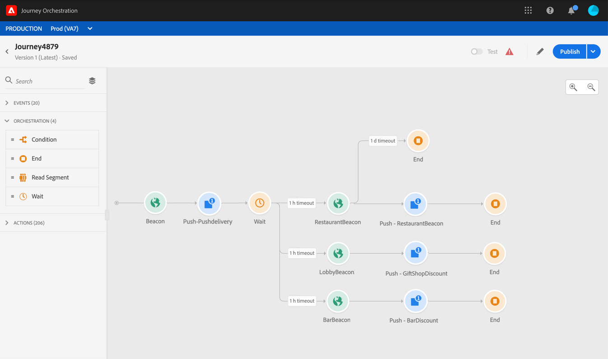

# Informazioni sulle attività eventi {#concept_rws_1rt_52b}

Gli eventi configurati dall’utente tecnico (consulta [questa pagina](../event/about-events.md)) vengono tutti visualizzati nella prima categoria della palette, sul lato sinistro dello schermo.

Avvia sempre il percorso trascinando e rilasciando un’attività evento. Puoi anche fare doppio clic su di esso.

Quando fai clic sull’attività dell’evento nell’area di lavoro, viene visualizzato il riquadro di configurazione dell’attività . Per impostazione predefinita, quando utilizzi più volte lo stesso evento, al nome dell’evento nell’area di lavoro viene aggiunto un numero incrementale. Inoltre, puoi utilizzare il campo **[!UICONTROL Label]** per aggiungere un suffisso al nome dell’evento che verrà visualizzato sotto l’attività nell’area di lavoro. Questo è utile per identificare gli eventi nell’area di lavoro, soprattutto se utilizzi più volte lo stesso evento. Semplifica inoltre il debug in caso di errori e faciliterà la lettura dei rapporti.

## Ascolto degli eventi durante un periodo di tempo specifico

Un’attività dell’evento posizionata nel percorso ascolta gli eventi a tempo indefinito. Per ascoltare un evento solo durante un certo periodo di tempo, devi configurare un timeout per l’evento.

Il percorso ascolterà quindi l&#39;evento durante il tempo specificato nel timeout. Se un evento viene ricevuto durante quel periodo, la persona scorre nel percorso dell&#39;evento. In caso contrario, il cliente può scorrere in un percorso di timeout o terminare il percorso.

Per configurare un timeout per un evento, effettua le seguenti operazioni:

1. Attiva l&#39;opzione **[!UICONTROL Enable the event timeout]** dalle proprietà dell&#39;evento.

1. Specifica il tempo di attesa dell’evento da parte del percorso.

1. Se desideri inviare gli utenti a un percorso di timeout quando non viene ricevuto alcun evento entro il timeout specificato, abilita l’opzione **[!UICONTROL Set the timeout path]** . Se questa opzione non è abilitata, il percorso termina per la persona una volta raggiunto il timeout.

   

In questo esempio, il percorso invia un primo messaggio push di benvenuto a un cliente. Invia quindi un push con sconto sul pasto solo se il cliente entra nel ristorante entro il giorno successivo. Abbiamo pertanto configurato l’evento del ristorante con un timeout di 1 giorno:

* Se l’evento del ristorante viene ricevuto meno di 1 giorno dopo il messaggio push di benvenuto, viene inviata l’attività push con sconto sui pasti.
* Se non viene ricevuto alcun evento di ristorante entro il giorno successivo, la persona scorre attraverso il percorso di timeout.

Tieni presente che se desideri configurare un timeout su più eventi posizionati dopo un’attività **[!UICONTROL Wait]** , devi configurare il timeout solo per uno di questi eventi.

Il timeout si applica a tutti gli eventi posizionati dopo l’attività **[!UICONTROL Wait]** . Se non viene ricevuto alcun evento prima del timeout specificato, i singoli utenti accederanno a un unico percorso di timeout o termineranno il loro percorso.

