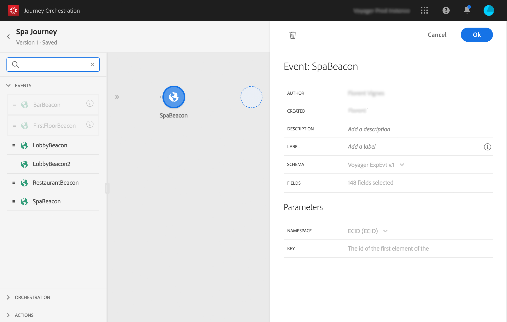

# Eventi generali {#section_ofg_jss_dgb}

Per questo tipo di evento, è possibile aggiungere solo un&#39;etichetta e una descrizione. Impossibile modificare il resto della configurazione. È stato eseguito dall&#39;utente tecnico. A questo proposito, consulta la sezione .

