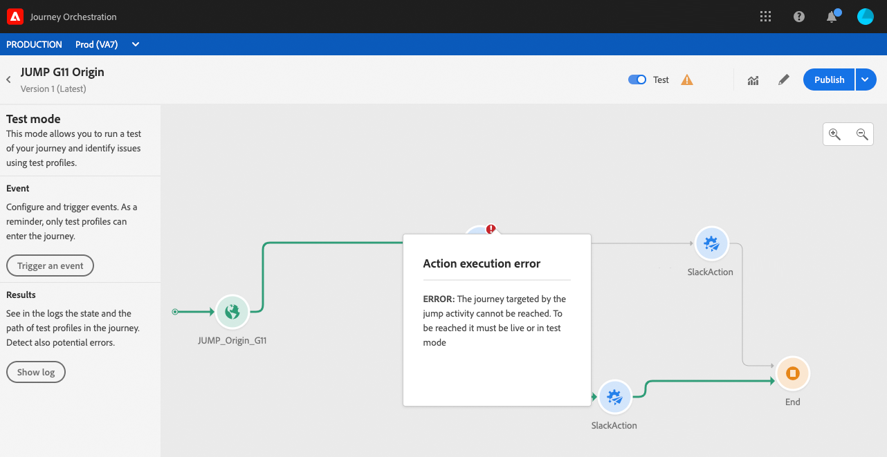

# Passaggio da un percorso a un altro {#jump}

La **[!UICONTROL Jump]** l’attività azione ti consente di inviare singoli utenti da un percorso all’altro. Questa funzione consente di:

* semplificare la progettazione di percorsi molto complessi suddividendoli in più
* creare percorsi basati su modelli di percorso comuni e riutilizzabili

Nel percorso di origine, aggiungi semplicemente un **[!UICONTROL Jump]** e seleziona un percorso di destinazione. Quando l’utente accede alla **[!UICONTROL Jump]** un evento interno viene inviato al primo evento del percorso di destinazione. Se la **[!UICONTROL Jump]** l&#39;azione ha successo, l&#39;individuo continua a progredire nel percorso. Il comportamento è simile ad altre azioni.

Nel percorso di destinazione, il primo evento attivato internamente dal **[!UICONTROL Jump]** farà il singolo flusso nel percorso.

>[!NOTE]
>
>Consulta anche il video tutorial [qui](https://experienceleague.adobe.com/docs/journey-orchestration-learn/tutorials/building-a-journey/jumping-to-another-journey.html?lang=it)

## Ciclo di vita

Supponiamo che tu abbia aggiunto un **[!UICONTROL Jump]** attività in un percorso A a un percorso B. Il Percorso A è il **percorso d&#39;origine** e il percorso B, **percorso target**.
Di seguito sono riportati i diversi passaggi del processo di esecuzione:

**Percorso A** viene attivato da un evento esterno:

1. Il percorso A riceve un evento esterno relativo a un individuo.
1. L&#39;individuo raggiunge il **[!UICONTROL Jump]** passo.
1. L&#39;individuo viene inviato al Percorso B e passa ai passaggi successivi nel Percorso A, dopo il **[!UICONTROL Jump]** passo.

Nel percorso B, il primo evento viene attivato internamente tramite il **[!UICONTROL Jump]** attività del percorso A:

1. Il percorso B ha ricevuto un evento interno dal Percorso A.
1. L&#39;individuo inizia a fluire nel Percorso B.

>[!NOTE]
>
>Il percorso B può essere attivato anche tramite un evento esterno.

## Best practice e limitazioni

### Authoring

* La **[!UICONTROL Jump]** l’attività è disponibile solo nei percorsi che utilizzano uno spazio dei nomi.
* Puoi passare solo a un percorso che utilizza lo stesso namespace del percorso di origine.
* Non puoi saltare a un percorso che inizia con un **Qualificazione di un segmento** evento.
* Non puoi avere un **[!UICONTROL Jump]** attività e **Qualificazione di un segmento** nello stesso percorso.
* Puoi includere più **[!UICONTROL Jump]** attività necessarie in un percorso. Dopo un **[!UICONTROL Jump]**, puoi aggiungere qualsiasi attività necessaria.
* Puoi avere tutti i livelli di salto necessari. Ad esempio, il Percorso A passa al percorso B, che passa al percorso C e così via.
* Il percorso di destinazione può anche includere un numero illimitato di **[!UICONTROL Jump]** le attività necessarie.
* I pattern di loop non sono supportati. Non c&#39;è modo di collegare due o più percorsi che creerebbero un ciclo infinito. La **[!UICONTROL Jump]** la schermata di configurazione dell’attività non consente di eseguire questa operazione.

### Esecuzione

* Quando il **[!UICONTROL Jump]** l’attività viene eseguita, viene attivata la versione più recente del percorso di destinazione.
* Come al solito, un individuo unico può essere presente solo una volta nello stesso percorso. Di conseguenza, se l’individuo inviato dal percorso di origine è già nel percorso di destinazione, l’utente non entrerà nel percorso di destinazione. Non verrà segnalato alcun errore nel **[!UICONTROL Jump]** perché si tratta di un comportamento normale.

## Configurazione dell’attività Jump

1. Progettazione di **percorso d&#39;origine**.

   

1. In qualsiasi fase del percorso, aggiungi un **[!UICONTROL Jump]** dall&#39;attività **[!UICONTROL ACTIONS]** categoria. Aggiungi un’etichetta e una descrizione.

   

1. Fai clic all’interno del **Percorso Target** campo .
Nell’elenco sono visualizzate tutte le versioni di percorso 2D, live o in modalità di test. Percorsi che utilizzano un namespace diverso o che iniziano con un **Qualificazione di un segmento** l&#39;evento non è disponibile. Vengono inoltre filtrati i percorsi di destinazione che creerebbero un pattern di ciclo.

   

   >[!NOTE]
   >
   >Puoi fare clic su **Apri percorso di destinazione** a destra per aprire il percorso di destinazione in una nuova scheda.

1. Seleziona il percorso di destinazione a cui desideri passare.
La **Primo evento** Il campo è precompilato con il nome del primo evento del percorso di destinazione. Se il percorso di destinazione include più eventi, la **[!UICONTROL Jump]** è consentito solo nel primo evento.

   

1. La **Parametri azione** visualizza tutti i campi dell&#39;evento target. Allo stesso modo degli altri tipi di azioni, mappa ogni campo con campi dell’evento di origine o dell’origine dati. Queste informazioni verranno trasmesse al percorso di destinazione in fase di esecuzione.
1. Aggiungi le attività successive per completare il percorso di origine.

   

   >[!NOTE]
   >
   >L&#39;identità dell&#39;individuo viene mappata automaticamente. Queste informazioni non sono visibili nell’interfaccia.

Le **[!UICONTROL Jump]** l’attività è configurata. Non appena il tuo percorso è attivo o in modalità di test, gli individui che raggiungono **[!UICONTROL Jump]** Il passaggio verrà inviato dal al percorso di destinazione.

Quando un **[!UICONTROL Jump]** l’attività è configurata in un percorso, un **[!UICONTROL Jump]** l’icona di ingresso viene aggiunta automaticamente all’inizio del percorso di destinazione. Questo ti aiuta a identificare che il percorso può essere attivato esternamente ma anche internamente da un **[!UICONTROL Jump]** attività.

## Risoluzione dei problemi

Quando il percorso viene pubblicato o in modalità di test, si verificano degli errori se:
* il percorso di destinazione non esiste più
* il percorso di destinazione è bozza, chiuso o interrotto
* se il primo evento del percorso di destinazione è cambiato e la mappatura è interrotta

