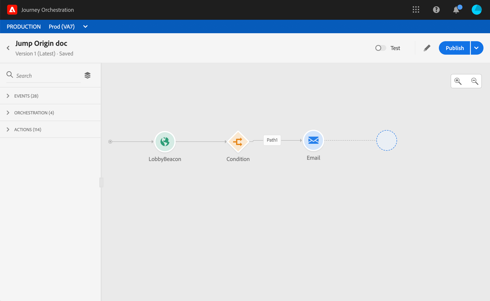
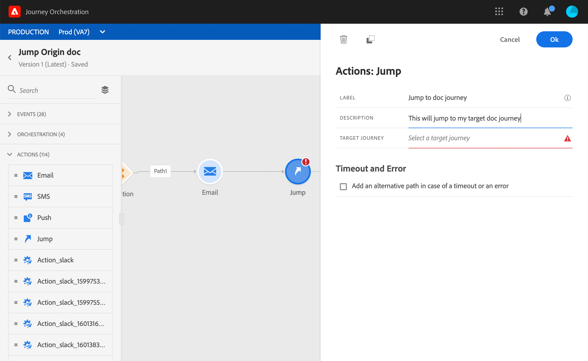

# Passaggio da un viaggio all&#39;altro {#jump}

>[!NOTE]
>
>Disponibilità effettiva: 15 novembre 2020

L’attività di azione **Jump** consente di spingere gli utenti da un viaggio all’altro. Questa funzione consente di:

* semplificare la progettazione di viaggi molto complessi suddividendoli in più
* costruire percorsi basati su percorsi comuni e riutilizzabili

Nel viaggio di origine, aggiungete semplicemente un **Jump** e selezionate un percorso di destinazione. Quando l&#39;individuo entra nel passaggio di salto, un evento interno viene inviato al primo evento del percorso di destinazione. Se l&#39;azione di salto ha successo, l&#39;individuo continua a progredire nel viaggio. Il comportamento è simile ad altre azioni.

Nel viaggio di destinazione, il primo evento attivato internamente dal salto farà scorrere il singolo viaggio.

## Ciclo

Supponiamo che tu abbia aggiunto un salto in un viaggio A a un viaggio B. Il viaggio A è il viaggio **di** origine e il percorso **B, il viaggio**didestinazione.
Di seguito sono riportati i diversi passaggi del processo di esecuzione:

**Il percorso A** viene attivato da un evento esterno:

1. Percorso A riceve un evento esterno relativo a un individuo.
1. L&#39;individuo raggiunge il passo di salto.
1. L&#39;individuo viene spinto al viaggio B, e passa ai passi successivi nel viaggio A, dopo il salto.

Nel **viaggio B**, il primo evento può essere attivato esternamente (come un evento regolare) o internamente, tramite un salto dal viaggio A:

1. Il viaggio B ha ricevuto un evento interno dal viaggio A.
1. Il primo evento del viaggio B viene attivato con le informazioni provenienti dal viaggio A.
1. Il singolo inizia a scorrere nel viaggio B.

## Note importanti

* È possibile passare a un percorso che utilizza lo stesso spazio nomi del percorso di origine.
* Non puoi passare a un percorso che inizia con un evento di qualifica **** Segmento.
* Quando il lancio viene eseguito, viene attivata l&#39;ultima versione del percorso di destinazione.
* In un viaggio potete includere tutti i salti necessari. Dopo un salto, potete aggiungere qualsiasi attività necessaria.
* Puoi avere tutti i livelli di salto necessari. Ad esempio, il viaggio A passa al viaggio B, che porta al viaggio C, e così via.
* Il percorso di destinazione può includere anche tutti i salti necessari.
* I pattern di loop non sono supportati. Non c&#39;è modo di collegare due o più viaggi insieme che creerebbero un ciclo infinito. La schermata di configurazione dell&#39;attività **Jump** vi impedisce di eseguire questa operazione.
* Come al solito, un individuo unico può essere presente solo una volta nello stesso viaggio. Di conseguenza, se l&#39;individuo spinto dal viaggio di origine è già nel viaggio di destinazione, l&#39;individuo non entrerà nel viaggio di destinazione. Nessun errore verrà segnalato durante il salto perché si tratta di un comportamento normale.

## Configurazione del collegamento

1. Progetta il tuo percorso di origine.

   

1. In qualsiasi fase del percorso, aggiungi un&#39;attività **Jump** dalla categoria **Azione** . Aggiungete un&#39;etichetta e una descrizione.

   

1. Fate clic all&#39;interno del campo del percorso **di** Target.
Nell&#39;elenco sono visualizzate tutte le versioni di viaggio in bozza, live o in modalità di prova. I percorsi che utilizzano uno spazio nomi diverso o che iniziano con un evento di qualificazione **** Segmento non sono disponibili. Vengono inoltre filtrati i viaggi di destinazione per creare un pattern di ciclo.

   

   >[!NOTE]
   >
   >Puoi fare clic sull’icona **Apri percorso** destinazione, a destra, per aprire il percorso di destinazione in una nuova scheda.

1. Selezionate il percorso di destinazione a cui desiderate passare.
Il campo **Primo evento** è precompilato con il nome del primo evento del percorso di destinazione. Se il percorso di destinazione include più eventi, il salto è consentito solo per il primo evento.

   

1. La sezione Parametri **** azione visualizza tutti i campi dell&#39;evento target. Allo stesso modo degli altri tipi di azioni, mappare ogni campo con campi dell&#39;evento di origine o dell&#39;origine dati. Queste informazioni verranno trasmesse al percorso di destinazione in fase di esecuzione.
1. Aggiungi le attività successive per completare il percorso di origine.

   

Il lancio è configurato. Non appena il tuo viaggio è live o in modalità di prova, gli individui che raggiungono il salto saranno spinti dal viaggio di destinazione.

Quando un salto viene configurato in un viaggio, all’inizio del percorso di destinazione viene automaticamente aggiunta un’icona di ingresso di salto. Questo consente di identificare che il viaggio può essere attivato esternamente ma anche internamente da un salto.

## Risoluzione dei problemi

Quando il viaggio viene pubblicato o in modalità di prova, si verificano degli errori se:
* il percorso di destinazione non esiste più
* il percorso di destinazione è stato sbloccato, chiuso o interrotto
* se il primo evento del percorso di destinazione è cambiato e la mappatura è interrotta
