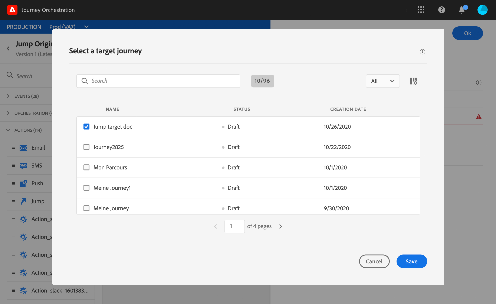

# Passaggio da un viaggio a un altro{#jump}

L&#39;attività di azione **[!UICONTROL Jump]** consente di spingere singoli utenti da un viaggio all&#39;altro. Questa funzione consente di:

* semplificare la progettazione di viaggi molto complessi suddividendoli in più
* costruire percorsi basati su percorsi comuni e riutilizzabili

Nel percorso di origine, aggiungete semplicemente un&#39;attività **[!UICONTROL Jump]** e selezionate un percorso target. Quando l&#39;individuo entra nel passaggio **[!UICONTROL Jump]**, un evento interno viene inviato al primo evento del percorso di destinazione. Se l&#39;azione **[!UICONTROL Jump]** ha esito positivo, l&#39;individuo continua a progredire nel percorso. Il comportamento è simile ad altre azioni.

Nel percorso target, il primo evento attivato internamente dall&#39;attività **[!UICONTROL Jump]** farà il singolo flusso nel percorso.

## Ciclo

Supponiamo che tu abbia aggiunto un&#39;attività **[!UICONTROL Jump]** in un viaggio A a un viaggio B. Il percorso A è il **percorso di origine** e il percorso B, il **percorso di destinazione**.
Di seguito sono riportati i diversi passaggi del processo di esecuzione:

**Journey** Ais attivato da un evento esterno:

1. Percorso A riceve un evento esterno relativo a un individuo.
1. L&#39;individuo raggiunge il passaggio **[!UICONTROL Jump]**.
1. L&#39;individuo viene spinto sul viaggio B e passa ai passi successivi del viaggio A, dopo il passaggio **[!UICONTROL Jump]**.

Nel viaggio B, il primo evento viene attivato internamente, attraverso l&#39;attività **[!UICONTROL Jump]** dal percorso A:

1. Il viaggio B ha ricevuto un evento interno dal viaggio A.
1. Il singolo inizia a scorrere nel viaggio B.

>[!NOTE]
>
>Il percorso B può essere attivato anche tramite un evento esterno.

## Best practice e limitazioni

### Authoring

* L&#39;attività **[!UICONTROL Jump]** è disponibile solo nei viaggi che utilizzano uno spazio dei nomi.
* È possibile passare a un percorso che utilizza lo stesso spazio nomi del percorso di origine.
* Non è possibile passare a un percorso che inizia con un evento **Qualificazione segmento**.
* Non è possibile avere un&#39;attività **[!UICONTROL Jump]** e un evento **Qualificazione segmento** nello stesso percorso.
* In un viaggio puoi includere tutte le attività **[!UICONTROL Jump]** necessarie. Dopo un **[!UICONTROL Jump]**, potete aggiungere qualsiasi attività necessaria.
* Puoi avere tutti i livelli di salto necessari. Ad esempio, il viaggio A passa al viaggio B, che porta al viaggio C, e così via.
* Il percorso di destinazione può includere anche tutte le **[!UICONTROL Jump]** attività necessarie.
* I pattern di loop non sono supportati. Non c&#39;è modo di collegare due o più viaggi insieme che creerebbero un ciclo infinito. La schermata di configurazione dell&#39;attività **[!UICONTROL Jump]** vi impedisce di eseguire questa operazione.

### Execution

* Quando l&#39;attività **[!UICONTROL Jump]** viene eseguita, viene attivata l&#39;ultima versione del percorso di destinazione.
* Come al solito, un individuo unico può essere presente solo una volta nello stesso viaggio. Di conseguenza, se l&#39;individuo spinto dal viaggio di origine è già nel viaggio di destinazione, l&#39;individuo non entrerà nel viaggio di destinazione. Nessun errore verrà segnalato nell&#39;attività **[!UICONTROL Jump]** perché si tratta di un comportamento normale.

## Configurazione dell&#39;attività Jump

1. Progettare il percorso di **origine**.

   

1. In qualsiasi fase del percorso, aggiungete un&#39;attività **[!UICONTROL Jump]** dalla categoria **[!UICONTROL ACTIONS]**. Aggiungete un&#39;etichetta e una descrizione.

   

1. Fare clic all&#39;interno del campo **Percorso di destinazione**.
Nell&#39;elenco sono visualizzate tutte le versioni di viaggio in bozza, live o in modalità di prova. I percorsi che utilizzano uno spazio nomi diverso o che iniziano con un evento **Qualificazione segmento** non sono disponibili. Vengono inoltre filtrati i viaggi di destinazione per creare un pattern di ciclo.

   

   >[!NOTE]
   >
   >Puoi fare clic sull&#39;icona **Apri percorso destinazione** a destra per aprire il percorso di destinazione in una nuova scheda.

1. Selezionate il percorso di destinazione a cui desiderate passare.
Il campo **Primo evento** è precompilato con il nome del primo evento del percorso di destinazione. Se il percorso di destinazione include più eventi, il percorso **[!UICONTROL Jump]** è consentito solo per il primo evento.

   

1. La sezione **Parametri azione** visualizza tutti i campi dell&#39;evento di destinazione. Allo stesso modo degli altri tipi di azioni, mappare ogni campo con campi dell&#39;evento di origine o dell&#39;origine dati. Queste informazioni verranno trasmesse al percorso di destinazione in fase di esecuzione.
1. Aggiungi le attività successive per completare il percorso di origine.

   

   >[!NOTE]
   >
   >L&#39;identità dell&#39;individuo viene mappata automaticamente. Queste informazioni non sono visibili nell&#39;interfaccia.

L&#39;attività **[!UICONTROL Jump]** è configurata. Non appena il tuo viaggio è live o in modalità di prova, gli individui che raggiungono il passo **[!UICONTROL Jump]** saranno spinti dal percorso di destinazione.

Quando un&#39;attività **[!UICONTROL Jump]** è configurata in un percorso, all&#39;inizio del percorso di destinazione viene automaticamente aggiunta un&#39;icona di ingresso **[!UICONTROL Jump]**. Questo consente di identificare che il percorso può essere attivato esternamente ma anche internamente da un&#39;attività **[!UICONTROL Jump]**.

## Risoluzione dei problemi

Quando il viaggio viene pubblicato o in modalità di prova, si verificano degli errori se:
* il percorso di destinazione non esiste più
* il percorso di destinazione è stato sbloccato, chiuso o interrotto
* se il primo evento del percorso di destinazione è cambiato e la mappatura è interrotta

