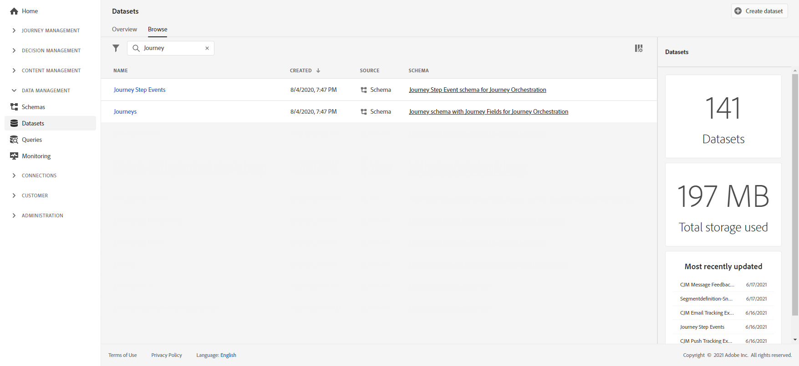

# Panoramica sulla condivisione delle fasi del percorso{#sharing-overview}

[!DNL Journey Orchestration] invia automaticamente i dati sulle prestazioni del percorso a Adobe Experience Platform in modo che possano essere combinati con altri dati a scopo di analisi.

>[!NOTE]
>
>Questa funzione è attivata per impostazione predefinita su tutte le istanze per gli eventi dei passaggi percorso. Per gli eventi delle fasi del profilo di percorso, l’attivazione avviene su richiesta. Gli schemi e i set di dati creati durante il provisioning per questa funzione non devono essere modificati.

Ad esempio, hai impostato un percorso che invia più e-mail. Questa funzionalità ti consente di combinare i dati [!DNL Journey Orchestration] con i dati evento a valle, come il numero di conversioni avvenute, il livello di coinvolgimento sul sito web o quante transazioni sono avvenute nello store. Le informazioni sul percorso possono essere combinate con i dati sul Adobe Experience Platform, provenienti da altre proprietà digitali o da proprietà offline per fornire una visione più completa delle prestazioni.

[!DNL Journey Orchestration] crea automaticamente gli schemi e i flussi necessari nei set di dati in Adobe Experience Platform per ogni passaggio effettuato da un singolo utente in un percorso. Un evento step corrisponde a un singolo spostamento da un nodo all&#39;altro in un percorso. Ad esempio, in un percorso con un evento, una condizione e un’azione, vengono inviati tre eventi di passaggio a Adobe Experience Platform.

L’elenco dei campi XDM passati è completo. Alcuni contengono codici generati dal sistema e altri hanno nomi descrittivi leggibili dall&#39;uomo. Gli esempi includono l’etichetta dell’attività del percorso o lo stato del passaggio: quante volte un&#39;azione è scaduta o terminata con un errore.

>[!CAUTION]
>
>Impossibile attivare i set di dati per il servizio di profilo in tempo reale. Assicurati che l&#39;interruttore **[!UICONTROL Profile]** sia disattivato.

I percorsi inviano i dati mentre si verificano, in modo streaming. È possibile eseguire query su questi dati utilizzando il servizio query. È possibile connettersi a strumenti di Customer Journey Analytics o altri strumenti BI per visualizzare i dati relativi a questi passaggi.

Vengono creati i seguenti schemi:

* Schema evento del profilo del passaggio del percorso per [!DNL Journey Orchestration]: eventi di esperienza per i passaggi effettuati in un Percorso insieme a una mappa di identità da utilizzare per la mappatura a un singolo partecipante al Percorso.
* Schema evento del passaggio del percorso per [!DNL Journey Orchestration] - evento del passaggio del Percorso associato a metadati del Percorso.
* Schema di percorso con campi Percorso per [!DNL Journey Orchestration] - Metadati Percorso per descrivere i Percorsi.

Vengono passati i seguenti set di dati:

* Schema evento del profilo del passaggio del percorso per [!DNL Journey Orchestration]
* Eventi percorso
* Percorsi

Gli elenchi dei campi XDM passati a Adobe Experience Platform sono descritti di seguito.

* [Campi comuni degli eventi journeySteps](../building-journeys/sharing-common-fields.md)
* [Campi di esecuzione dell’azione eventi journeyStep](../building-journeys/sharing-execution-fields.md)
* [Campi di recupero dati di eventi journeyStep](../building-journeys/sharing-fetch-fields.md)
* [Campi di identità dell’evento journeyStep](../building-journeys/sharing-identity-fields.md)
* [campi del percorso](../building-journeys/sharing-journey-fields.md)

Per ulteriori informazioni sugli eventi dei passaggi che inviano rapporti a Adobe Experience Platform, guarda questo [video tutorial](https://experienceleague.adobe.com/docs/journey-orchestration-learn/tutorials/reporting-step-events-to-adobe-experience-platform.html).
