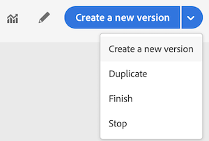

# Terminazione di un percorso

Le opzioni **[!UICONTROL Stop]** e **[!UICONTROL Close to new entrances]** consentono di terminare i viaggi **live** . La chiusura di un viaggio implica **che l&#39;arrivo di nuovi clienti nel viaggio è bloccato** e che i clienti che hanno già effettuato il viaggio possono sperimentarlo fino alla fine. Questo è il modo più consigliato per porre fine a un percorso che offre la migliore esperienza ai clienti. Fermare un viaggio implica che le persone già entrate in viaggio vengono tutte fermate nel loro cammino. Il viaggio è fondamentalmente spento.

>[!NOTE]
>
>Non è possibile riprendere un viaggio chiuso o interrotto.

## Chiusura di un viaggio

Potete chiudere manualmente un viaggio per garantire che i clienti che sono già entrati nel percorso possano completare il percorso ma che i nuovi utenti non siano in grado di entrarvi.

Non è possibile riavviare o eliminare una versione di viaggio chiusa. Potete crearne una nuova versione o duplicarla.

Per chiudere un viaggio, fai clic **[!UICONTROL Close to new entrances]** mentre passi il cursore su un viaggio nell’elenco dei viaggi.

Puoi inoltre:

1. In **[!UICONTROL Home]**, fare clic sul viaggio che si desidera chiudere.
1. In alto a destra, fate clic sulla freccia giù.

   

1. Fai clic su **[!UICONTROL Close to new entrances]**. Viene visualizzata una finestra di dialogo.
1. Fate clic **[!UICONTROL Close to new entrances]** per confermare.

## Interruzione di un viaggio

Puoi interrompere un viaggio quando si è verificata un&#39;emergenza e tutte le operazioni di elaborazione devono essere terminate immediatamente durante un viaggio.

Impossibile riavviare una versione di viaggio interrotta.

Puoi interrompere un viaggio (ad esempio, se un esperto di marketing si rende conto che il viaggio si rivolge a un pubblico sbagliato o che un&#39;azione personalizzata che dovrebbe inviare i messaggi non funziona correttamente...) facendo clic **[!UICONTROL Stop]** mentre passi il cursore su un viaggio nell&#39;elenco dei viaggi.

Puoi inoltre:

1. In **[!UICONTROL Home]**, clicca sul viaggio che vuoi fermare.
1. In alto a destra, fate clic sulla freccia giù.

1. Fai clic su **[!UICONTROL Stop]**. Viene visualizzata una finestra di dialogo.
1. Fate clic **[!UICONTROL Stop]** per confermare.
