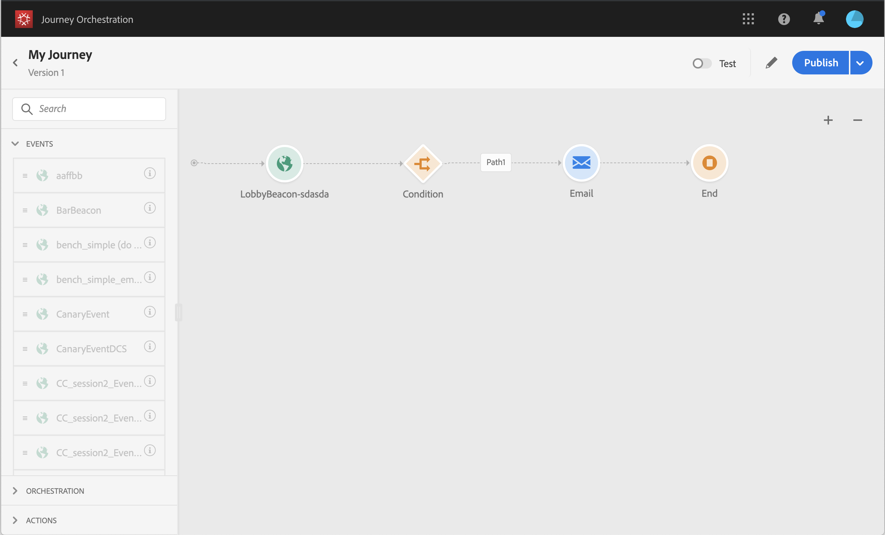
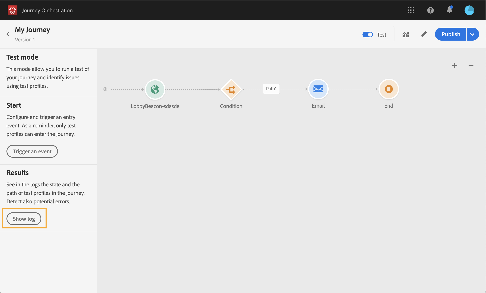

# Verifica del percorso{#testing_the_journey}

Prima di poter verificare il percorso, devi risolvere tutti gli errori, se ce ne sono. Vedi [questa sezione](../about/troubleshooting.md#section_h3q_kqk_fhb).

Potete provare il viaggio prima della pubblicazione utilizzando i profili di test. Questo consente di analizzare il flusso di individui nel percorso e di risolvere eventuali problemi prima della pubblicazione.

Per utilizzare la modalità di prova, effettuate le seguenti operazioni:

1. Prima di verificare il percorso, verifica che sia valido e che non si verifichi alcun errore. Non potrai avviare un test di un viaggio con errori. Vedi [questa sezione](../about/troubleshooting.md#section_h3q_kqk_fhb). In caso di errori, viene visualizzato un simbolo di avviso.

1. Per attivare la modalità di prova, fate clic sull’ **[!UICONTROL Test]** interruttore, situato nell’angolo in alto a destra.

   

1. Utilizzate il **[!UICONTROL Wait time in test]** parametro, nell&#39;angolo in basso a sinistra, per definire l&#39;ora in cui ciascuna attività di attesa durerà in modalità di prova. Il tempo predefinito è di 10 secondi. In questo modo sarà possibile ottenere rapidamente i risultati del test. Questo parametro viene visualizzato solo se avete abbandonato una o più attività di attesa nel viaggio.

   

1. Fate clic **[!UICONTROL Trigger an event]** per configurare e inviare gli eventi al percorso. Assicuratevi di inviare gli eventi relativi ai profili di test. Consultate [Attivazione degli eventi](#firing_events).

   

1. Dopo la ricezione degli eventi, fate clic sul **[!UICONTROL Show log]** pulsante per visualizzare il risultato del test e verificarlo. Consultate [Visualizzazione dei registri](#viewing_logs).

   

1. In caso di errori, disattiva la modalità di test, modifica il percorso e verificalo di nuovo. Quando il test è conclusivo, potete pubblicare il viaggio. Consulta [questa pagina](../building-journeys/publishing-the-journey.md).

## Note importanti {#important_notes}

* Viene fornita un&#39;interfaccia per attivare gli eventi per il percorso testato, ma gli eventi possono essere inviati anche da sistemi di terze parti come Postman.
* Solo gli individui contrassegnati come &quot;profili di prova&quot; nel servizio di profilo cliente in tempo reale potranno entrare nel percorso testato. Vedi [questa sezione](../building-journeys/testing-the-journey.md#create-test-profile).
* La modalità test è disponibile solo nelle bozze di viaggio che utilizzano uno spazio dei nomi. La modalità di prova deve verificare se una persona che accede al viaggio è un profilo di prova o meno e deve quindi essere in grado di raggiungere l’Adobe Experience Platform.
* Il numero massimo di profili di test che possono entrare in un percorso durante una sessione di test è 100.
* Quando disattivate la modalità di prova, i viaggi vengono svuotati da tutte le persone che sono entrate nel passato o che vi si trovano attualmente. Inoltre, la relazione è stata cancellata.
* Potete attivare/disattivare la modalità di prova il numero di volte necessario.
* Non è possibile modificare il percorso quando viene attivata la modalità di prova. In modalità di prova, potete pubblicare direttamente il percorso, senza dover disattivare la modalità di prova prima.

## Creating a test profile{#create-test-profile}

La procedura per creare un profilo di test è la stessa utilizzata per creare un profilo in Adobe Experience Platform. Viene eseguito tramite chiamate API. See this [page](https://docs.adobe.com/content/help/it-IT/experience-platform/profile/home.html)

È necessario utilizzare uno schema di profilo che contenga il mixin &quot;profili test details&quot;. Il flag testProfile fa parte di questo mixin.

Quando create un profilo, accertatevi di trasmettere il valore: testprofile = true.

È inoltre possibile aggiornare un profilo esistente per modificare il flag testProfile in &quot;true&quot;.

Di seguito è riportato un esempio di chiamata API per creare un profilo di test:

```
curl -X POST \
'https://dcs.adobedc.net/collection/xxxxxxxxxxxxxx' \
-H 'Cache-Control: no-cache' \
-H 'Content-Type: application/json' \
-H 'Postman-Token: xxxxx' \
-H 'cache-control: no-cache' \
-H 'x-api-key: xxxxx' \
-H 'x-gw-ims-org-id: xxxxx' \
-d '{
"header": {
"msgType": "xdmEntityCreate",
"msgId": "xxxxx",
"msgVersion": "xxxxx",
"xactionid":"xxxxx",
"datasetId": "xxxxx",
"imsOrgId": "xxxxx",
"source": {
"name": "Postman"
},
"schemaRef": {
"id": "https://example.adobe.com/mobile/schemas/xxxxx",
"contentType": "application/vnd.adobe.xed-full+json;version=1"
}
},
"body": {
"xdmMeta": {
"schemaRef": {
"contentType": "application/vnd.adobe.xed-full+json;version=1"
}
},
"xdmEntity": {
"_id": "xxxxx",
"_mobile":{
"ECID": "xxxxx"
},
"testProfile":true
}
}
}'
```

## Configurazione degli eventi {#firing_events}

Il **[!UICONTROL Trigger an event]** pulsante consente di configurare un evento che farà entrare una persona nel percorso.

>[!NOTE]
>
>Quando si attiva un evento in modalità di prova, viene generato un evento reale, il che significa che toccherà anche gli altri percorsi in ascolto di questo evento.

Come prerequisito, è necessario sapere quali profili vengono contrassegnati come profili di test in Adobe Experience Platform. In effetti, la modalità di prova consente solo questi profili nel percorso e l&#39;evento deve contenere un ID. L’ID previsto dipende dalla configurazione dell’evento. Ad esempio, può essere un ECID.

Se il viaggio contiene diversi eventi, utilizzate l&#39;elenco a discesa per selezionare un evento. Quindi, per ogni evento, configurate i campi passati e l’esecuzione dell’invio dell’evento. L&#39;interfaccia consente di trasmettere le informazioni corrette nel payload dell&#39;evento e verificare che il tipo di informazioni sia corretto. La modalità di prova salva gli ultimi parametri utilizzati in una sessione di prova per un uso successivo.


L&#39;interfaccia consente di passare semplici parametri di evento. Se si desidera trasmettere raccolte o altri oggetti avanzati nell&#39;evento, è possibile fare clic su per visualizzare **[!UICONTROL Code View]** l&#39;intero codice del payload e modificarlo. Ad esempio, potete copiare e incollare le informazioni sull&#39;evento preparate da un utente tecnico.


Un utente tecnico può anche utilizzare questa interfaccia per comporre i payload di eventi e attivare gli eventi senza dover utilizzare uno strumento di terze parti.

Quando si fa clic sul **[!UICONTROL Send]** pulsante, inizia il test. La progressione dell&#39;individuo nel viaggio è rappresentata da un flusso visivo. Il percorso diventa progressivamente verde mentre l&#39;individuo si sposta lungo il percorso. Se si verifica un errore, nel passaggio corrispondente viene visualizzato un simbolo di avviso. È possibile posizionare il cursore su di esso per visualizzare ulteriori informazioni sull&#39;errore e accedere ai dettagli completi (se disponibili).


Quando selezionate un profilo di test diverso nella schermata di configurazione dell&#39;evento ed eseguite nuovamente il test, il flusso visivo viene cancellato e mostra il percorso del nuovo individuo.

Quando si apre un viaggio nel test, il percorso visualizzato corrisponde all&#39;ultimo test eseguito.

Il flusso visivo funziona sia che l&#39;evento venga attivato tramite l&#39;interfaccia, sia che venga attivato esternamente (utilizzando, ad esempio, Postman).

## Modalità di prova per i viaggi basati su regole {#test-rule-based}

La modalità di prova è disponibile anche per i viaggi che utilizzano un evento basato su regole. For more information on rule-based events, refer to [this page](../event/about-events.md).

Quando si attiva un evento, la schermata di configurazione **dell&#39;** evento consente di definire i parametri dell&#39;evento da trasmettere nel test. Per visualizzare la condizione ID evento, fate clic sull&#39;icona della descrizione comando nell&#39;angolo superiore destro. Accanto a ciascun campo che fa parte della valutazione delle regole è disponibile una descrizione comandi.


Per ulteriori informazioni su come utilizzare la modalità di prova, consultate [questa pagina](../building-journeys/testing-the-journey.md).

## Visualizzazione dei registri {#viewing_logs}

Il **[!UICONTROL Show log]** pulsante consente di visualizzare i risultati del test. In questa pagina vengono visualizzate le informazioni correnti del viaggio in formato JSON. Un pulsante consente di copiare nodi interi. Devi aggiornare manualmente la pagina per aggiornare i risultati del test del viaggio.


>[!NOTE]
>
>Nei registri di test, in caso di errore durante la chiamata a un sistema di terze parti (origine dati o azione), vengono visualizzati il codice di errore e la risposta di errore.

Viene visualizzato il numero di individui (tecnicamente chiamati istanze) attualmente presenti nel percorso. Seguono alcune informazioni utili che vengono visualizzate per ogni singolo utente:

* _Id_: l’ID interno dell’utente durante il viaggio. Può essere utilizzato a scopo di debug.
* _currentstep_: il passo in cui si trova l&#39;individuo nel viaggio. È consigliabile aggiungere etichette alle attività per identificarle più facilmente.
* _currentstep_ > step: lo stato del viaggio (in esecuzione, completato, errore o scaduto). Per ulteriori informazioni, vedi sotto.
* _currentstep_ > _extraInfo_: descrizione dell’errore e di altre informazioni contestuali.
* _currentstep_ > _fetchErrors_: informazioni sugli errori di recupero dei dati che si sono verificati durante questo passaggio.
* _externalKeys_: il valore della formula chiave definita nell&#39;evento.
* _data_ arricchita: i dati recuperati nel caso in cui il viaggio utilizzi origini dati.
* _TransitionHistory_: l&#39;elenco dei passaggi seguiti dall&#39;utente. Per gli eventi, viene visualizzato il payload.
* _actionExecutionErrors_ : informazioni sugli errori verificatisi.

Di seguito sono riportati i diversi stati del viaggio di un individuo:

* _In esecuzione_: l&#39;individuo è attualmente in viaggio.
* _Completato_: l&#39;individuo è alla fine del viaggio.
* _Errore_: l&#39;individuo viene fermato durante il viaggio a causa di un errore.
* _Timeout_: l&#39;individuo viene fermato nel viaggio per un passo che ha richiesto troppo tempo.

Quando un evento viene attivato utilizzando la modalità di prova, un dataset viene generato automaticamente con il nome dell&#39;origine.

Quando un evento viene attivato utilizzando la modalità di prova, un dataset viene generato automaticamente con il nome dell&#39;origine.

La modalità test crea automaticamente un evento esperienza e lo invia ad Adobe Experience Platform. Il nome dell&#39;origine di questo evento esperienza è &quot;Eventi test Journey Orchestration&quot;.

In caso di eventi multipli attivati da viaggi multipli

Esiste uno scenario in cui si verificano più eventi inviati da viaggi multipli che avranno schemi diversi. Lo schema può mappare a 1 dataset? In caso contrario, saranno necessari più insiemi di dati.

La creazione e la denominazione automatica di questi set di dati viene eseguita se un set di dati di destinazione non è incluso nell&#39;evento esperienza. Ecco perché oggi vediamo il &quot;dataset creato automaticamente per voyager&quot;.

La denominazione della nostra fonte determina la creazione automatica. Se abbiamo più eventi, dovremmo concatenarli e farli diventare &quot;Journey Orchestration Test Event - NAME OF SCHEMA&quot;. Viene automaticamente impostato su &quot;Set di dati generato automaticamente per Journey Orchestration evento di test - NAME OF SCHEMA&quot;.

