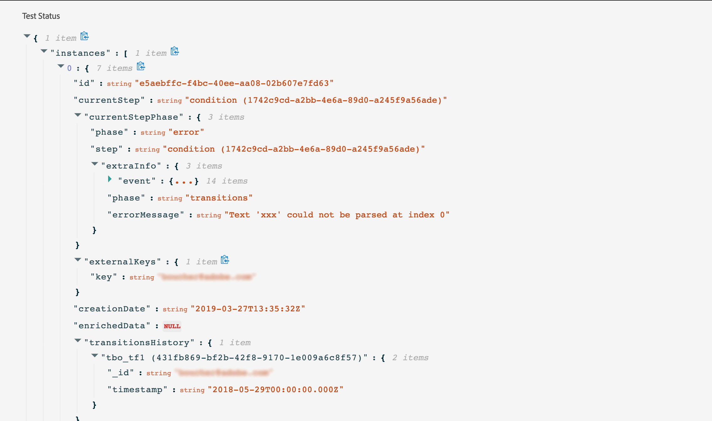

# Verifica del percorso{#testing_the_journey}

Prima di poter testare il percorso, è necessario risolvere tutti gli eventuali errori. Vedi [questa sezione](../about/troubleshooting.md#section_h3q_kqk_fhb).

Puoi testare il percorso prima della pubblicazione utilizzando i profili di test. Questo consente di analizzare il flusso di singoli utenti nel percorso e di risolvere eventuali problemi prima della pubblicazione.

Solo i profili di test possono accedere a un percorso in modalità di test. Puoi [creare un nuovo profilo di test](../building-journeys/testing-the-journey.md#create-test-profile) o [trasformare un profilo esistente in un profilo di test](../building-journeys/testing-the-journey.md#turning-profile-into-test).

Per utilizzare la modalità di test, effettua le seguenti operazioni:

1. Prima di testare il percorso, verifica che sia valido e che non vi siano errori. Non potrai avviare un test di un percorso con errori. Vedi [questa sezione](../about/troubleshooting.md#section_h3q_kqk_fhb). In caso di errori, viene visualizzato un simbolo di avviso.

1. Per attivare la modalità di test, fai clic sull’interruttore **[!UICONTROL Test]** situato nell’angolo in alto a destra.

   

1. Utilizza il parametro **[!UICONTROL Wait time in test]** nell’angolo in basso a sinistra per definire l’ora in cui durerà ogni attività di attesa in modalità di test. Il tempo predefinito è di 10 secondi. In questo modo sarà possibile ottenere rapidamente i risultati del test. Questo parametro viene visualizzato solo se hai eliminato una o più attività di attesa nel percorso.

   

1. Fai clic su **[!UICONTROL Trigger an event]** per configurare e inviare eventi al percorso. Assicurati di inviare eventi relativi ai profili di test. Consulta [Attivazione degli eventi](#firing_events).

   

1. Dopo aver ricevuto gli eventi, fai clic sul pulsante **[!UICONTROL Show log]** per visualizzare il risultato del test e verificarlo. Consulta [Visualizzazione dei log](#viewing_logs).

   

1. In caso di errori, disattiva la modalità di test, modifica il percorso e verificalo di nuovo. Quando il test è conclusivo, puoi pubblicare il percorso. Consulta [questa pagina](../building-journeys/publishing-the-journey.md).

## Note importanti {#important_notes}

* Viene fornita un’interfaccia per attivare gli eventi al percorso testato, ma gli eventi possono essere inviati anche da sistemi di terze parti come Postman.
* Solo i singoli utenti contrassegnati come &quot;profili di test&quot; nel servizio Profilo cliente in tempo reale potranno accedere al percorso testato. Vedi [questa sezione](../building-journeys/testing-the-journey.md#create-test-profile).
* La modalità di test è disponibile solo nelle bozze di percorso che utilizzano uno spazio dei nomi. La modalità di test deve verificare se una persona che accede al percorso è un profilo di test o meno e deve quindi essere in grado di raggiungere il Adobe Experience Platform.
* Il numero massimo di profili di test che possono entrare in un percorso durante una sessione di test è 100.
* Quando disattivi la modalità di test, svuota i percorsi da tutte le persone che le hanno inserite in passato o che vi si trovano attualmente. Inoltre, cancella la segnalazione.
* Puoi attivare/disattivare la modalità di test il numero di volte necessario.
* Non puoi modificare il percorso quando viene attivata la modalità di test. In modalità di test, puoi pubblicare direttamente il percorso, senza dover disattivare la modalità di test in precedenza.

## Trasformazione di un profilo in un profilo di test{#turning-profile-into-test}

Puoi trasformare un profilo esistente in un profilo di test. In Adobe Experience Platform puoi aggiornare gli attributi dei profili tramite chiamate API, ma non tramite l’interfaccia.

Il modo più semplice per farlo è utilizzare un&#39;attività di azione **Aggiorna profilo** e cambiare il campo booleano del profilo di test da false a true. Vedi [questa sezione](../building-journeys/update-profiles.md#using-the-test-mode).

## Creazione di un profilo di test{#create-test-profile}

Se desideri creare un nuovo profilo di test, la procedura è la stessa di quando crei un profilo in Adobe Experience Platform. Viene eseguito tramite chiamate API. Vedere questa [pagina](https://docs.adobe.com/content/help/it-IT/experience-platform/profile/home.html)

Devi utilizzare uno schema di profilo contenente il mixin &quot;profile test details&quot; (Dettagli test profilo). Il flag testProfile fa parte di questo mixin.

Quando crei un profilo, accertati di trasmettere il valore: testProfile = true.

Tieni presente che puoi anche aggiornare un profilo esistente per modificare il relativo flag testProfile in &quot;true&quot;.

Ecco un esempio di chiamata API per creare un profilo di test:

```
curl -X POST \
'https://dcs.adobedc.net/collection/xxxxxxxxxxxxxx' \
-H 'Cache-Control: no-cache' \
-H 'Content-Type: application/json' \
-H 'Postman-Token: xxxxx' \
-H 'cache-control: no-cache' \
-H 'x-api-key: xxxxx' \
-H 'x-gw-ims-org-id: xxxxx' \
-d '{
"header": {
"msgType": "xdmEntityCreate",
"msgId": "xxxxx",
"msgVersion": "xxxxx",
"xactionid":"xxxxx",
"datasetId": "xxxxx",
"imsOrgId": "xxxxx",
"source": {
"name": "Postman"
},
"schemaRef": {
"id": "https://example.adobe.com/mobile/schemas/xxxxx",
"contentType": "application/vnd.adobe.xed-full+json;version=1"
}
},
"body": {
"xdmMeta": {
"schemaRef": {
"contentType": "application/vnd.adobe.xed-full+json;version=1"
}
},
"xdmEntity": {
"_id": "xxxxx",
"_mobile":{
"ECID": "xxxxx"
},
"testProfile":true
}
}
}'
```

## Attivazione degli eventi {#firing_events}

Il pulsante **[!UICONTROL Trigger an event]** ti consente di configurare un evento che farà sì che una persona entri nel percorso.

>[!NOTE]
>
>Quando attivi un evento in modalità di test, viene generato un evento reale, il che significa che si verifica anche per altri percorsi che ascoltano questo evento.

Come prerequisito, devi sapere quali profili vengono contrassegnati come profili di test in Adobe Experience Platform. In effetti, la modalità di test consente solo questi profili nel percorso e l’evento deve contenere un ID. L’ID previsto dipende dalla configurazione dell’evento. Ad esempio, può essere un ECID.

Se il percorso contiene diversi eventi, utilizza l’elenco a discesa per selezionare un evento. Quindi, per ogni evento, configura i campi passati e l’esecuzione dell’invio dell’evento. L’interfaccia ti aiuta a trasmettere le informazioni corrette nel payload dell’evento e ad assicurarti che il tipo di informazioni sia corretto. La modalità di test salva gli ultimi parametri utilizzati in una sessione di test per un utilizzo successivo.


L’interfaccia ti consente di trasmettere parametri di eventi semplici. Se desideri passare raccolte o altri oggetti avanzati nell’evento, puoi fare clic su **[!UICONTROL Code View]** per visualizzare l’intero codice del payload e modificarlo. Ad esempio, puoi copiare e incollare le informazioni sull’evento preparate da un utente tecnico.


Un utente tecnico può inoltre utilizzare questa interfaccia per comporre payload di eventi e attivare eventi senza dover utilizzare uno strumento di terze parti.

Quando si fa clic sul pulsante **[!UICONTROL Send]**, il test inizia. La progressione dell’individuo nel percorso è rappresentata da un flusso visivo. Il percorso diventa progressivamente verde mentre l’individuo si muove attraverso il percorso. Se si verifica un errore, nel passaggio corrispondente viene visualizzato un simbolo di avviso. È possibile posizionare il cursore su di esso per visualizzare ulteriori informazioni sull&#39;errore e accedere a tutti i dettagli (se disponibili).


Quando selezioni un profilo di test diverso nella schermata di configurazione dell’evento ed esegui nuovamente il test, il flusso visivo viene cancellato e mostra il percorso del nuovo individuo.

Quando si apre un percorso in un test, il percorso visualizzato corrisponde all’ultimo test eseguito.

Il flusso visivo funziona se l’evento viene attivato tramite l’interfaccia o esternamente (ad esempio utilizzando Postman).

## Modalità di test per i percorsi basati su regole {#test-rule-based}

La modalità di test è disponibile anche per i percorsi che utilizzano un evento basato su regole. Per ulteriori informazioni sugli eventi basati su regole, consulta [questa pagina](../event/about-events.md).

Quando si attiva un evento, la schermata **Event configuration** ti consente di definire i parametri dell’evento da trasmettere nel test. Per visualizzare la condizione dell’ID evento, fai clic sull’icona della descrizione comando nell’angolo in alto a destra. È disponibile anche una descrizione comandi accanto a ciascun campo che fa parte della valutazione delle regole.


Per ulteriori informazioni su come utilizzare la modalità di test, consulta [questa pagina](../building-journeys/testing-the-journey.md).

## Visualizzazione dei registri {#viewing_logs}

Il pulsante **[!UICONTROL Show log]** ti consente di visualizzare i risultati del test. In questa pagina vengono visualizzate le informazioni correnti del percorso in formato JSON. Un pulsante consente di copiare interi nodi. Devi aggiornare manualmente la pagina per aggiornare i risultati del test del percorso.



>[!NOTE]
>
>Nei registri di test, in caso di errore durante la chiamata a un sistema di terze parti (origine dati o azione), vengono visualizzati il codice di errore e la risposta di errore.

Viene visualizzato il numero di persone (tecnicamente sono denominate istanze) attualmente all’interno del percorso. Seguono alcune utili informazioni visualizzate per ogni singolo utente:

* _Id_: l’ID interno della persona nel percorso. Può essere utilizzato a scopo di debug.
* _currentstep_: il passo in cui si trova l’individuo nel percorso. È consigliabile aggiungere etichette alle attività per identificarle più facilmente.
* _currentstep_ > fase: lo stato del percorso dell’utente (in esecuzione, completato, errore o timeout). Per ulteriori informazioni, consulta di seguito.
* _currentstep_ >  _extraInfo_: descrizione dell’errore e di altre informazioni contestuali.
* _currentstep_ >  _fetchErrors_: informazioni sugli errori di recupero dati che si sono verificati durante questo passaggio.
* _externalKeys_: il valore della formula chiave definita nell&#39;evento.
* _dati_ arricchiti: i dati recuperati nel caso in cui il percorso utilizzi origini dati.
* _TransitionHistory_: l’elenco dei passaggi seguiti dall’utente. Per gli eventi, viene visualizzato il payload.
* _actionExecutionErrors_ : informazioni sugli errori verificatisi.

Di seguito sono riportati i diversi stati del percorso di un individuo:

* _In esecuzione_: l’utente è attualmente in viaggio.
* _Completato_: l&#39;individuo è alla fine del viaggio.
* _Errore_: l’utente viene arrestato nel percorso a causa di un errore.
* _Timeout_: l’individuo viene fermato nel percorso a causa di un passaggio che richiedeva troppo tempo.

Quando un evento viene attivato utilizzando la modalità di test, un set di dati viene generato automaticamente con il nome dell’origine.

Quando un evento viene attivato utilizzando la modalità di test, un set di dati viene generato automaticamente con il nome dell’origine.

La modalità di test crea automaticamente un evento esperienza e lo invia a Adobe Experience Platform. Il nome dell&#39;origine di questo evento esperienza è &quot;Eventi test Journey Orchestration&quot;.

Nel caso di più eventi attivati da più percorsi

Esiste uno scenario in cui ci sono più eventi inviati da più percorsi che avranno schemi diversi. Lo schema può essere mappato su 1 set di dati? In caso contrario, saranno necessari più set di dati.

La creazione e la denominazione automatica di questi set di dati viene eseguita se un set di dati di destinazione non è incluso nell’evento di esperienza. Ecco perché oggi vediamo il &quot;dataset creato automaticamente per voyager&quot;.

La denominazione della nostra sorgente determina la creazione automatica. Se abbiamo più eventi, dovremmo concatenarli e farli diventare &quot;Evento di test Journey Orchestration - NOME DELLO SCHEMA&quot;. Viene automaticamente impostato su &quot;Set di dati generato automaticamente per evento di test Journey Orchestration - NAME OF SCHEMA&quot;.

