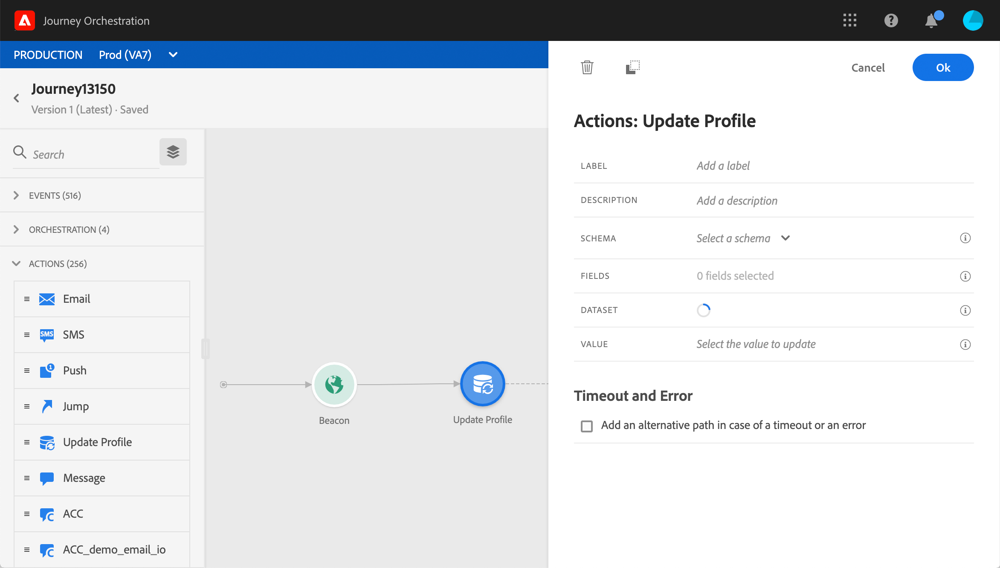

# Aggiorna profilo {#update-profile}

Il **[!UICONTROL Update profile]** attività azione consente di aggiornare un profilo Adobe Experience Platform esistente con informazioni provenienti dall’evento, da un’origine dati o utilizzando un valore specifico.

## Note importanti

* Il **Aggiorna profilo** può essere utilizzata solo nei percorsi che iniziano con un evento che ha uno spazio dei nomi.
* L’azione aggiorna solo i campi esistenti, non crea nuovi campi profilo.
* Non è possibile utilizzare **Aggiorna profilo** azione per generare eventi di esperienza, ad esempio un acquisto.
* Proprio come qualsiasi altra azione, puoi definire un percorso alternativo in caso di errore o timeout e non puoi inserire due azioni in parallelo.
* La richiesta di aggiornamento inviata a Platform sarà veloce ma non immediata/entro un secondo. Ci vorrà normalmente qualche secondo, ma a volte di più senza alcuna garanzia. Di conseguenza, ad esempio, se un’azione utilizza &quot;campo 1&quot; aggiornato da un’azione Aggiorna profilo posizionata in precedenza, non è previsto che &quot;campo 1&quot; venga aggiornato nell’azione.
* In modalità di test, l’aggiornamento del profilo non verrà simulato. L’aggiornamento verrà eseguito sul profilo di test.
* Il **Aggiorna profilo** L’attività non supporta i campi XDM definiti come enumerazione.

## Utilizzo dell’aggiornamento del profilo

1. Progetta il percorso iniziando con un evento. Consulta questa [sezione](../building-journeys/journey.md).

1. In **Azione** nella palette, rilascia la sezione **Aggiorna profilo** attività nell’area di lavoro.

   

1. Seleziona uno schema dall’elenco.

1. Fai clic su **Campi** per selezionare il campo da aggiornare. È possibile selezionare un solo campo.

   

1. Seleziona un set di dati dall’elenco.

   >[!NOTE]
   >
   >Il **Aggiorna profilo** azione aggiorna i dati del profilo in tempo reale, ma non i set di dati. La selezione del set di dati è necessaria in quanto il profilo è un record correlato a un set di dati.

1. Fai clic sul pulsante **Valore** per definire il valore da utilizzare:

   * Utilizzando l’editor di espressioni semplici, puoi selezionare un campo da un’origine dati o dall’evento in ingresso.

     

   * Se desideri definire un valore specifico o sfruttare funzioni avanzate, fai clic su **Modalità avanzata**.

     

Il **Aggiorna profilo** è ora configurato.

