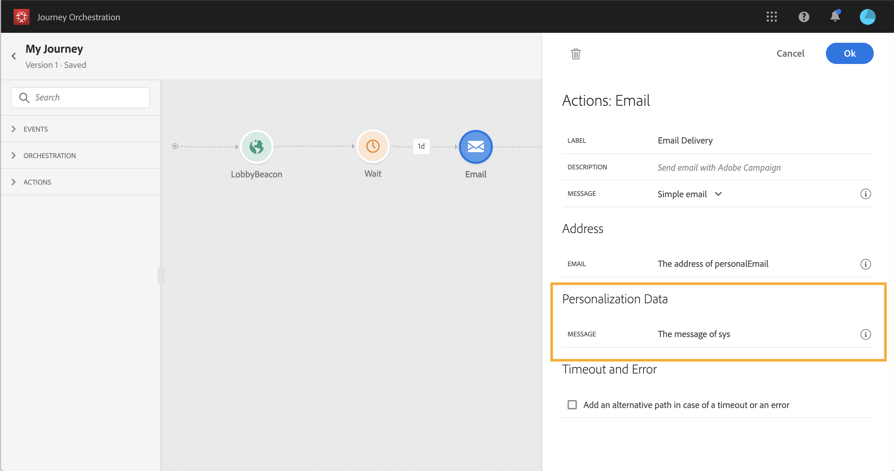

# Utilizzo delle azioni di Adobe Campaign {#using_campaign_action}

Se avete  Adobe Campaign Standard, sono disponibili le seguenti attività di azione out-of-the-box: **[!UICONTROL Email]**, **[!UICONTROL Push]** e **[!UICONTROL SMS]**.

>[!NOTE]
>
>A tal fine, è necessario configurare l&#39;azione integrata. Fai riferimento a [](../action/working-with-adobe-campaign.md).

Per ciascuno di questi canali, è possibile selezionare un **modello** Adobe Campaign Standard di messaggi transazionali. In effetti, non [!DNL Journey Orchestration] è una soluzione che invia messaggi. Per i canali e-mail, SMS e push incorporati, ci affidiamo ai messaggi transazionali per eseguire l&#39;invio dei messaggi. Se desiderate utilizzare un determinato modello di messaggio nei vostri viaggi, dovete pubblicarlo in  Adobe Campaign Standard. Per informazioni sull’utilizzo di questa funzione, fare riferimento a questa [pagina](https://docs.adobe.com/content/help/it-IT/campaign-standard/using/communication-channels/transactional-messaging/about-transactional-messaging.translate.html) .


Potete utilizzare un evento (noto anche come in tempo reale) o un modello di messaggi transazionali di profilo.

>[!NOTE]
>
>Quando inviamo messaggi transazionali in tempo reale (rtEvent) o quando inviamo messaggi con un sistema di terze parti grazie a un&#39;azione personalizzata, è necessaria una configurazione specifica per la gestione dell&#39;affaticamento, dell&#39;elenco dei blocchi o dell&#39;annullamento dell&#39;iscrizione. Ad esempio, se un attributo &quot;unsubscription&quot; è memorizzato nell&#39;Platform o in un sistema di terze parti, prima dell&#39;invio del messaggio per verificare questa condizione sarà necessario aggiungere una condizione.

Quando selezionate un modello, tutti i campi previsti nel payload di messaggi vengono visualizzati nel riquadro di configurazione dell&#39;attività in **[!UICONTROL Address]** e **[!UICONTROL Personalization Data]**. È necessario mappare ciascuno di questi campi con il campo che si desidera utilizzare, sia dall&#39;evento che dall&#39;origine dati. È inoltre possibile utilizzare l&#39;editor di espressioni avanzate per trasmettere manualmente un valore, per eseguire la manipolazione dei dati sulle informazioni recuperate (ad esempio, convertire una stringa in caratteri maiuscoli) o per utilizzare funzioni come &quot;if, then, else&quot;. A questo proposito, consulta la sezione [](../expression/expressionadvanced.md).


## E-mail e SMS {#section_asc_51g_nhb}

Per **[!UICONTROL Email]** e **[!UICONTROL SMS]**, i parametri sono identici.

>[!NOTE]
>
>Per le e-mail, se utilizzate un modello transazionale per i profili, il meccanismo di annullamento dell’iscrizione viene gestito out-of-the-box da Campaign Standard. È sufficiente aggiungere un blocco di **[!UICONTROL Unsubscription link]** contenuto nel modello ([ulteriori](https://docs.adobe.com/content/help/it-IT/campaign-standard/using/communication-channels/transactional-messaging/about-transactional-messaging.translate.html)informazioni). Se utilizzate un modello basato su eventi (rtEvent), dovete aggiungere nel messaggio un collegamento che passa l&#39;e-mail della persona nel parametro URL e che indichi una pagina di destinazione senza iscrizione. Devi creare questa pagina di destinazione e accertarti che la decisione dell’utente di annullare l’iscrizione sia trasmessa ad Adobe.

Innanzitutto, è necessario scegliere un modello di messaggistica transazionale. A questo proposito, consulta la sezione [](../building-journeys/about-action-activities.md).

Sono disponibili due categorie: **[!UICONTROL Address]** e **[!UICONTROL Personalization Data]**.

È possibile definire facilmente dove recuperare l&#39; **[!UICONTROL Address]** o l&#39; **[!UICONTROL Personalization Data]** interfaccia. È possibile sfogliare gli eventi e i campi dell&#39;origine dati disponibili. È inoltre possibile utilizzare l&#39;editor di espressioni avanzate per casi di utilizzo più avanzati, ad esempio per utilizzare un&#39;origine dati che richiede il passaggio di parametri o l&#39;esecuzione di operazioni di manipolazione. A questo proposito, consulta la sezione [](../expression/expressionadvanced.md).

**[!UICONTROL Address]**

>[!NOTE]
>
>Questa categoria è visibile solo se selezioni un messaggio transazionale &quot;event&quot;. Per i messaggi di &quot;profilo&quot;, il **[!UICONTROL Address]** campo viene automaticamente recuperato dal Adobe Campaign Standard  dal sistema.

Questi sono i campi che il sistema richiede per sapere dove inviare il messaggio. Per un modello e-mail, si tratta dell’indirizzo e-mail. Per un SMS, è il numero di telefono cellulare.


**[!UICONTROL Personalization Data]**

>[!NOTE]
>
>Non potete trasmettere una raccolta nei dati di personalizzazione. Se l&#39;e-mail o l&#39;SMS di transazione prevede raccolte, non funzionerà. Inoltre, i dati di personalizzazione hanno un formato previsto (ad esempio: stringa, decimale ecc.). È necessario fare attenzione a rispettare questi formati previsti.

Questi sono i campi previsti dal messaggio di Adobe Campaign Standard . Questi campi possono essere utilizzati per personalizzare il messaggio, applicare la formattazione condizionale o selezionare una specifica variante del messaggio.



## Push {#section_im3_hvf_nhb}

Prima di utilizzare l&#39;attività push, l&#39;app mobile deve essere configurata insieme ad Campaign Standard per inviare le notifiche push. Utilizzate questo [articolo](https://helpx.adobe.com/campaign/kb/integrate-mobile-sdk.html) per effettuare i passaggi di implementazione necessari per mobile.

Innanzitutto, devi scegliere un&#39;app mobile dall&#39;elenco a discesa e un messaggio transazionale. A questo proposito, consulta la sezione [](../building-journeys/about-action-activities.md).


Sono disponibili due categorie: **[!UICONTROL Target]** e **[!UICONTROL Personalization Data]**.

**[!UICONTROL Target]**

>[!NOTE]
>
>Questa categoria è visibile solo se si seleziona un messaggio evento. Per i messaggi di profilo, i **[!UICONTROL Target]** campi vengono recuperati automaticamente dal sistema utilizzando la riconciliazione eseguita dal Adobe Campaign Standard .

In questa sezione, è necessario definire il **[!UICONTROL Push platform]**. L&#39;elenco a discesa consente di selezionare **[!UICONTROL Apple Push Notification Server]** (iOS) o **[!UICONTROL Firebase Cloud Messaging]** (Android). In alternativa, è possibile selezionare un campo specifico da un evento o un&#39;origine dati, oppure definire un&#39;espressione avanzata.

È inoltre necessario definire il **[!UICONTROL Registration Token]**. L&#39;espressione dipende da come il token viene definito nel payload dell&#39;evento o in altre [!DNL Journey Orchestration] informazioni. Può essere un campo semplice o un&#39;espressione più complessa nel caso in cui il token sia definito in una raccolta, ad esempio:

```
@{Event_push._experience.campaign.message.profileSnapshot.pushNotificationTokens.first().token}
```

**[!UICONTROL Personalization Data]**

>[!NOTE]
>
>Non potete trasmettere una raccolta nei dati di personalizzazione. Se il push transazionale prevede raccolte, non funzionerà. Inoltre, i dati di personalizzazione hanno un formato previsto (ad esempio: stringa, decimale ecc.). È necessario fare attenzione a rispettare questi formati previsti.

Questi sono i campi previsti dal modello di transazione utilizzato nel messaggio di Adobe Campaign Standard . Questi campi possono essere utilizzati per personalizzare il messaggio, applicare la formattazione condizionale o selezionare una specifica variante del messaggio.
