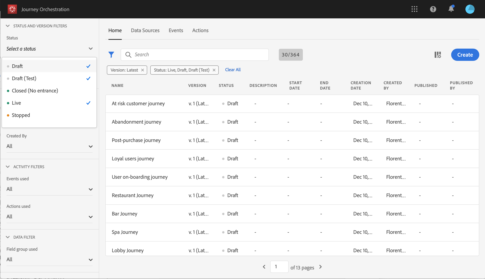

# Utilizzo del designer del percorso {#concept_m1g_5qt_52b}

Il menu Home del viaggio consente di visualizzare l&#39; **elenco dei viaggi**. Crea un nuovo percorso o fai clic su uno esistente per aprire l&#39;interfaccia **del progettista del** percorso. Il designer è costituito dalle seguenti aree: la palette, il quadro e il riquadro di configurazione dell&#39;attività.

## La lista di viaggi {#journey_list}

L&#39;elenco **dei** viaggi consente di visualizzare tutti i viaggi contemporaneamente, visualizzarne lo stato ed eseguire le azioni di base. Puoi duplicare, interrompere o eliminare i tuoi viaggi. A seconda del percorso, alcune azioni potrebbero non essere disponibili. Ad esempio, non puoi interrompere un viaggio interrotto. Potete anche usare la barra di ricerca per cercare un viaggio.

Per **[!UICONTROL Filters]**accedervi, fate clic sull’icona del filtro in alto a sinistra nell’elenco. Il menu dei filtri consente di filtrare i viaggi visualizzati in base a criteri diversi (stato, quelli creati, quelli modificati negli ultimi 30 giorni, solo le versioni più recenti, ecc.). Potete anche scegliere di visualizzare solo i viaggi che utilizzano un evento, un gruppo di campi o un&#39;azione particolare. È possibile configurare le colonne visualizzate nell&#39;elenco. Tutti i filtri e le colonne vengono salvati per utente.

Tutte le versioni dei viaggi vengono visualizzate nell’elenco con il numero di versione. Vedere .

>[!NOTE]
>
>Per aprire il quadro di un viaggio in un&#39;altra scheda del browser, tieni premuto il tasto **Ctrl** o **Comando** e fai clic sul percorso.

## La palette {#palette}

La **palette** si trova sul lato sinistro dello schermo. Tutte le attività disponibili sono suddivise in diverse categorie: **[!UICONTROL Events]**,**[!UICONTROL Orchestration]** e **[!UICONTROL Actions]**. Potete espandere o comprimere le diverse categorie facendo clic sul loro nome. Per utilizzare un’attività nel viaggio, trascinatela dalla palette al quadro. È inoltre possibile fare doppio clic su un&#39;attività nella palette per aggiungerla all&#39;area di lavoro, al passaggio successivo disponibile. È necessario configurare ogni attività aggiunta dalla palette prima di pubblicare il percorso. Se rilasci un&#39;attività nell&#39;area di lavoro e non ne finisci la configurazione, rimarrà nell&#39;area di lavoro, ma un avviso rosso indicherà che la configurazione non è terminata per questa attività.

>[!NOTE]
>
>Notate che esistono delle regole quando si configura un viaggio. La configurazione non consentita verrà scartata. Ad esempio, non potete mettere in parallelo delle azioni, collegare un&#39;attività a un passaggio precedente per creare un ciclo, avviare un percorso con qualcos&#39;altro rispetto a un evento, ecc.

## Il quadro {#canvas}

Il **quadro** è la zona centrale del designer di viaggi. È in questa zona che puoi rilasciare le tue attività e configurarle. Fate clic su un&#39;attività nel quadro per configurarla. Viene aperto il riquadro di configurazione dell&#39;attività sul lato destro. Potete ingrandire e ridurre utilizzando i pulsanti &quot;+&quot; e &quot;-&quot; in alto a destra. Nell’area di lavoro, tutte le attività consentono di aggiungere un passaggio successivo, tranne **[!UICONTROL End]**le attività (vedere).

## Riquadro di configurazione dell&#39;attività {#configuration_pane}

Il riquadro **di configurazione dell&#39;** attività viene visualizzato quando si fa clic su un&#39;attività nella palette. Compila i campi richiesti. Fate clic sull&#39; **[!UICONTROL Delete]**icona per eliminare l&#39;attività. Fate clic su**[!UICONTROL Cancel]** per annullare le modifiche o **[!UICONTROL Ok]**confermare. Per eliminare le attività, potete anche selezionare una (o più) attività e premere il tasto Backspace. Premere il tasto Escape per chiudere il riquadro di configurazione dell&#39;attività.

Nell’area di lavoro, le attività dell’azione e dell’evento sono rappresentate da un’icona con il nome dell’evento o dell’azione visualizzato sotto. Nel riquadro di configurazione dell&#39;attività, potete utilizzare il **[!UICONTROL Label]**campo per aggiungere un suffisso al nome dell&#39;attività. Queste etichette consentiranno di contestualizzare l&#39;uso di eventi e azioni, soprattutto quando durante il viaggio si utilizza più volte lo stesso evento o azione. Sarà inoltre possibile visualizzare le etichette aggiunte nel report Orchestrazione percorso.

## Azioni nella barra superiore {#top_actions}

A seconda dello stato del viaggio, puoi eseguire diverse azioni sul viaggio utilizzando i pulsanti disponibili nell’angolo in alto a destra: **[!UICONTROL Publish]**,**[!UICONTROL Duplicate]**, **[!UICONTROL Delete]**,**[!UICONTROL Journey properties]**, **[!UICONTROL Test]**. Questi pulsanti vengono visualizzati quando non è selezionata alcuna attività. Alcuni pulsanti verranno visualizzati contestualmente. Il pulsante del registro della modalità di prova viene visualizzato quando la modalità di prova è attivata (vedere). Il pulsante di segnalazione viene visualizzato quando il viaggio è live, interrotto o completato.

## Utilizzo dei percorsi nel quadro {#paths}

Diverse attività (**[!UICONTROL Condition]**,**[!UICONTROL Action]** attività) consentono di definire un&#39;azione di fallback in caso di errore o timeout. Nel riquadro di configurazione dell&#39;attività, selezionate la casella: **[!UICONTROL Add an alternative path in case of a timeout or an error]**. Un altro percorso viene aggiunto dopo l&#39;attività. La durata di timeout è definita nelle proprietà del percorso (vedeteda un utente amministratore. Ad esempio, se l’invio di un messaggio e-mail richiede troppo tempo o si verifica un errore, potete decidere di inviarlo.

Diverse attività (evento, azione, attesa) consentono di aggiungere diversi percorsi dopo di esse. A questo scopo, posizionate il cursore sull&#39;attività e fate clic sul simbolo &quot;+&quot;. Solo le attività di evento e di attesa possono essere impostate in parallelo. Se più eventi sono impostati in parallelo, il percorso scelto sarà quello del primo evento che si verifica.

Quando ascoltate un evento, vi consigliamo di non attendere l’evento a tempo indeterminato. Non è obbligatorio, è solo una buona pratica. Se si desidera ascoltare uno o più eventi solo durante un certo periodo di tempo, si posizionano uno o più eventi e un&#39;attività di attesa in parallelo. Vedere .

Per eliminare il percorso, posizionate il cursore su di esso e fate clic sull’ **[!UICONTROL Delete arrow]**icona .

