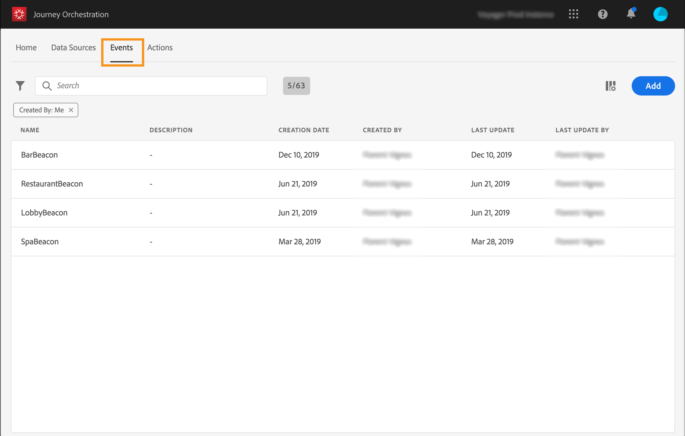

# Informazioni sugli eventi {#concept_gfj_fqt_52b}

>[!CONTEXTUALHELP]
>id="jo_events"
>title="Informazioni sugli eventi"
>abstract="Un evento è collegato a una persona e si riferisce al suo comportamento: ad esempio, se ha acquistato un prodotto, se ha visitato un negozio, se è uscita da un sito web, e così via. Oppure, indica qualcosa che si verifica in relazione a una persona, che può ad esempio aver raggiunto 10.000 punti fedeltà. Nell’ambito dei percorsi, [!DNL Journey Orchestration] farà da listener a questi dati, in modo da orchestrare le migliori azioni da eseguire successivamente."

Un evento è collegato a una persona e si riferisce al suo comportamento: ad esempio, se ha acquistato un prodotto, se ha visitato un negozio, se è uscita da un sito web, e così via. Oppure, indica qualcosa che si verifica in relazione a una persona, che può ad esempio aver raggiunto 10.000 punti fedeltà. Nell’ambito dei percorsi, [!DNL Journey Orchestration] farà da listener a questi dati, in modo da orchestrare le migliori azioni da eseguire successivamente.

Tale configurazione è **obbligatoria**[!DNL Journey Orchestration], in quanto è progettata per fare da listener agli eventi ed è sempre eseguita da un **utente tecnico**.

La configurazione dell’evento consente di definire le informazioni che [!DNL Journey Orchestration] riceverà sotto forma di eventi. All’interno dei vari di un percorso puoi utilizzare numerosi eventi, mentre più percorsi possono sfruttare il medesimo evento.

Se modifichi un evento utilizzato in una bozza di percorso o in un percorso live, puoi cambiare solo il nome e la descrizione oppure aggiungere i campi payload. Al fine di evitare l’interruzione dei percorsi, limitiamo rigorosamente la modifica delle bozze di percorso o dei percorsi live.

## Principio generale {#section_r1f_xqt_pgb}

Gli eventi sono chiamate API POST. Gli eventi vengono inviati ad Adobe Experience Platform tramite le API Streaming Ingestion. La destinazione URL degli eventi inviati tramite le API di messaggistica transazionale è denominata “entrata”. Il payload degli eventi segue la formattazione XDM.

Nell’intestazione del payload sono contenute le informazioni richieste per il funzionamento delle API Streaming Ingestion, oltre alle informazioni necessarie all’operatività di [!DNL Journey Orchestration], come l’ID evento e una parte del corpo del payload, e infine le informazioni da utilizzare nei percorsi (ad esempio, nel corpo, la quantità presente in un carrello abbandonato). Lo streaming ingestion può avvenire in modalità autenticata e non autenticata. Per informazioni dettagliate sulle API Streaming Ingestion, fai riferimento a [questo collegamento](https://docs.adobe.com/content/help/it-IT/experience-platform/xdm/api/getting-started.html).

Una volta arrivati attraverso le API Streaming Ingestion, gli eventi si propagano in un servizio interno denominato Pipeline e infine passano ad Adobe Experience Platform. Se nello schema dell’evento è abilitato il flag Profilo del cliente in tempo reale ed è presente un ID set di dati con il medesimo flag, tale schema si propaga nel Profilo del cliente in tempo reale.

La pipeline filtra gli eventi che presentano un payload contenente gli ID evento di [!DNL Journey Orchestration] (vedi il processo di creazione degli eventi illustrato in seguito) che sono forniti da [!DNL Journey Orchestration] e contenuti nel payload dell’evento. [!DNL Journey Orchestration] fa da listener agli eventi, il che attiva il percorso corrispondente.

## Creazione di un nuovo evento {#section_tbk_5qt_pgb}

Di seguito sono riportati i passaggi principali per la configurazione di un nuovo evento:

1. Nel menu principale, fai clic sulla scheda **[!UICONTROL Events]**. Viene visualizzato l’elenco degli eventi. Per ulteriori informazioni sull’interfaccia, consulta la sezione .

   

1. Per creare un nuovo evento, fai clic su **[!UICONTROL Add]**. Il riquadro di configurazione dell’evento si apre sul lato destro dello schermo.

   

1. Inserisci un nome per l’evento.

   >[!NOTE]
   >
   >Non utilizzare spazi o caratteri speciali. Non usare più di 30 caratteri.

1. Aggiungi una descrizione all’evento. Questo passaggio è facoltativo.
1. Definisci i campi dello schema e del payload: in questo punto è possibile selezionare le informazioni sull’evento, solitamente denominato payload, che [!DNL Journey Orchestration] prevede di ricevere. Potrai quindi utilizzare queste informazioni nel tuo percorso. A questo proposito, consulta la sezione .
1. Il numero di percorsi che utilizzano questo evento viene visualizzato nel campo **[!UICONTROL Used in]**. Puoi fare clic sull’icona **[!UICONTROL View journeys]** per visualizzare l’elenco dei percorsi che utilizzano questo evento.
1. Aggiungi uno spazio dei nomi. Questo passaggio è facoltativo ma consigliato, poiché l’aggiunta di uno spazio dei nomi consente di sfruttare le informazioni memorizzate nel servizio Profilo cliente in tempo reale, definendo il tipo di chiave di cui dispone l’evento. A questo proposito, consulta la sezione .
1. Definisci la chiave: scegli un campo di payload o specifica una formula per identificare la persona associata all’evento. Se selezioni uno spazio dei nomi, questa chiave viene impostata automaticamente, ma può essere comunque modificata. In effetti, [!DNL Journey Orchestration] seleziona la chiave che deve corrispondere allo spazio dei nomi, ad esempio, se scegli uno spazio dei nomi e-mail, opterà per la chiave e-mail. A questo proposito, consulta la sezione .
1. Aggiungi una condizione. Questo passaggio è facoltativo. In tal modo, consenti al sistema di elaborare solo gli eventi che soddisfano la condizione specifica. Tale condizione può essere basata solo sulle informazioni contenute nell’evento. A questo proposito, consulta la sezione .
1. Clic **[!UICONTROL Save]**.

   

   L’evento è ora configurato e pronto per essere rilasciato in un percorso. Per poter ricevere gli eventi sono necessari ulteriori passaggi di configurazione. A questo proposito, consulta la sezione .
