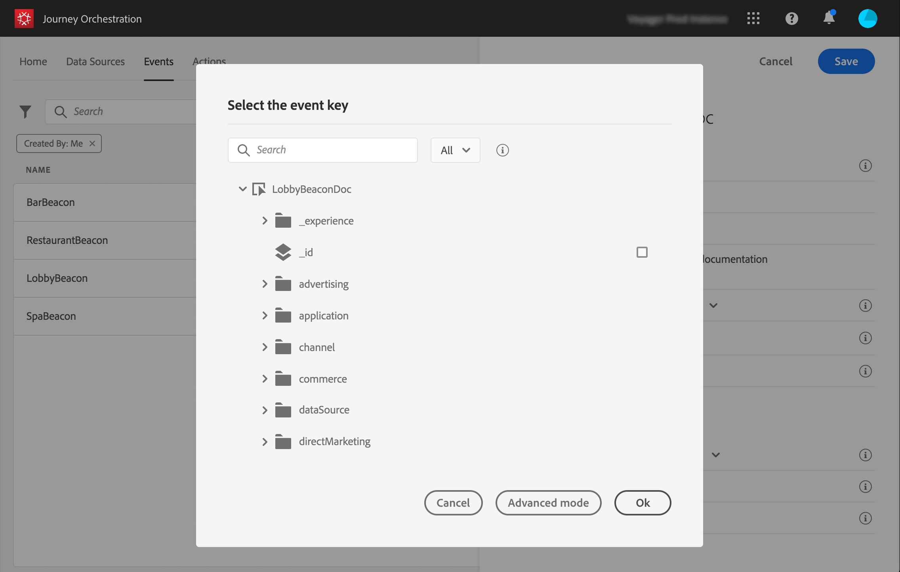

# Definizione del codice evento {#concept_ond_hqt_52b}

La chiave è il campo o la combinazione di campi fa parte dei dati di payload dell’evento e consentirà al sistema di identificare la persona associata all’evento. La chiave può essere, ad esempio, l&#39;ID Experience Cloud , un ID CRM o un indirizzo e-mail.

Se intendete sfruttare i dati memorizzati nel database Profilo cliente in tempo reale, dovete selezionare, come chiave dell&#39;evento, le informazioni definite come identità del profilo nel servizio [Profilo cliente in tempo](https://docs.adobe.com/content/help/it-IT/experience-platform/profile/home.html)reale.

Consentirà al sistema di eseguire la riconciliazione tra l&#39;evento e il profilo dell&#39;individuo. Se si seleziona uno schema con un&#39;identità primaria, i campi **[!UICONTROL Key]** e **[!UICONTROL Namespace]** vengono precompilati. Se non è definita alcuna identità, come chiave primaria selezioneremo _identityMap > id_ . Quindi è necessario selezionare uno spazio dei nomi e la chiave sarà precompilata (sotto il **[!UICONTROL Namespace]** campo) utilizzando _identityMap > id_.

Quando si selezionano i campi, i tag dei campi identità primari sono assegnati.

Se devi usare una chiave diversa, ad esempio un ID CRM o un indirizzo e-mail, devi aggiungerla manualmente:

1. Fare clic all&#39;interno del **[!UICONTROL Key]** campo o sull&#39;icona a forma di matita.

   

1. Selezionare il campo scelto come chiave nell&#39;elenco dei campi di payload. È inoltre possibile passare all&#39;editor di espressioni avanzate per creare chiavi più complesse (ad esempio, una concatenazione di due campi degli eventi). Vedere di seguito, in questa sezione.

   

Quando l&#39;evento viene ricevuto, il valore della chiave consentirà al sistema di identificare la persona associata all&#39;evento. Associata a uno spazio dei nomi (vedere ), la chiave può essere utilizzata per eseguire query sull&#39;Adobe Experience Platform. A questo proposito, consulta la sezione .
La chiave viene utilizzata anche per verificare che una persona sia in viaggio. Infatti, una persona non può trovarsi in due luoghi diversi nello stesso viaggio. Di conseguenza, il sistema non consente alla stessa chiave, ad esempio la chiave CRMID=3224, di trovarsi in luoghi diversi nello stesso percorso.

È inoltre possibile accedere alle funzioni di espressione avanzate (**[!UICONTROL Advanced mode]**) per eseguire ulteriori manipolazioni. Queste funzioni consentono di manipolare i valori utilizzati per eseguire query specifiche, ad esempio la modifica dei formati, eseguendo concatenazioni di campi, tenendo conto solo di una parte di un campo (ad esempio i 10 primi caratteri). A questo proposito, consulta la sezione .
