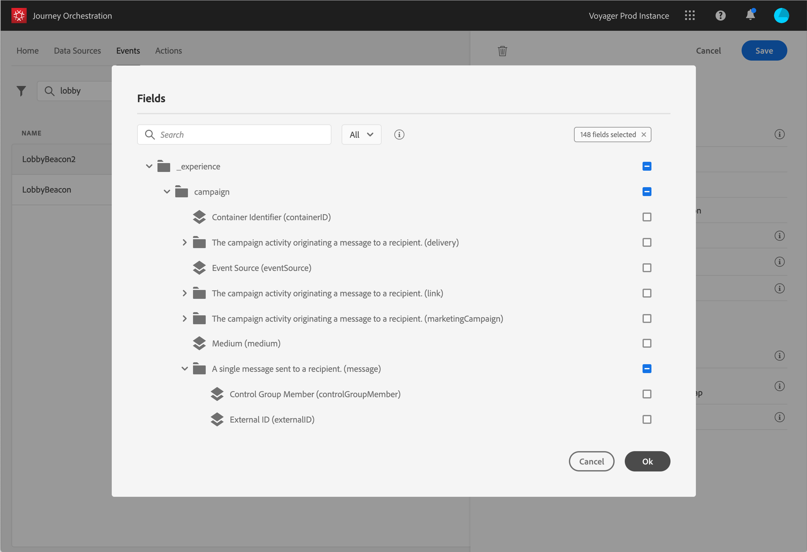

# Definizione dei campi payload {#concept_yrw_3qt_52b}

La definizione del payload ti consente di scegliere le informazioni che il sistema prevede di ricevere dall’evento nel tuo percorso e la chiave per identificare quale persona è associata all’evento. Il payload si basa sulla definizione del campo XDM di Experience Cloud. Per ulteriori informazioni su XDM, consulta [questa pagina](https://experienceleague.adobe.com/docs/experience-platform/xdm/home.html).

1. Seleziona uno schema XDM dall’elenco e fai clic sul campo **[!UICONTROL Payload]** o sull’icona **[!UICONTROL Edit]**.

   

   Vengono visualizzati tutti i campi definiti nello schema. L’elenco dei campi varia da uno schema all’altro. È possibile cercare un campo specifico o utilizzare i filtri per visualizzare tutti i nodi e i campi o solo i campi selezionati. In base alla definizione dello schema, alcuni campi possono essere obbligatori e preselezionati. Non è possibile deselezionarli. Per impostazione predefinita, tutti i campi obbligatori affinché l’evento possa essere ricevuto correttamente dal Journey Orchestration sono selezionati.

   >[!NOTE]
   >
   >Accertati di aver aggiunto il mixin &quot;orchestrazione&quot; allo schema XDM. Questo assicurerà che lo schema contenga tutte le informazioni necessarie per funzionare con [!DNL Journey Orchestration].

   

1. Seleziona i campi che si prevede di ricevere dall’evento. Questi sono i campi che l&#39;utente aziendale sfrutterà nel percorso. Devono inoltre includere la chiave che verrà utilizzata per identificare la persona associata all&#39;evento (consulta [questa pagina](../event/defining-the-event-key.md)).

   

   >[!NOTE]
   >
   >Per gli eventi generati dal sistema, il campo **[!UICONTROL eventID]** viene aggiunto automaticamente nell’elenco dei campi selezionati in modo che [!DNL Journey Orchestration] possa identificare l’evento. Il sistema che preme l’evento non deve generare un ID, ma deve utilizzare quello disponibile nell’anteprima del payload. Consulta [questa pagina](../event/previewing-the-payload.md).

1. Dopo aver selezionato i campi necessari, fai clic su **[!UICONTROL Save]** o premi **[!UICONTROL Enter]**.

   

   Il numero di campi selezionati viene visualizzato nel campo **[!UICONTROL Payload]** .

   
