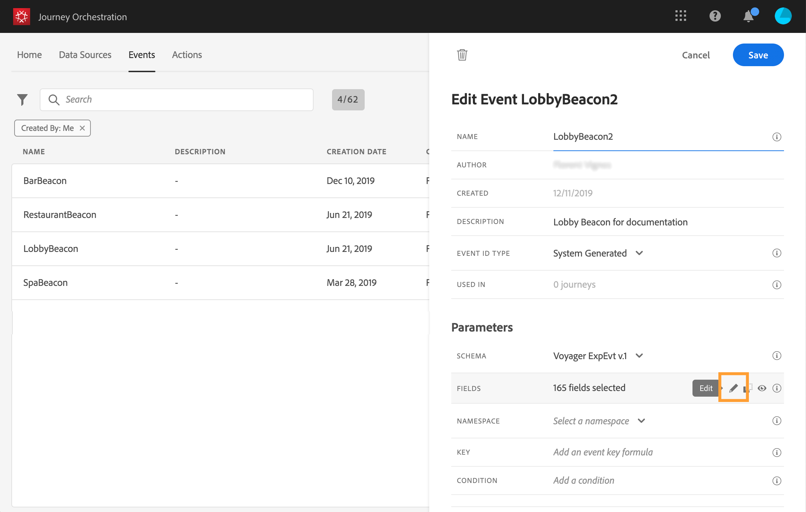
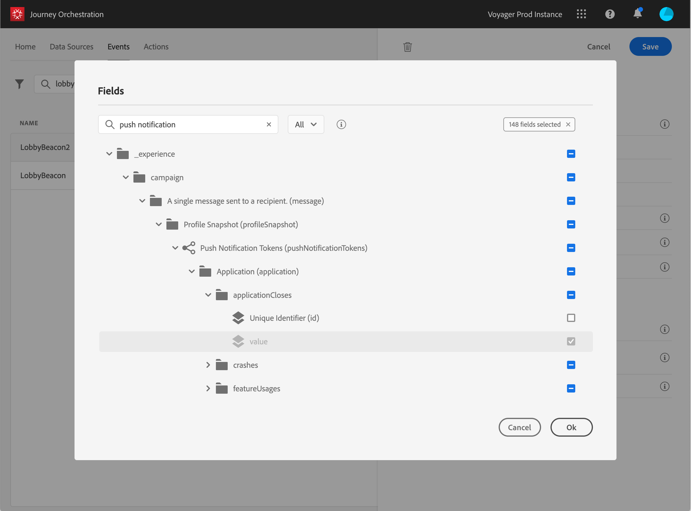
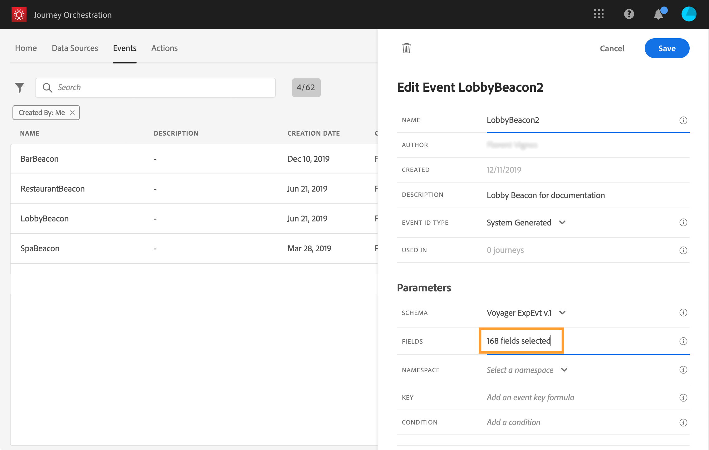

# Definizione dei campi payload {#concept_yrw_3qt_52b}

>[!CAUTION]
>
>**Stai cercando Adobe Journey Optimizer**? Fai clic [qui](https://experienceleague.adobe.com/it/docs/journey-optimizer/using/ajo-home){target="_blank"} per la documentazione di Journey Optimizer.
>
>
>_Questa documentazione fa riferimento ai precedenti materiali su Journey Orchestration, che è stato sostituito da Journey Optimizer. In caso di domande sull’accesso a Journey Orchestration o Journey Optimizer, contatta il team del tuo account._

La definizione del payload consente di scegliere le informazioni che il sistema si aspetta di ricevere dall’evento nel percorso e la chiave per identificare quale persona è associata all’evento. Il payload si basa sulla definizione del campo XDM di Experience Cloud. Per ulteriori informazioni su XDM, consulta [questa pagina](https://experienceleague.adobe.com/docs/experience-platform/xdm/home.html?lang=it).

1. Selezionare uno schema XDM dall&#39;elenco e fare clic sul campo **[!UICONTROL Payload]** o sull&#39;icona **[!UICONTROL Edit]**.

   

   Vengono visualizzati tutti i campi definiti nello schema. L’elenco dei campi varia da uno schema all’altro. Puoi cercare un campo specifico o utilizzare i filtri per visualizzare tutti i nodi e i campi o solo i campi selezionati. In base alla definizione dello schema, alcuni campi possono essere obbligatori e preselezionati. Non è possibile deselezionarli. Per impostazione predefinita, vengono selezionati tutti i campi obbligatori per la corretta ricezione dell’evento da parte di Journey Orchestration.

   >[!NOTE]
   >
   >Assicurati di aver aggiunto il mixin &quot;orchestrazione&quot; allo schema XDM. In questo modo lo schema conterrà tutte le informazioni necessarie per l&#39;utilizzo di [!DNL Journey Orchestration].

   

1. Seleziona i campi che prevedi di ricevere dall’evento. Questi sono i campi che l’utente aziendale sfrutterà nel percorso. Devono inoltre includere la chiave che verrà utilizzata per identificare la persona associata all&#39;evento (vedere [questa pagina](../event/defining-the-event-key.md)).

   

   >[!NOTE]
   >
   >Per gli eventi generati dal sistema, il campo **[!UICONTROL eventID]** viene aggiunto automaticamente nell&#39;elenco dei campi selezionati in modo che [!DNL Journey Orchestration] possa identificare l&#39;evento. Il sistema che trasmette l’evento non deve generare un ID, deve utilizzare quello disponibile nell’anteprima del payload. Consulta [questa pagina](../event/previewing-the-payload.md).

1. Dopo aver selezionato i campi necessari, fare clic su **[!UICONTROL Save]** o premere **[!UICONTROL Enter]**.

   

   Il numero di campi selezionati viene visualizzato nel campo **[!UICONTROL Payload]**.

   
