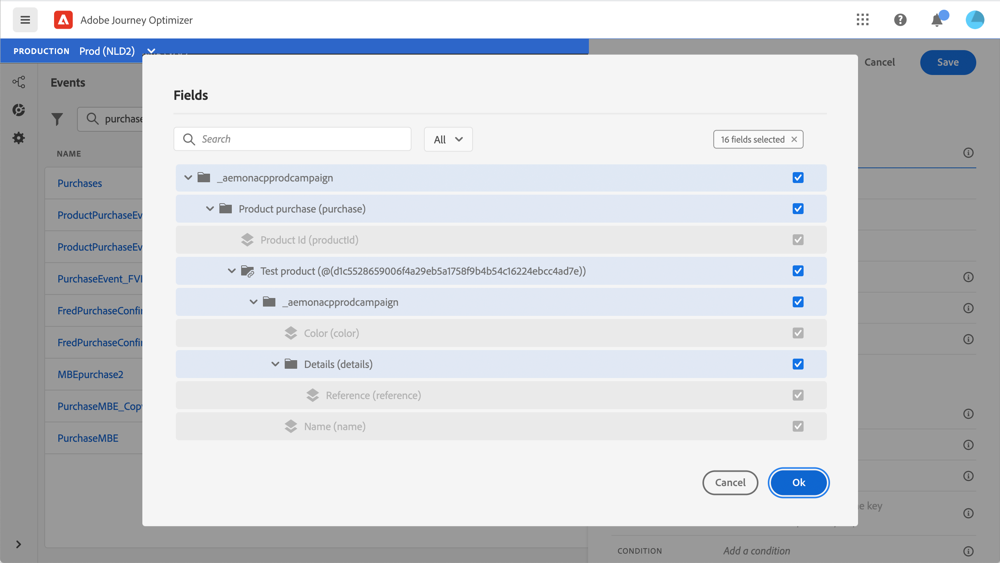

# Informazioni sugli schemi ExperienceEvent per [!DNL Journey Orchestration] eventi

[!DNL Journey Orchestration] eventi sono eventi esperienza XDM inviati a Adobe Experience Platform tramite Streaming Ingestion.

Un prerequisito importante per la configurazione degli eventi per [!DNL Journey Orchestration] è la conoscenza di Experience Data Model (o XDM) di Adobe Experience Platform, delle modalità di composizione degli schemi Experience Event XDM e del flusso di dati in formato XDM verso Adobe Experience Platform.

## Requisiti dello schema per [!DNL Journey Orchestration] eventi

Il primo passaggio nella configurazione di un evento per [!DNL Journey Orchestration] consiste nel verificare di disporre di uno schema XDM definito per rappresentare l&#39;evento e di un set di dati creato per registrare le istanze dell&#39;evento sul Adobe Experience Platform. Disporre di un set di dati per gli eventi non è strettamente necessario, ma l’invio di eventi a un set di dati specifico ti consentirà di mantenere la cronologia degli eventi degli utenti per riferimenti e analisi futuri, quindi è sempre una buona idea. Se non disponi già di uno schema e di un set di dati appropriati per l’evento, entrambe queste attività possono essere eseguite nell’interfaccia web di Adobe Experience Platform.

Qualsiasi schema XDM che verrà utilizzato per gli eventi [!DNL Journey Orchestration] deve soddisfare i seguenti requisiti:

* Lo schema deve essere della classe ExperienceEvent XDM.

  

* Per gli eventi generati dal sistema, lo schema deve includere il mixin Orchestration eventID. [!DNL Journey Orchestration] utilizza questo campo per identificare gli eventi utilizzati nei percorsi.

  

* Dichiara un campo di identità per identificare l’oggetto dell’evento. Se non viene specificata alcuna identità, è possibile utilizzare una mappa di identità. Queste operazioni non sono consigliate.

  

* Se desideri che questi dati siano disponibili per la ricerca in un secondo momento in un Percorso, contrassegna lo schema e il set di dati per il profilo.

  

  

* Puoi includere campi dati per acquisire altri dati contestuali che desideri includere con l’evento, ad esempio informazioni sull’utente, sul dispositivo da cui è stato generato l’evento, sulla posizione o su qualsiasi altra circostanza significativa correlata all’evento.

  

  

## Sfruttare le relazioni tra schemi{#leverage_schema_relationships}

Adobe Experience Platform consente di definire relazioni tra schemi per utilizzare un set di dati come tabella di ricerca per un altro.

Supponiamo che il modello dati del brand abbia uno schema per l’acquisizione degli acquisti. Inoltre, disponi di uno schema per il catalogo dei prodotti. Puoi acquisire l’ID prodotto nello schema di acquisto e utilizzare una relazione per cercare dettagli di prodotto più completi dal catalogo dei prodotti. Questo consente di creare un segmento per tutti i clienti che hanno acquistato un notebook, ad esempio, senza dover elencare esplicitamente tutti gli ID dei notebook o acquisire ogni singolo dettaglio di prodotto nei sistemi transazionali.

Per definire una relazione, è necessario disporre di un campo dedicato nello schema di origine, in questo caso il campo ID prodotto nello schema di acquisto. Questo campo deve fare riferimento al campo ID prodotto nello schema di destinazione. Le tabelle di origine e di destinazione devono essere abilitate per i profili e lo schema di destinazione deve avere quel campo comune definito come identità primaria.

Di seguito è riportato lo schema del catalogo dei prodotti abilitato per il profilo con l’ID prodotto definito come identità primaria.

Schema di acquisto con la relazione definita nel campo ID prodotto.

>[!NOTE]
>
>Ulteriori informazioni sulle relazioni tra schemi nella [documentazione di Experience Platform](https://experienceleague.adobe.com/docs/platform-learn/tutorials/schemas/configure-relationships-between-schemas.html?lang=en).

In Journey Orchestration, puoi quindi sfruttare tutti i campi delle tabelle collegate:

* durante la configurazione di un evento unitario, [Ulteriori informazioni](../event/experience-event-schema.md#unitary_event_configuration)
* quando si utilizzano le condizioni in un percorso, [Ulteriori informazioni](../event/experience-event-schema.md#journey_conditions_using_event_context)
* nella personalizzazione delle azioni personalizzate, [Ulteriori informazioni](../event/experience-event-schema.md#custom_action_personalization_with_journey_event_context)

### Configurazione evento unitaria{#unitary_event_configuration}

I campi dello schema collegati sono disponibili nella configurazione unitaria dell’evento:

* quando esplori i campi dello schema dell’evento nella schermata di configurazione dell’evento.
* durante la definizione di una condizione per gli eventi generati dal sistema.

I campi collegati non sono disponibili:

* nella formula chiave evento
* condizione id evento (eventi basati su regole)

Per informazioni su come configurare un evento unitario, consulta questa [pagina](../event/about-creating.md).

### Condizioni di percorso utilizzando il contesto dell’evento{#journey_conditions_using_event_context}

Puoi utilizzare i dati di una tabella di ricerca collegata a un evento utilizzato in un percorso per la creazione di condizioni (editor di espressioni).

Aggiungi una condizione in un percorso, modifica l’espressione e apri il nodo dell’evento nell’editor espressioni.

Per informazioni su come definire le condizioni del percorso, consulta questa [pagina](../building-journeys/condition-activity.md).

### Personalizzazione delle azioni con contesto di evento percorso{#custom_action_personalization_with_journey_event_context}

I campi collegati sono disponibili durante la configurazione dei parametri di azione di un’attività di azione del percorso.

Per informazioni su come utilizzare le azioni personalizzate, consulta questa [pagina](../building-journeys/using-custom-actions.md).

