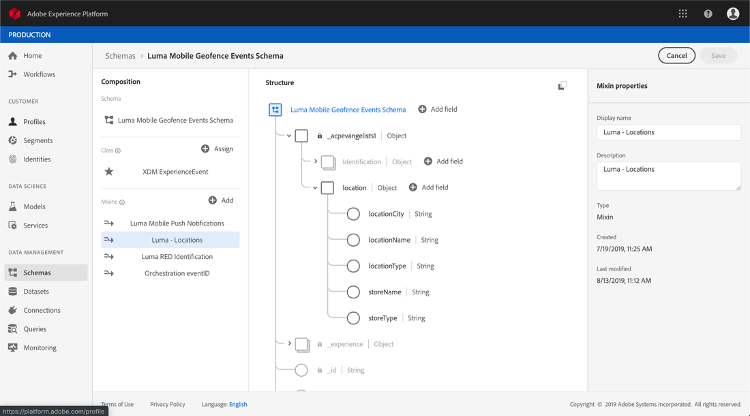

# Informazioni sugli schemi ExperienceEvent per [!DNL Journey Orchestration] gli eventi

[!DNL Journey Orchestration] gli eventi sono eventi di esperienza XDM che vengono inviati all&#39;Adobe Experience Platform tramite Streaming Ingestion.

Di conseguenza, un prerequisito importante per configurare gli eventi per [!DNL Journey Orchestration] è che tu abbia familiarità con il modello dati esperienza (o XDM) di Adobe Experience Platform e con come comporre gli schemi evento esperienza XDM, nonché con come trasmettere dati in formato XDM all’Adobe Experience Platform.

## Requisiti dello schema per [!DNL Journey Orchestration] gli eventi

Il primo passaggio nella configurazione di un evento [!DNL Journey Orchestration] è garantire che sia definito uno schema XDM per rappresentare l&#39;evento, e che sia creato un dataset per registrare le istanze dell&#39;evento sull&#39;Adobe Experience Platform. La disponibilità di un set di dati per gli eventi non è strettamente necessaria, ma l&#39;invio degli eventi a un set di dati specifico vi consentirà di mantenere la cronologia degli eventi degli utenti per riferimento e analisi futuri, pertanto è sempre una buona idea. Se non si dispone già di uno schema e di un set di dati adeguati per l&#39;evento, entrambe le operazioni possono essere eseguite nell&#39;interfaccia Web di Adobe Experience Platform.

Qualsiasi schema XDM che verrà utilizzato per [!DNL Journey Orchestration] gli eventi deve soddisfare i seguenti requisiti:

* Lo schema deve essere della classe ExperienceEvent XDM.

   

* Lo schema deve includere il mixin eventID di orchestrazione. [!DNL Journey Orchestration] utilizza questo campo per identificare gli eventi utilizzati nei viaggi.

   

* Dichiarare un campo di identità per identificare l’oggetto dell’evento. Se non viene specificata alcuna identità, è possibile utilizzare una mappa di identità. Questo non è consigliato.

   

* Se si desidera che questi dati siano disponibili per la ricerca successiva in un viaggio, contrassegnare lo schema e il dataset per il profilo.

   

   

* Potete includere campi di dati per acquisire qualsiasi altro dato contestuale da includere nell&#39;evento, ad esempio informazioni sull&#39;utente, sul dispositivo da cui è stato generato l&#39;evento, sulla posizione o su qualsiasi altra circostanza significativa correlata all&#39;evento.

   

   