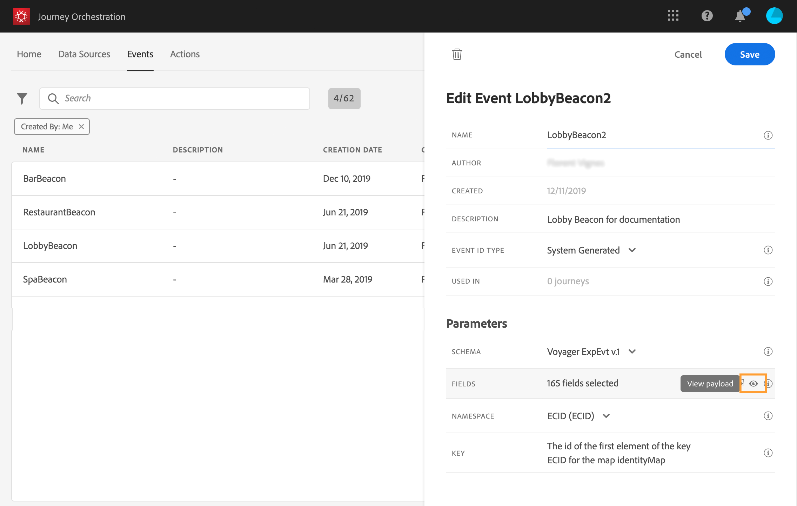

# Anteprima del payload {#concept_jgf_4yk_4fb}

L’anteprima del payload ti consente di convalidare la definizione del payload.

>[!NOTE]
>
>Per gli eventi generati dal sistema, quando crei un evento, prima di visualizzare l’anteprima del payload, salva l’evento e riaprilo. Questo passaggio è necessario per generare un ID evento nel payload.

1. Fai clic sull&#39;icona **[!UICONTROL View Payload]** per visualizzare in anteprima il payload previsto dal sistema.

   

   I campi selezionati vengono visualizzati.

   

1. Seleziona l’anteprima per convalidare la definizione del payload.

1. Quindi, puoi condividere l’anteprima del payload con la persona responsabile dell’invio dell’evento. Questo payload può aiutarlo a progettare la configurazione di un evento che preme su [!DNL Journey Orchestration]. Consulta [questa pagina](../event/additional-steps-to-send-events-to-journey-orchestration.md).
