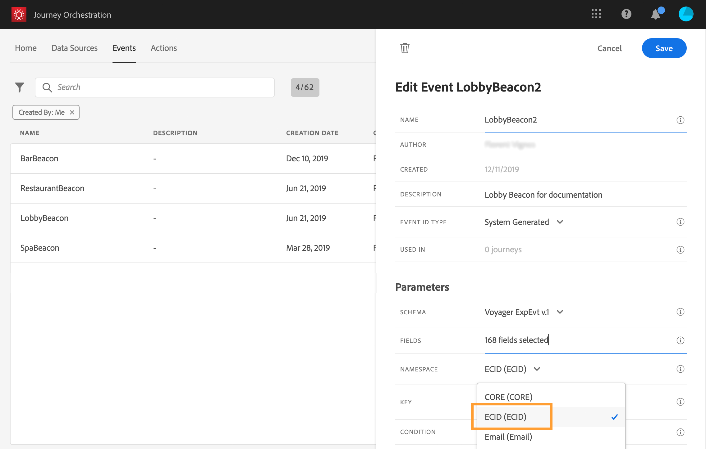

# Selezione dello spazio dei nomi {#concept_ckb_3qt_52b}

>[!CAUTION]
>
>**Stai cercando Adobe Journey Optimizer**? Fai clic [qui](https://experienceleague.adobe.com/it/docs/journey-optimizer/using/ajo-home){target="_blank"} per la documentazione di Journey Optimizer.
>
>
>_Questa documentazione fa riferimento ai precedenti materiali su Journey Orchestration, che è stato sostituito da Journey Optimizer. In caso di domande sull’accesso a Journey Orchestration o Journey Optimizer, contatta il team del tuo account._

Lo spazio dei nomi consente di definire il tipo di chiave utilizzato per identificare la persona associata all’evento. La sua configurazione è facoltativa. È necessario se desideri recuperare nei tuoi percorsi informazioni aggiuntive provenienti dal [Profilo cliente in tempo reale](https://experienceleague.adobe.com/docs/experience-platform/profile/home.html?lang=it). La definizione dello spazio dei nomi non è necessaria se utilizzi solo dati provenienti da un sistema di terze parti tramite un’origine dati personalizzata.

Puoi utilizzare uno dei predefiniti o crearne uno nuovo utilizzando il servizio Identity Namespace. Consulta [questa pagina](https://experienceleague.adobe.com/docs/experience-platform/identity/home.html?lang=it).

Se selezioni uno schema con un&#39;identità primaria, i campi **[!UICONTROL Key]** e **[!UICONTROL Namespace]** sono precompilati. Se non è stata definita alcuna identità, verrà selezionata _identityMap > id_ come chiave primaria. Quindi devi selezionare uno spazio dei nomi e la chiave verrà precompilata (sotto il campo **[!UICONTROL Namespace]**) utilizzando _identityMap > id_.

Quando selezioni i campi, vengono taggati i campi di identità primari.

Seleziona uno spazio dei nomi dall’elenco a discesa.

È consentito un solo spazio dei nomi per percorso. Se utilizzi più eventi nello stesso percorso, è necessario che utilizzino lo stesso namespace. Consulta [questa pagina](../building-journeys/journey.md).
