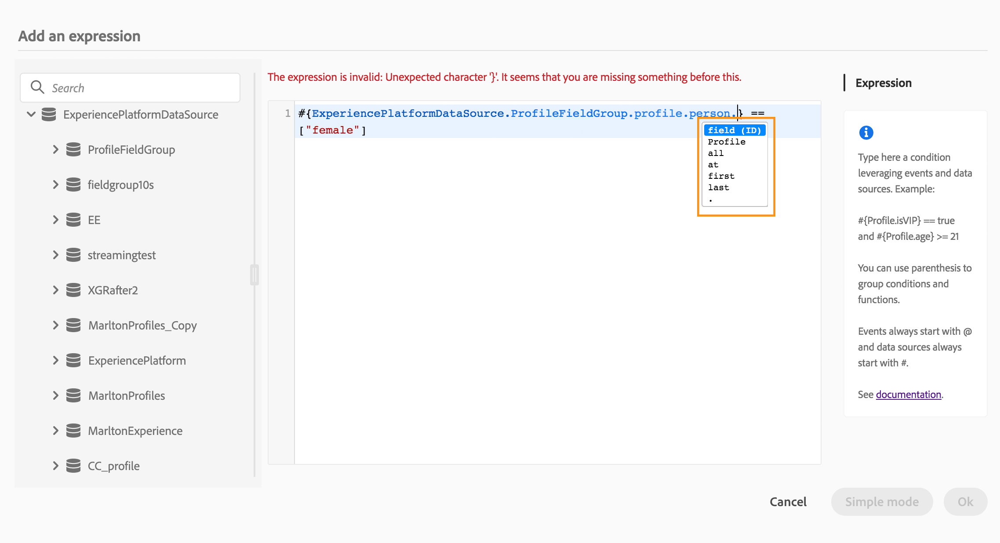
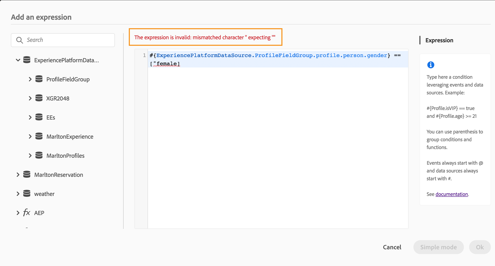

# Informazioni sull’editor di espressioni avanzate {#concept_uyj_trt_52b}

L&#39;editor di espressioni avanzate consente di creare espressioni avanzate in varie schermate dell&#39;interfaccia, ad esempio, quando si definisce una condizione di origine dati.
È inoltre disponibile ogni volta che è necessario definire parametri di azione che richiedono specifiche manipolazioni dei dati. È possibile sfruttare i dati provenienti dagli eventi o informazioni aggiuntive recuperate dall&#39;origine dati. In un viaggio, l&#39;elenco visualizzato dei campi dell&#39;evento è contestuale e varia in base agli eventi aggiunti nel viaggio.

L&#39;editor di espressioni avanzate offre un set di funzioni e operatori incorporati che consentono di manipolare i valori e definire un&#39;espressione adatta alle proprie esigenze. L&#39;editor di espressioni avanzate consente inoltre di definire i valori del parametro dell&#39;origine dati esterna, di manipolare i campi e le raccolte delle mappe, ad esempio eventi di esperienza.

_Interfaccia editor di espressioni avanzate_

L&#39;editor di espressioni avanzate può essere utilizzato per:

* creazione di condizioni  avanzate sulle origini dati e le informazioni sull&#39;evento
* definire attività [di attesa personalizzate](../building-journeys/wait-activity.md#custom)
* definizione del mapping dei parametri di azione

Quando possibile, è possibile passare tra le due modalità utilizzando il **[!UICONTROL Advanced mode]** / **[!UICONTROL Simple mode]** pulsante. La modalità semplice è descritta [qui](../building-journeys/condition-activity.md#about_condition).

>[!NOTE]
>
>Le condizioni possono essere definite nell&#39;editor di espressioni semplice o avanzato. ma restituiscono sempre un tipo booleano.
>
>I parametri delle azioni possono essere definiti selezionando i campi o tramite l&#39;editor di espressioni avanzate. restituiscono un tipo di dati specifico in base alla relativa espressione.

## Accessing the advanced expression editor {#section_fdz_4nj_cjb}

Potete accedere all&#39;editor di espressioni avanzate in diversi modi:

* Quando crei una condizione di origine dati, puoi accedere all&#39;editor avanzato facendo clic su **[!UICONTROL Advanced mode]**.

   

* Quando si crea un timer personalizzato, l&#39;editor avanzato viene visualizzato direttamente.
* Quando mappate il parametro azione, fate clic su **[!UICONTROL Advanced mode]**.

## Esplorazione dell’interfaccia{#section_otq_tnj_cjb}

Questa schermata consente di scrivere manualmente l’espressione.

Nella parte sinistra dello schermo sono visualizzati i campi e le funzioni disponibili:

* **[!UICONTROL Events]**: scegliete uno dei campi ricevuti dall&#39;evento in entrata. L&#39;elenco visualizzato dei campi evento è contestuale e varia a seconda degli eventi aggiunti nel viaggio.
* **[!UICONTROL Data Sources]**: scegliere dall&#39;elenco di campi disponibili dai gruppi di campi delle origini dati.
* **[!UICONTROL Functions]**: scegliere dall&#39;elenco di funzioni integrate che consentono di eseguire filtri complessi. Le funzioni sono organizzate per categorie.

Un meccanismo di completamento automatico visualizza suggerimenti contestuali.

Un meccanismo di convalida della sintassi verifica l&#39;integrità del codice. Gli errori vengono visualizzati sopra all&#39;editor.

**Necessità di parametri per la creazione di condizioni con l&#39;editor di espressioni avanzate**

Se si seleziona un campo da un&#39;origine dati esterna che richiede la chiamata di un parametro (vedere . Ad esempio, in un&#39;origine dati correlata al tempo, un parametro utilizzato di frequente sarà &quot;city&quot;. Di conseguenza, è necessario selezionare il punto in cui si desidera ottenere questo parametro della città. Le funzioni possono essere applicate anche ai parametri per eseguire modifiche di formato o concatenazioni.

Per casi di utilizzo più complessi, se si desidera includere i parametri dell&#39;origine dati nell&#39;espressione principale, è possibile definirne i valori utilizzando la parola chiave &quot;params&quot;. Vedere [questa pagina](../expression/field-references.md).
