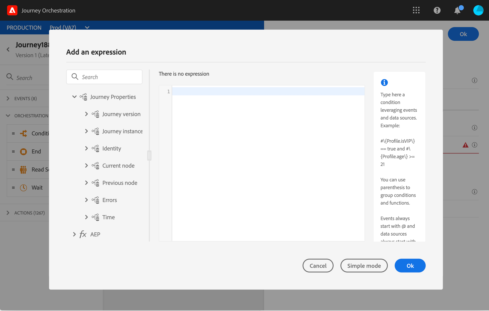

# Attributi delle proprietà del percorso {#journey-properties}

Nell’editor di espressioni avanzate, trovi la categoria **Proprietà Percorso** , sotto le categorie di eventi e origini dati. Questa categoria contiene campi tecnici relativi al percorso per un determinato profilo. Si tratta delle informazioni recuperate dal sistema dai percorsi in tempo reale, ad esempio l’ID percorso o gli errori specifici rilevati.

>[!NOTE]
>
>Gli attributi delle proprietà del percorso sono disponibili anche nell’editor di espressioni semplici. Vedere questa [sezione](../building-journeys/condition-activity.md#about_condition)

Troverete informazioni, ad esempio:

* Versione percorso: uid di percorso, uid di versione di percorso, uid di istanza, ecc.
* errori: recupero dati, esecuzione azione, ecc.
* passaggio corrente, ultimo passaggio corrente, ecc.
* profili scartati

Puoi utilizzare questi campi per creare espressioni. Durante l’esecuzione del percorso, i valori verranno recuperati direttamente dal percorso.

Di seguito sono riportati alcuni esempi di casi d’uso:

* **Registrare i profili** scartati: puoi inviare tutti i profili esclusi da un messaggio tramite una regola di limitazione a un sistema di terze parti a scopo di registrazione. A questo scopo, imposta un percorso in caso di timeout ed errore e aggiungi una condizione per filtrare in base a uno specifico tipo di errore, ad esempio: &quot;elimina le persone con la regola di limitazione&quot;. Puoi quindi inviare i profili scartati a un sistema di terze parti tramite un’azione personalizzata.

* **Inviare avvisi in caso di errori**: puoi inviare una notifica a un sistema di terze parti ogni volta che si verifica un errore in un messaggio. A questo scopo, imposta un percorso in caso di errore, aggiungi una condizione e un’azione personalizzata. Ad esempio, puoi inviare una notifica su un canale di Slack con la descrizione dell’errore rilevato.

* **Ridefinizione degli errori nel reporting** : invece di avere un solo percorso per i messaggi in errore, puoi definire una condizione per tipo di errore. Questo ti consentirà di perfezionare il reporting e visualizzare tutti i dati dei tipi di errore.

## Elenco dei campi {#journey-properties-fields}

| Categoria | Nome campo | Etichetta | Descrizione |
|---|---|---|------------|
| Versione percorso | journeyUID | Identificatore percorso |  |
|  | journeyVersionUID | Identificatore versione percorso |  |
|  | journeyVersionName | Nome versione percorso |  |
|  | journeyVersionDescription | Descrizione della versione del percorso |  |
|  | journeyVersion | Versione percorso |  |
| Istanza percorso | instanceUID | Identificatore istanza percorso | ID dell’istanza |
|  | externalKey | Chiave esterna | Identificatore individuale che attiva il percorso |
|  | OrganizationId | Identificatore organizzazione | Organizzazione di Brand |
|  | sandboxName | Nome della sandbox | Nome della sandbox |
| Identità | profileId | Identificatore identità profilo | Identificatore del profilo nel percorso |
|  | namespace | Spazio dei nomi dell’identità del profilo | Spazio dei nomi del profilo nel percorso (esempio: ECID) |
| Nodo corrente | currentNodeId | Identificatore nodo corrente | Identificatore dell&#39;attività corrente (nodo) |
|  | currentNodeName | Nome nodo corrente | Nome dell’attività corrente (nodo) |
| Nodo precedente | previousNodeId | Identificatore nodo precedente | Identificatore dell’attività precedente (nodo) |
|  | previousNodeName | Nome nodo precedente | Nome dell’attività precedente (nodo) |
| Errori | lastNodeUIDInError | Identificatore ultimo nodo in errore | Identificatore dell’attività più recente (nodo) in errore |
|  | lastNodeNameInError | Nome ultimo nodo in errore | Nome dell’attività più recente (nodo) in errore |
|  | lastNodeTypeInError | Ultimo tipo di nodo in errore | Tipo di errore dell&#39;attività più recente (nodo) in errore. Tipi possibili:<ul><li>Eventi: Eventi, Reazioni, SQ (esempio: Qualificazione del segmento)</li><li>Controllo del flusso: Fine, Condizione, Attendi</li><li>Azioni: Azioni ACS, Jump, Custom Action</li></ul> |
|  | lastErrorCode | Ultimo codice di errore | Codice di errore dell&#39;ultima attività (nodo) in errore. Possibili errori: <ul><li>Codici di errore HTTP</li><li>cappuccio</li><li>timedOut</li><li>error (esempio: predefinito in caso di errore imprevisto. Non dovrebbe/estremamente raro)</li></ul> |
|  | lastExecutionActionErrorCode | Codice errore ultima azione eseguita | Codice di errore dell’ultima azione in errore |
|  | lastDataFetchErrorCode | Codice errore ultimo recupero dati | Codice di errore del recupero dati più recente da origini dati |
| Tempo | lastActionExecutionElapsedTime | Tempo trascorso dell’ultima esecuzione dell’azione | Tempo impiegato per eseguire l’azione più recente |
|  | lastDataFetchElapsedTime | Tempo trascorso ultimo recupero dati | Tempo impiegato per eseguire il recupero dati più recente da origini dati |
