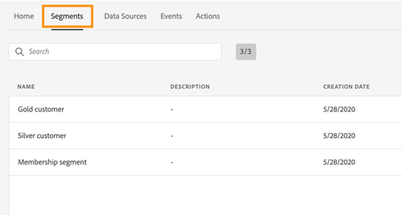

# Note sulla versione {#release-notes}

>[!CAUTION]
>
>**Ricerca di Adobe Journey Optimizer**? Fai clic [qui](https://experienceleague.adobe.com/it/docs/journey-optimizer/using/ajo-home){target="_blank"} per la documentazione di Journey Optimizer.
>
>
>_Questa documentazione fa riferimento ai materiali Journey Orchestration legacy che sono stati sostituiti da Journey Optimizer. Contatta il team del tuo account in caso di domande sull&#39;accesso a Journey Orchestration o Journey Optimizer._

Questa pagina elenca tutte le nuove funzionalità e i miglioramenti introdotti in Journey Orchestration. Per le funzioni di Experience Platform, fare riferimento alle seguenti [note sulla versione](https://experienceleague.adobe.com/docs/experience-platform/release-notes/latest.html?lang=it).

Per le funzionalità rilasciate dopo il 2022, i collegamenti rimandano alla [documentazione di Adobe Journey Optimizer](https://experienceleague.adobe.com/it/docs/journey-optimizer/using/ajo-home){target="_blank"}.

## Versione di marzo 2024 {#mar-rn-2024}

### Miglioramenti {#mar-2024-improvements}

Sono stati aggiunti nuovi stati intermedi al ciclo di vita di authoring del percorso:

* Stato **Pubblicazione** tra gli stati **Bozza** e **Live**
* Stato **Interruzione** tra gli stati **Live** e **Interrotto**
* Stati **Attivazione modalità di test** o **Disattivazione modalità di test** tra gli stati **Bozza** e **Bozza (test)**

Quando un percorso si trova in uno stato intermedio, è di sola lettura. [Ulteriori informazioni](https://experienceleague.adobe.com/it/docs/journey-optimizer/using/orchestrate-journeys/create-journey/journey-gs#filter){target="_blank"}

## Versione di febbraio 2024 {#feb-rn-2024}

### Miglioramenti {#feb-2024-improvements}

* **Filtrare i percorsi**: è ora possibile utilizzare inventari di **date personalizzate per filtrare i percorsi**, oltre ai filtri di data predefiniti esistenti. Questo consente di perfezionare l’elenco visualizzando i percorsi creati o pubblicati in una data specifica, all’interno di un mese specifico, durante un anno intero o compresi in intervalli di tempo specifici. [Ulteriori informazioni](https://experienceleague.adobe.com/docs/journey-optimizer/using/orchestrate-journeys/create-journey/journey-gs.html?lang=it#filter){target="_blank"}
* **Azioni personalizzate**: ora puoi aggiornare l’intestazione **content-type**. Questo nuovo **content-type** dovrebbe fare riferimento al contenuto JSON. [Ulteriori informazioni](https://experienceleague.adobe.com/docs/journey-optimizer/using/configuration/configure-journeys/action-journeys/about-custom-action-configuration.html?lang=it#url-configuration){target="_blank"}
* **Configurazione**: l’attributo identityMap in stepEvents ora è precompilato. L’identità primaria è definita come “primary = true”. [Ulteriori informazioni](https://experienceleague.adobe.com/docs/journey-optimizer/using/reporting/reports/sharing-field-list.html?lang=it){target="_blank"}
* **Interfaccia utente**: la barra superiore, nelle schermate del percorso, è stata riorganizzata per offrire un’esperienza migliorata. Tra i diversi aggiornamenti, l’icona a forma di “matita” che consente di accedere alle proprietà del percorso è ora visualizzata a sinistra della barra superiore, accanto al nome del percorso. [Ulteriori informazioni](https://experienceleague.adobe.com/docs/journey-optimizer/using/orchestrate-journeys/create-journey/journey-gs.html?lang=it#change-properties){target="_blank"}

## Versione di gennaio 2024 {#jan-rn-2024}

### Miglioramenti {#jan-2024-improvements}

* **Durata eventi di reazione**: la durata massima che puoi definire negli **eventi di reazione** è ora di 29 giorni anziché di 30. [Ulteriori informazioni](https://experienceleague.adobe.com/docs/journey-optimizer/using/orchestrate-journeys/about-journey-building/reaction-events.html?lang=it){target="_blank"}
* **Gruppi di campi**: questa versione risolve un problema che in alcuni casi impediva il salvataggio dei gruppi di campi.
* Il supporto a `<listObject>` è stato modificato in più funzioni.

## Versione di agosto 2023 {#aug-rn-2023}

### Miglioramenti {#aug-2023-improvements}

* Ora puoi sfruttare le risposte alle chiamate API nelle azioni personalizzate e orchestrare il percorso in base a tali risposte. Questa funzione è attualmente disponibile solo come versione beta privata. Consulta la [documentazione](https://experienceleague.adobe.com/docs/journey-optimizer/using/configuration/configure-journeys/action-journeys/action-response.html?lang=it){target="_blank"} di Journey Optimizer.

## Versione di aprile 2023 {#apr-rn-2023}

### Miglioramenti {#april-2023-improvements}

* È stato migliorato il layout del riquadro di configurazione, che ora mostra azioni, origini dati, eventi e percorsi.
* È ora possibile definire parametri di query statici o dinamici nelle azioni personalizzate. Consulta la [documentazione](https://experienceleague.adobe.com/docs/journey-optimizer/using/configuration/configure-journeys/action-journeys/about-custom-action-configuration.html?lang=it#url-configuration){target="_blank"} di Journey Optimizer.
* Nuovi guardrail per gestire la crescita delle esperienze fornite dai percorsi:
   * Si consiglia di mantenere un massimo di 50 nodi per garantire percorsi efficienti e facili da leggere nonché per favorire il controllo qualità e la risoluzione dei problemi. Il numero di attività verrà visualizzato nella sezione in alto a sinistra dell’area di lavoro del percorso. Consulta la [documentazione](https://experienceleague.adobe.com/docs/journey-optimizer/using/get-started/guardrails.html?lang=it#journeys-guardrails-journeys){target="_blank"} di Journey Optimizer
   * Durante lo sviluppo e l’avvio dei percorsi, riceverai una notifica in prossimità del traguardo di 100 percorsi live alla volta. Se i tuoi piani richiedono più di 100 percorsi alla volta, crea un ticket per il supporto dopo aver visualizzato la notifica e ti auiteremo. Consulta la [documentazione](https://experienceleague.adobe.com/docs/journey-optimizer/using/get-started/guardrails.html?lang=it#journeys-guardrails-journeys){target="_blank"} di Journey Optimizer

## Versione di marzo 2023 {#mar-2023}

### Miglioramenti {#mar-2023-improvements}

* La nuova **API di limitazione** consente di impostare un limite al numero di eventi inviati al secondo, evitando picchi di traffico eccessivi sui sistemi esterni o sulle API. Al raggiungimento del limite impostato, tutte le chiamate API successive vengono messe in coda ed elaborate il prima possibile, nell’ordine in cui sono state ricevute. Questa funzione supporta una sola configurazione di limitazione per tutte le sandbox. [Ulteriori informazioni](../api/throttling.md)
* L’area di lavoro del percorso è stata ottimizzata per un’esperienza utente più semplice e migliorata. Alla fine di ogni percorso nell’area di lavoro, i segnaposto vuoti sono stati rimossi. Ora puoi semplicemente aggiungere le attività trascinandole alla fine di un percorso.
* Nell’area di lavoro del percorso, l’etichetta del tag **Fine** non viene più impostata automaticamente con il nome dell’attività precedente. Se necessario, gli utenti possono aggiungere manualmente un’etichetta personalizzata.
* Il timeout predefinito e la durata dell’errore nelle proprietà del percorso sono stati modificati da 5 a 30 secondi. Consulta la [documentazione](https://experienceleague.adobe.com/docs/journey-optimizer/using/configuration/configure-journeys/external-systems/external-systems.html?lang=it#timeout){target="_blank"} di Journey Optimizer.
* È stato aggiunto un guardrail alla modalità di test per ascoltare solo gli eventi inviati tramite l’interfaccia. Gli eventi inviati tramite uno strumento esterno non vengono presi in considerazione. Consulta la [documentazione](https://experienceleague.adobe.com/docs/journey-optimizer/using/orchestrate-journeys/create-journey/testing-the-journey.html?lang=it){target="_blank"} di Journey Optimizer.

## Versione di febbraio 2023 {#feb-2023}

### Miglioramenti {#feb-2023-improvements}

* Il campo **Periodo di attesa per il reingresso** è stato aggiunto alle proprietà del percorso. Questo campo ti consente di definire il tempo di attesa prima di consentire a un profilo di accedere nuovamente al percorso in percorsi unitari (a partire da un evento o una qualifica di segmento). In questo modo si evita che i percorsi vengano attivati erroneamente più volte per lo stesso evento. Per impostazione predefinita, il campo è impostato su 5 minuti. Consulta la [documentazione](https://experienceleague.adobe.com/docs/journey-optimizer/using/orchestrate-journeys/create-journey/journey-gs.html?lang=it#entrance){target="_blank"} di Journey Optimizer.
* Sono stati apportati miglioramenti per le **date di inizio e di fine percorso**. Se non hai specificato una data di inizio, ora viene aggiunta automaticamente al momento della pubblicazione. Questo consente ai profili di uscire automaticamente quando viene raggiunta la data. Consulta la [documentazione](https://experienceleague.adobe.com/docs/journey-optimizer/using/orchestrate-journeys/create-journey/journey-gs.html?lang=it#dates){target="_blank"} di Journey Optimizer.

## Versione di gennaio 2023 {#jan-2023-release}

### Miglioramenti {#jan-2023-improvements}

* Quando si aggiunge una **Qualificazione del segmento** in un percorso, lo spazio dei nomi ora viene precompilato, per impostazione predefinita, con l’ultimo spazio dei nomi utilizzato. Consulta la [documentazione](https://experienceleague.adobe.com/docs/journey-optimizer/using/orchestrate-journeys/about-journey-building/segment-qualification-events.html?lang=it#about-segment-qualification){target="_blank"} di Journey Optimizer.
* Nell’area di lavoro del percorso, nella barra degli strumenti è disponibile un nuovo pulsante che consente di scaricare una schermata del percorso.

## Versione di settembre 2022{#sept-2022-release}

### Nuove funzionalità{#sept-2022-features}

<table>
<thead>
<tr>
<th><strong>Governance dei dati e privacy</strong> </th>
</tr>
</thead>
<tbody>
<tr>
<td>

Con il framework di governance per l’etichettatura e l’applicazione dell’utilizzo dati (DULE), Journey Orchestration ora può sfruttare i criteri di governance di Adobe Experience Platform per impedire che campi sensibili vengano esportati in sistemi di terze parti tramite azioni personalizzate. Se il sistema identifica un campo con restrizioni nei parametri delle azioni personalizzate, viene visualizzato un errore che impedisce la pubblicazione del percorso.

L’utilizzo dell’etichettatura e l’applicazione dell’utilizzo dati (DULE) è attualmente limitato a clienti selezionati e verrà implementato in tutti gli ambienti in una versione futura.

Per ulteriori informazioni, consulta la <a href="https://experienceleague.adobe.com/docs/journey-optimizer/using/privacy/action-privacy.html?lang=it">documentazione</a> di Journey Optimizer.
</td>
</tr>
</tbody>
</table>

### Miglioramenti{#sept-2022-improvements}

* È stata aggiunto un nuovo guardrail ai percorsi unitari (che iniziano con un evento o una qualificazione di segmento) per evitare che i percorsi vengano erroneamente attivati più volte per lo stesso evento. Per impostazione predefinita, il reingresso nel profilo viene ora bloccato temporaneamente per 5 minuti. Consulta la [documentazione](https://experienceleague.adobe.com/docs/journey-optimizer/using/get-started/guardrails.html?lang=it#events-g){target="_blank"} di Journey Optimizer.

### Altre modifiche{#sept-2022-other}

* Per migliorare le prestazioni, i gruppi di campo evento di un’esperienza non possono più essere utilizzati nei percorsi che iniziano con un’attività di qualificazione del segmento. Questo cambiamento è applicabile solo ai nuovi percorsi. Quelli esistenti manterranno il comportamento corrente. Consulta la [documentazione](https://experienceleague.adobe.com/docs/journey-optimizer/using/get-started/guardrails.html?lang=it#expression-editor){target="_blank"} di Journey Optimizer.

### Miglioramenti

* **Cessazione di un percorso** - Nell’area di lavoro del percorso, l’attività **Fine** è stata rimossa dalla palette. I tag di fine vengono ora aggiunti per impostazione predefinita alla fine di ciascun percorso e non possono essere rimossi. Questo miglioramento consente una migliore generazione di rapporti su dove un cliente ha abbandonato il percorso, senza che sia necessaria alcuna azione da parte del professionista del percorso. Consulta la [documentazione](https://experienceleague.adobe.com/docs/journey-optimizer/using/orchestrate-journeys/manage-journey/end-journey.html?lang=it){target="_blank"} di Journey Optimizer.

* L’opzione **Fuso orario del profilo** è ora deselezionata per impostazione predefinita nelle proprietà del percorso. [Ulteriori informazioni](https://experienceleague.adobe.com/docs/journey-optimizer/using/orchestrate-journeys/manage-journey/timezone-management.html?lang=it#timezone-from-profiles){target="_blank"}.

## Versione di maggio 2022 {#may-2022-release}

### Miglioramenti

* **Editor espressioni**: è stata aggiunta la funzione [limit](../functions/functionlimit.md) per consentire di limitare il numero di elementi di un elenco. La funzione [sort](../functions/functionsort.md) consente ora di ordinare un oggetto elenco. È stato aggiunto anche il supporto di listObject alle funzioni [disctinct](../functions/functiondistinct.md) e [distinctWithNull](../functions/functiondistinctwithnull.md).

## Versione di marzo 2022 {#feb-2022-release}

### Miglioramenti

* Per evitare di includere campi non necessari nello schema di profilo unificato, lo schema Evento delle fasi del percorso non è più abilitato per i profili per impostazione predefinita. Se necessario, puoi attivarlo. [Ulteriori informazioni](../building-journeys/sharing-overview.md)
* I nuovi eventi delle fasi relativi ai processi di esportazione vengono ora inviati da Journey Optimizer a Adobe Experience Platform. Nella documentazione sono stati aggiunti esempi di query. [Ulteriori informazioni](../building-journeys/query-examples.md)

## Versione di febbraio 2022 {#february-2022-release}

### Miglioramenti

* Per ottimizzare le prestazioni ed evitare l’utilizzo di risorse obsolete, tutti i percorsi in modalità di test che non sono stati attivati per una settimana torneranno allo stato Bozza. [Ulteriori informazioni](../building-journeys/testing-the-journey.md#important_notes)

## Versione di gennaio 2022 {#january-2022-release}

### Miglioramenti

* Gli eventi dei passaggi di Journey Orchestration ora possono essere collegati ad altri set di dati in [Adobe Customer Journey Analytics](https://experienceleague.adobe.com/docs/analytics-platform/using/cja-overview/cja-overview.html?lang=it){target="_blank"}. Il campo **profileID** nello schema incorporato Evento passaggio percorso è ora definito come campo di identità. [Ulteriori informazioni](../building-journeys/sharing-overview.md#integration-cja)
* La regola di limite per le azioni Adobe Campaign Standard è stata modificata in 4000 chiamate/5 minuti. [Ulteriori informazioni](../action/working-with-adobe-campaign.md)

## Versione di ottobre 2021 {#october-2021-release}

### Miglioramenti

* **Editor espressioni** - In qualità di utente avanzato, ora puoi utilizzare le funzioni per lavorare con le mappe. [Ulteriori informazioni](../expression/field-references.md)
* **Accessibilità**: sono stati implementati miglioramenti relativi all’accessibilità. Journey Orchestration è ora completamente conforme in termini di accessibilità.
* **Raccolte** - Sono ora supportati gli array di oggetti contenenti oggetti secondari. [Ulteriori informazioni](../usecase/collections.md)
* **Monitoraggio** - Sono stati migliorati gli eventi di passaggio per i percorsi live e la modalità di test. [Nuovi campi](../building-journeys/sharing-field-list.md#serviceevents) sono stati aggiunti in relazione ai processi di esportazione del profilo. Per una migliore esperienza utente, i campi degli eventi dei passaggi ora sono organizzati in diverse categorie nello schema degli eventi dei passaggi del percorso per Journey Orchestration. Tutti i campi degli eventi dei passaggi precedenti sono ancora disponibili nella categoria [stepEvents](../building-journeys/sharing-legacy-fields.md).

## Versione di settembre 2021 {#september-2021-release}

<table>
<thead>
<tr>
<th><strong>Trasmettere dinamicamente elenchi di dati utilizzando azioni personalizzate</strong> </th>
</tr>
</thead>
<tbody>
<tr>
<td>

Ora puoi trasferire raccolte o un elenco di dati nei parametri delle azioni personalizzate che verranno compilati in modo dinamico in fase di esecuzione. Sono supportati due tipi di raccolte: raccolte semplici e raccolte di oggetti. Le azioni personalizzate create in precedenza continueranno a funzionare. 

Per ulteriori informazioni, consulta la <a href="../usecase/collections.md">documentazione dettagliata</a>. 

Le funzioni filtro e intersezione sono state aggiunte all’elenco delle funzioni disponibili nell’editor di espressioni avanzate. Questo offre più possibilità per il filtraggio della raccolta e il confronto.

Consulta la documentazione sulle funzioni <a href="../functions/functionfilter.md">filtro</a> e <a href="../functions/functionintersect.md">intersezione</a>.

</td>
</tr>
</tbody>
</table>

### Miglioramenti

* Gli schemi e i set di dati generati dal sistema che sono stati creati durante il provisioning per gli eventi delle fasi ora sono in modalità di sola lettura, in modo da evitare eventuali modifiche involontarie agli schemi critici. [Ulteriori informazioni](../building-journeys/sharing-overview.md)
* Etichetta in modo chiaro l’attività **Attesa** con un’etichetta che verrà visualizzata nell’area di lavoro. L’etichetta viene utilizzata anche nei registri della modalità di reporting e test per identificare chiaramente ciò che si sta facendo. [Ulteriori informazioni](../building-journeys/using-the-journey-designer.md)
* Trova più rapidamente i tuoi eventi e le tue azioni filtrando gli elementi nelle categorie **Eventi** e **Azione** utilizzando la ricerca. Le attività di orchestrazione non vengono più filtrate. [Ulteriori informazioni](../building-journeys/using-the-journey-designer.md)
* Quando definisci una condizione ID evento in un evento basato su regole, l’operatore “contiene” è ora disponibile per i tipi di campi stringa. [Ulteriori informazioni](../event/about-creating.md)

## Versione di agosto 2021 {#august-2021-release}

### Miglioramenti

**Percorsi**

* **Intestazioni dinamiche** - Ora puoi trasmettere dati dinamici nei parametri di intestazione HTTP. Questi parametri possono essere utilizzati dai sistemi di integrazione che ricevono le chiamate di azione HTTP del percorso, ad esempio la marca temporale o l’ID di tracciamento. [Ulteriori informazioni](../action/url-configuration.md)
* **Percorsi URL dinamici** - Ora puoi impostare percorsi URL dinamici per azioni personalizzate. [Ulteriori informazioni](../action/url-configuration.md)

## Versione di luglio 2021 {#july-2021-release}

<table>
<thead>
<tr>
<th><strong>Sfruttare le relazioni tra schemi</strong> </th>
</tr>
</thead>
<tbody>
<tr>
<td>

Adobe Experience Platform consente di definire relazioni tra schemi per utilizzare un set di dati come tabella di ricerca per un altro. Journey Orchestration ora può sfruttare i dati provenienti da uno schema collegato.

Questi campi sono disponibili nella configurazione unitaria degli eventi, nelle condizioni dei percorsi e nella personalizzazione delle azioni.

Per ulteriori informazioni, consulta la <a href="../event/experience-event-schema.md#leverage_schema_relationships">documentazione dettagliata</a>.

</td>
</tr>
</tbody>
</table>

### Miglioramenti

* Il campo **Durata della cache** è stato rimosso dal riquadro di configurazione dell’origine dati. [Ulteriori informazioni](../datasource/about-data-sources.md)

## Versione di giugno 2021 {#june-2021-release}

<table>
<thead>
<tr>
<th><strong> Integrazione di Adobe Campaign Classic</strong> </th>
</tr>
</thead>
<tbody>
<tr>
<td>

L’integrazione con Adobe Campaign Classic è ora GA. Consente di inviare e-mail, notifiche push e SMS utilizzando le funzionalità di messaggistica transazionale v7 o v8 di Adobe Campaign.

La connessione tra le istanze Journey Orchestration e Campaign viene impostata da Adobe al momento del provisioning.

Per ulteriori informazioni, consulta la <a href="../action/acc-action.md">documentazione dettagliata</a>.

</td>
</tr>
</tbody>
</table>

### Miglioramenti

* Per le origini dati esterne, ora viene definita automaticamente una regola di limitazione di 15 chiamate al secondo. [Ulteriori informazioni](../about/external-systems.md#capping)
* Gli editor di espressioni semplici e avanzate ora supportano il formato data XDM.
* Nella schermata dell’elenco dei percorsi è stato aggiunto un nuovo filtro. Ora puoi filtrare per tipo di percorso: **[!UICONTROL Unitary event]** o **[!UICONTROL Segment qualification]**. [Ulteriori informazioni](../about/user-interface.md#section_lgm_hpz_pgb)
* Per i percorsi live, nella schermata delle proprietà del percorso vengono ora visualizzate la data di pubblicazione e il nome dell’utente che ha pubblicato il percorso. Queste informazioni sono disponibili anche quando si copiano i dettagli tecnici del percorso. [Ulteriori informazioni](../building-journeys/changing-properties.md#section_lgm_hpz_pgb)

## Versione di aprile 2021 {#april-2021-release}

### Miglioramenti

* Nella schermata **Configurazione evento** della modalità di test, ora viene visualizzato un menu a discesa per i campi che prevedono un’enumerazione. È sufficiente selezionare uno dei valori disponibili. In questo modo si evitano errori se si attiva l’evento in presenza di un valore con definizione errata. [Ulteriori informazioni](../building-journeys/testing-the-journey.md#firing_events)

## Versione di marzo 2021 {#march-2021-release}

### Miglioramenti

* È stato aggiunto un nuovo stato ai percorsi. Quando un percorso termina o viene chiuso manualmente, lo stato cambia da **Chiuso** a **Completato** 30 giorni dopo la chiusura. Questo permette di identificare più facilmente i percorsi inattivi e di assicurarsi che tuttle persone ancora presenti abbiano il tempo di finire il percorso. [Ulteriori informazioni](../building-journeys/journey.md#ending_a_journey)
* Nei riquadri delle attività a destra per i percorsi bozza, i campi di sola lettura ora sono nascosti per impostazione predefinita. L’interfaccia risulta così più semplice e facilita la configurazione delle attività. Per visualizzarli, fai clic sull’icona **Mostra campi di sola lettura**, in alto a sinistra nel riquadro di configurazione dell’attività. [Ulteriori informazioni](../building-journeys/using-the-journey-designer.md#configuration_pane)
* In modalità di prova, nella schermata **Configurazione evento**, il campo **Chiave** utilizzato per definire l&#39;ID del profilo di test è stato rinominato **Identificatore profilo**, per chiarezza. [Ulteriori informazioni](../building-journeys/testing-the-journey.md).
* Per gli eventi di reazione, la durata del timeout può ora essere impostata solo tra 40 secondi e 30 giorni. Quando si esegue il test di un percorso che utilizza un evento di reazione, il valore **[!UICONTROL Wait time]** predefinito e minimo per la modalità di test è ora di 40 secondi. [Ulteriori informazioni](../building-journeys/reaction-events.md).

## Versione di febbraio 2021 {#february-2021-release}

<table>
<thead>
<tr>
<th><strong>Attività Aggiorna profilo</strong> </th>
</tr>
</thead>
<tbody>
<tr>
<td>

Questa nuova attività di azione ti consente di aggiornare un profilo Adobe Experience Platform esistente con un valore specifico oppure con informazioni provenienti dall’evento o da un’origine dati.

Per ulteriori informazioni, consulta la <a href="../building-journeys/update-profiles.md">documentazione dettagliata</a>.

</td>
</tr>
</tbody>
</table>

### Altri miglioramenti

* Ora, durante la configurazione di un evento, solo i campi obbligatori per la convalida XDM sono preselezionati per impostazione predefinita. Questi campi non possono essere deselezionati.
* Nella palette del percorso è stato aggiunto un nuovo filtro. Consente di visualizzare solo gli ultimi cinque eventi e azioni utilizzati, oltre a quelli predefiniti. Questo è specifico per ogni utente. Per impostazione predefinita, vengono visualizzati tutti gli elementi. [Ulteriori informazioni](../building-journeys/using-the-journey-designer.md#palette)
* Quando si avvia un nuovo percorso, gli elementi che non possono essere rilasciati nell’area di lavoro come primo passaggio sono ora nascosti. Questo riguarda tutte le azioni, l’attività della condizione, l’attesa e la reazione.
* Nella parte sinistra dell’editor di espressioni avanzate, le funzioni ora sono raggruppate in una sezione **Funzioni** alla fine dell&#39;elenco.

## Versione di gennaio 2021 {#january-2021-release}

Quando si seleziona uno schema nella configurazione dell’evento, vengono selezionati solo i campi obbligatori per consentire la corretta ricezione dell’evento da parte di Journey Orchestration. [Ulteriori informazioni](../event/defining-the-payload-fields.md)

Gli attributi delle proprietà del percorso sono ora disponibili nell’editor di espressioni semplici. [Ulteriori informazioni](../expression/journey-properties.md)

Sono stati aggiunti due nuovi attributi di proprietà del percorso (sandboxName e organizationId). [Ulteriori informazioni](../expression/journey-properties.md)

Per allinearsi agli SLA di Adobe Campaign Standard, una regola di limite pari a 13 chiamate al secondo viene ora definita automaticamente per le azioni di Adobe Campaign Standard non appena viene impostata l’integrazione con Adobe Campaign Standard. [Ulteriori informazioni](../action/working-with-adobe-campaign.md)

La durata del timeout dell’evento viene ora specificata più chiaramente nel percorso di timeout. [Ulteriori informazioni](../building-journeys/event-activities.md#listening-to-events-during-a-specific-time)

Le funzioni [getListItem](../functions/functiongetlistitem.md) e [split](../functions/functionsplit.md) sono state aggiunte all’elenco delle funzioni disponibili nell’editor di espressioni avanzate. Questo offre ulteriori possibilità nei casi d’uso con calcolo delle stringhe.

## Versione di novembre 2020 {#november-release}

<table>
<thead>
<tr>
<th><strong>Passaggio da un percorso a un altro</strong> </th>
</tr>
</thead>
<tbody>
<tr>
<td>

Una nuova attività di azione consente di inviare singoli utenti da un percorso all’altro. L’attività dell’azione <strong>Salta</strong> consente di:

<ul>
<li>semplificare la progettazione di percorsi molto complessi suddividendoli in diversi percorsi più semplici; </li>
<li>creare percorsi basati su pattern di percorso comuni e riutilizzabili.</li>
</ul>

Per ulteriori informazioni, consulta la <a href="../building-journeys/jump.md">documentazione dettagliata</a> e il <a href="https://experienceleague.adobe.com/docs/journey-orchestration-learn/tutorials/building-a-journey/jumping-to-another-journey.html?lang=it">video tutorial</a>.

</td>
</tr>
</tbody>
</table>

<table>
<thead>
<tr>
<th><strong>Utilizzo delle proprietà del percorso nell’editor delle espressioni</strong> </th>
</tr>
</thead>
<tbody>
<tr>
<td>

Nell’editor di espressioni avanzate, è stata aggiunta una nuova categoria nell’elenco dei campi e delle funzioni. Si tratta delle informazioni che il sistema recupera dai percorsi in tempo reale, ad esempio l’ID percorso o specifici errori rilevati. Questo offre più possibilità nella creazione dei percorsi. Ad esempio, potrai avvisare i sistemi di terze parti in caso di errori riscontrati in una condizione o in un’azione.

Per ulteriori informazioni, consulta la <a href="../expression/journey-properties.md">documentazione dettagliata</a>.

</td>
</tr>
</tbody>
</table>

<table>
<thead>
<tr>
<th><strong>Eventi basati su regole (Beta)</strong> </th>
</tr>
</thead>
<tbody>
<tr>
<td>

È ora disponibile un nuovo metodo per configurare gli eventi in modo più semplice, senza utilizzare un eventID: gli eventi basati su regole valutano se l’evento deve essere attivato in base a una condizione. È comunque possibile utilizzare il metodo esistente, ora denominato “generato dal sistema”. Questa funzione, testata da un numero limitato di clienti tramite il programma Alpha, è ora disponibile in versione beta per tutti i clienti.

</td>
</tr>
</tbody>
</table>

### Altri miglioramenti

Sono state aggiunte limitazioni per la creazione di nuove versioni di un percorso. Queste limitazioni evitano modifiche troppo drastiche nel percorso per mantenere una certa coerenza da una versione all’altra. [Ulteriori informazioni](../about/limitations.md#journey-versions-limitations)

L’attività **Qualificazione del segmento** non può più essere utilizzata in un percorso che include attività messaggio di Campaign Standard. Questa restrizione protegge l’integrità delle istanze Adobe Campaign Standard. In effetti, l’utilizzo della qualificazione dei segmenti può causare picchi giornalieri di invio dei messaggi che rischiano di sovraccaricare il servizio di messaggi transazionali di Campaign Standard. [Ulteriori informazioni](../about/limitations.md#segment-qualification)

## Versione di ottobre 2020 {#october-release}

<table>
<thead>
<tr>
<th><strong>Timeout degli eventi</strong> </th>
</tr>
</thead>
<tbody>
<tr>
<td>

Ora puoi configurare un timeout per un evento in modo che un percorso ascolti un evento solo durante un certo periodo di tempo. Per ottenere questo risultato, non è più necessario aggiungere un’attività Attendi in parallelo al percorso dell’evento.

Per ulteriori informazioni, consulta la <a href="../building-journeys/event-activities.md#listening-to-events-during-a-specific-time">documentazione dettagliata</a>.

</td>
</tr>
</tbody>
</table>

### Altri miglioramenti

* Quando pubblichi una nuova versione di un percorso, la versione precedente termina automaticamente e il suo stato diventa Chiuso. [Ulteriori informazioni](../building-journeys/journey-versions.md)

## Versione di settembre 2020 {#september-release}

### Aggiornamenti con disponibilità generale{#september-ga-update}

<table>
<thead>
<tr>
<th><strong>Miglioramenti alle attività con condizioni</strong> </th>
</tr>
</thead>
<tbody>
<tr>
<td>

Quando aggiungi condizioni al percorso, ora puoi definire un’etichetta. Se utilizzi più condizioni in un percorso, questo ti consente di identificarle più facilmente.

Per ulteriori informazioni, consulta la <a href="../building-journeys/condition-activity.md#about_condition">documentazione dettagliata</a>.

</td>
</tr>
</tbody>
</table>

### Aggiornamenti Alpha{#september-alpha-update}

<table>
<thead>
<tr>
<th><strong>Miglioramenti all’attività Leggi segmento</strong> </th>
</tr>
</thead>
<tbody>
<tr>
<td>

Sono stati apportati i seguenti miglioramenti all’attività <strong>Leggi segmento</strong>:

<ul>
<li>
I percorsi basati su segmenti ora mostrano, al di sopra dell’area di lavoro, un promemoria del tipo di pianificazione del percorso. Puoi fare clic su questo promemoria per accedere al menu di configurazione della pianificazione.

</li>
<li>
È stata migliorata la granularità dei registri della modalità di test per visualizzare lo stato di avanzamento dell’esportazione del segmento.

</li>
</ul>
</td>
</tr>
</tbody>
</table>

## Versione di agosto 2020 {#august-release}

### Aggiornamenti con disponibilità generale{#august-ga-update}

Il payload degli eventi di qualificazione dei segmenti ora contiene le seguenti informazioni contestuali, che è possibile utilizzare in condizioni e azioni: il comportamento (entrata, uscita), il timestamp della qualificazione e l’ID del segmento. [Ulteriori informazioni](../building-journeys/segment-qualification-events.md)

### Aggiornamenti Alpha{#august-alpha-update}

<table>
<thead>
<tr>
<th><strong>Attività attivazione segmento</strong> </th>
</tr>
</thead>
<tbody>
<tr>
<td>

Sono stati apportati i seguenti miglioramenti all’attività attivazione segmento:

<ul>
<li>
Il nome dell’attività è stato modificato in “Leggi segmento”. 

</li>
<li>
La configurazione dell’utilità di pianificazione del percorso è stata rimossa dalle proprietà dell’attività. Ora è accessibile direttamente dalle proprietà del percorso, in una sezione dedicata che verrà visualizzata se un’attività Leggi segmento è stata rilasciata nell’area di lavoro. 

</li>
<li>
Ora puoi testare il percorso su un profilo unitario e monitorare l’avanzamento del profilo nel percorso utilizzando il flusso visivo.

</li>
</ul>
</td>
</tr>
</tbody>
</table>

<table>
<thead>
<tr>
<th><strong>Eventi basati su regole</strong> </th>
</tr>
</thead>
<tbody>
<tr>
<td>

Sono stati apportati i seguenti miglioramenti agli eventi basati su regole:

<ul>
<li>
Ora puoi sfruttare tutti i dati dell’evento comportamentale di Adobe Analytics che già acquisisci e trasferisci in Platform per attivare i percorsi e automatizzare le esperienze per i clienti. <a href="../event/about-analytics.md">Ulteriori informazioni</a>

</li>
<li>
Ora, quando attivi un evento basato su regole in modalità di test, puoi visualizzare direttamente la condizione dell’ID evento. Inoltre, è stata aggiunta una descrizione del comando accanto a ciascun campo che fa parte della valutazione delle regole. <a href="../building-journeys/testing-the-journey.md#test-rule-based">Ulteriori informazioni</a>

</li>
<li>
La schermata di definizione degli eventi basati su regole è stata riorganizzata per migliorare l’esperienza. <a href="../event/about-creating.md">Ulteriori informazioni</a>

</li>
</ul>
</td>
</tr>
</tbody>
</table>

## Versione Alpha - Luglio 2020 {#alpha-release---july-2020}

Il programma Alpha offre funzioni che sono attualmente in fase di test per un numero limitato di clienti. Questo ci permette di migliorare il nostro prodotto in base al feedback ricevuto. Le funzioni non sono disponibili per tutti i clienti di Journey Orchestration.

<table>
<thead>
<tr>
<th><strong>Interfaccia utente migliorata</strong> </th>
</tr>
</thead>
<tbody>
<tr>
<td>

La navigazione all’interno dei menu di Journey Orchestration è stata migliorata per fornire un’interfaccia coerente con Adobe Experience Platform:

<ul>
<li>
I menu sono stati spostati dalla parte superiore al lato sinistro dell’interfaccia. 

</li>
<li>
Le funzionalità di amministrazione sono state raggruppate in un’unica dashboard.

</li>
</ul>
</td>
</tr>
</tbody>
</table>

<table>
<thead>
<tr>
<th><strong>Attività attivazione segmento</strong> </th>
</tr>
</thead>
<tbody>
<tr>
<td>

L’attività attivazione segmento consente di fare in modo che tutti i singoli utenti appartenenti a un segmento Adobe Experience Platform entrino in un percorso. L’ingresso in un percorso può essere eseguito una volta o su base regolare. 

</td>
</tr>
</tbody>
</table>

<table>
<thead>
<tr>
<th><strong>Eventi basati su regole</strong> </th>
</tr>
</thead>
<tbody>
<tr>
<td>

Abbiamo semplificato la configurazione degli eventi di esperienza. Stiamo introducendo un nuovo metodo che non richiede l’uso di un ID evento. Ora quando configuri l’evento in Journey Orchestration puoi definire un evento basato su regole. <a href="../event/about-events.md">Ulteriori informazioni</a>

</td>
</tr>
</tbody>
</table>

## Versione secondo trimestre - Giugno 2020 {#q2-release---june-2020}

<table>
<thead>
<tr>
<th><strong>Miglioramenti dell’integrazione di Adobe Experience Platform</strong> </th>
</tr>
</thead>
<tbody>
<tr>
<td>

Sono stati apportati i seguenti miglioramenti all’integrazione di Adobe Experience Platform:

<ul>
<li>
Una nuova attività consente di ascoltare le entrate/uscite dei segmenti Adobe Experience Platform per consentire alle persone di accedere a un percorso o proseguire in esso. <a href="../building-journeys/segment-qualification-events.md">Ulteriori informazioni</a>

</li>
<li>
Grazie alla nuova scheda <strong>Segmenti</strong> ora è possibile creare e modificare i segmenti di Adobe Experience Platform senza uscire dall’interfaccia di Journey Orchestration. <a href="../segment/about-segments.md">Ulteriori informazioni</a>

</li>
<li>
Nell’editor delle espressioni semplici, i segmenti di Adobe Experience Platform ora sono elencati direttamente nella struttura di navigazione per semplificare la configurazione di condizioni quali “questa persona appartiene al segmento A?”. <a href="../segment/using-a-segment.md">Ulteriori informazioni</a>

</li>
<li>
Ora Journey Orchestration passa automaticamente ad Adobe Experience Platform i passaggi eseguiti nei percorsi. Ciò include i potenziali errori rilevati. Queste informazioni possono essere utilizzate per ottenere rapporti e ai fini di risoluzione dei problemi attraverso l’esecuzione di query sugli eventi del passaggio del percorso o per tutti i percorsi. <a href="../building-journeys/sharing-overview.md">Ulteriori informazioni</a>

</li>
<li>
Ora Journey Orchestration può essere collegata alle sandbox Adobe Experience Platform, sia di produzione che non di produzione. Le sandbox sono una funzione beta. <a href="../about/access-management.md#sandboxes">Ulteriori informazioni</a>

</li>
</ul>
</td>
</tr>
</tbody>
</table>

<table>
<thead>
<tr>
<th><strong>Miglioramenti di designer del percorso e modalità di test</strong> </th>
</tr>
</thead>
<tbody>
<tr>
<td>

Sono stati apportati i seguenti miglioramenti al designer del percorso e alla modalità di test:

<ul>
<li>
È ora possibile copiare e incollare le attività da un percorso all’altro, selezionando 1 o N attività di percorso. <a href="../building-journeys/using-the-journey-designer.md#copy-paste">Ulteriori informazioni</a>

</li>
<li>
Dopo aver attivato un evento per la creazione di un profilo di test per l’accesso a un percorso, ora potrai vederne i progressi grazie a un flusso visivo colorato. In caso di errore nel percorso, vengono visualizzati anche i dettagli degli errori. <a href="../building-journeys/testing-the-journey.md#firing_events">Ulteriori informazioni</a>

</li>
<li>Lo stato di percorso <strong>Finished</strong> è stato rinominato <strong>Closed (no entrance)</strong> per riflettere meglio il suo significato.</li>
</ul>
</td>
</tr>
</tbody>
</table>

**Altri miglioramenti**

Per evitare di inviare un numero eccessivo di chiamate API a sistemi di terze parti, stiamo introducendo una nuova API pubblica per impostare le regole di “limitazione di utilizzo”. Le regole di limitazione di utilizzo consentono di definire un numero massimo di chiamate a un endpoint API per millisecondi. [Ulteriori informazioni](../api/capping.md)

Adesso il controllo di accesso consente una maggiore granularità nella gestione degli accessi utente. Disponibilità effettiva: 30 giugno 2020. [Ulteriori informazioni](../about/access-management.md#create-product-profile)

Journey Orchestration è ora disponibile in APAC (datacenter australiano). Disponibilità effettiva: 30 giugno 2020

L’interfaccia Journey Orchestration è disponibile in giapponese.

## Versione primo trimestre - Marzo 2020 {#q1-release---march-2020}

<table>
<thead>
<tr>
<th><strong>Miglioramenti della modalità di test</strong> </th>
</tr>
</thead>
<tbody>
<tr>
<td>

Sono stati apportati i seguenti miglioramenti alla modalità di test:

<ul>
<li>Quando un percorso utilizza diversi eventi, adesso puoi attivarli singolarmente da un elenco a discesa, dalla schermata <strong>Event configuration (Configurazione dell’evento)</strong> della modalità di test. <a href="../building-journeys/testing-the-journey.md#firing_events">Ulteriori informazioni</a>
</li>
<li>
Quando una o più attività <strong>Attendi</strong> vengono utilizzate in un percorso, ora puoi impostare la durata di ciascuna in modalità di test. Il tempo predefinito è di 10 secondi. Puoi modificare questo valore usando il parametro <strong>Wait time in test (Tempo di attesa nel test)</strong>, nell’angolo in basso a sinistra. <a href="../building-journeys/testing-the-journey.md">Ulteriori informazioni</a>

</li>
<li>Nei <strong>registri di test</strong>, in caso di errore durante la chiamata a un sistema di terze parti, che sia origine dati o azione, adesso vengono visualizzati il codice di errore e la risposta relativa. <a href="../building-journeys/testing-the-journey.md#viewing_logs">Ulteriori informazioni</a>
</li>
</ul>
</td>
</tr>
</tbody>
</table>

<table>
<thead>
<tr>
<th><strong>Gestione centralizzata del fuso orario</strong> </th>
</tr>
</thead>
<tbody>
<tr> 
<td>

La gestione del fuso orario è ora centralizzata nel pannello delle proprietà del percorso. Nelle proprietà del percorso sono stati aggiunti due parametri:

<ul>
<li>L’elenco a discesa <strong>Timezone (Fuso orario)</strong> consente di selezionare un fuso orario specifico. Per impostazione predefinita, viene utilizzato il fuso orario del browser. </li>
<li>La casella di controllo <strong>Profile Timezone (Fuso orario profilo)</strong> consente di usare il fuso orario del profilo di Adobe Experience Platform della persona che accede al percorso, se disponibile. In caso contrario, viene utilizzato il fuso orario specificato nell’elenco a discesa. Questa funzione non è compatibile con i percorsi che utilizzano eventi privi di spazio dei nomi.</li>
</ul>

Per ulteriori informazioni, consulta le sezioni <a href="../building-journeys/changing-properties.md#timezone">Modifica delle proprietà</a> e <a href="../building-journeys/timezone-management.md">Gestione del fuso orario</a>.

</td>
</tr>
</tbody>
</table>

<table>
<thead>
<tr>
<th><strong>Miglioramenti al designer del percorso</strong> </th>
</tr>
</thead>
<tbody>
<tr> 
<td>

È stata migliorata la <strong>palette</strong> del percorso, posizionata a sinistra rispetto al designer del percorso:

<ul>
<li>Una nuova icona, posta accanto alla barra di <strong>ricerca</strong>, consente di nascondere o visualizzare gli elementi non disponibili nella palette, ad esempio gli eventi che utilizzano uno spazio dei nomi diverso rispetto a quelli usati nel percorso. Per impostazione predefinita, gli elementi non disponibili sono nascosti.</li>
<li>Quando si utilizza il campo <strong>ricerca</strong>, ora viene visualizzato il numero di risultati per ogni categoria di attività dell’area di lavoro.</li>
<li>È stata migliorata la navigazione tra le diverse categorie di attività.</li>
</ul>

Nel designer del percorso, ora puoi verificare di aver effettuato l’accesso all’ultima versione del percorso. Queste informazioni vengono visualizzate accanto al numero di versione.

Quando due attività vengono disconnesse, adesso nell’<strong>area di lavoro</strong> del percorso viene visualizzato un messaggio di avviso.

Per ulteriori informazioni, consulta la <a href="../building-journeys/using-the-journey-designer.md">documentazione dettagliata</a>.

</td>
</tr>
</tbody>
</table>

<table>
<thead>
<tr>
<th><strong>Aiuto contestuale</strong> </th>
</tr>
</thead>
<tbody>
<tr>
<td>

È ora disponibile un aiuto contestuale nelle diverse schermate dell’elenco di Journey Orchestration (percorsi, eventi, azioni e origini dati). In tal modo, puoi visualizzare una descrizione rapida delle funzionalità correnti e accedere agli articoli e ai video correlati.

Per visualizzare l’aiuto contestuale, fai clic sull’icona  posta nell’angolo in alto a destra dello schermo. 

</td>
</tr>
</tbody>
</table>

**Altri miglioramenti**

* Dopo l’introduzione negli Stati Uniti, ora Journey Orchestration è accessibile nell’**EMEA**. L’applicazione e la documentazione sono disponibili in francese e tedesco.

* Experience League è ora integrato all’interno del prodotto, il che semplifica l’accesso ai contenuti correlati, consentendoti di trarre il massimo da Experience Cloud. L’accesso diretto alla documentazione di Journey Orchestration è disponibile nella parte inferiore della scheda dell’aiuto. Inoltre, puoi fare clic su Aiuto > Feedback per segnalare eventuali problemi o condividere le tue idee con Adobe.

* La scelta rapida da tastiera **C**, che consente di creare un nuovo elemento è ora disponibile in tutte le schermate elenco: percorsi, origini dati, azioni ed eventi. [Ulteriori informazioni](../about/user-interface.md#section_ksq_zr1_ffb)

* Ora è possibile **eliminare** i percorsi interrotti. I rapporti associati a questi percorsi eliminati non saranno disponibili.

* Durante l’esplorazione dei **campi di Adobe Experience Platform** (formato XDM), ora viene mostrato il nome visualizzato in aggiunta al nome del campo. Queste informazioni vengono recuperate dalla definizione dello schema di Experience Data Model. Il nome visualizzato alternativo viene mostrato, se disponibile. Questa descrizione semplice e intuitiva, particolarmente utile per i campi eVar, ti consente di identificare più facilmente i campi. [Ulteriori informazioni](../about/user-interface.md#friendly-names-display)

## Versione GA - Dicembre 2019 {#ga-release---december-2019}

Journey Orchestration è ora disponibile al pubblico.

Crea casi d’uso di orchestrazione in tempo reale sulla base dei dati contestuali memorizzati negli eventi o nelle origini dati.

Journey Orchestration consente l’orchestrazione in tempo reale basata su dati contestuali derivati dagli eventi, su informazioni provenienti da Adobe Experience Platform oppure su dati di servizi API di terze parti. Nell’ambito di flussi di più passaggi denominati percorsi, l’applicazione determina le migliori azioni da eseguire in futuro che sono specifiche del consumatore, in base al profilo e ai comportamenti adottati. Tale procedura include sia la tempistica ottimale, sia il tipo di azione, ad esempio la notifica di un sistema di terze parti o l’invio al consumatore di una notifica push tramite le funzionalità di messaggistica transazionali di Adobe Campaign Standard (richiesto). Queste decisioni sono prese sulla base di regole e punteggi Sensei.

[Ulteriori informazioni](../action/working-with-adobe-campaign.md) su Journey Orchestration.

Risorse aggiuntive:

* [Tutorial](https://experienceleague.adobe.com/docs/platform-learn/tutorials/journey-orchestration/introduction.html?lang=it)
* [Community](https://www.adobe.com/go/journeyorchestrationcommunity)
