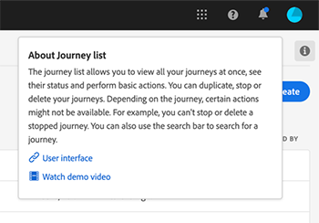

# Note sulla versione {#release-notes}

Questa pagina elenca tutte le nuove funzionalità e i miglioramenti introdotti per Journey Orchestration.
È inoltre possibile consultare gli ultimi [aggiornamenti della documentazione](../release-notes/documentation-updates.md).

## Rilascio di novembre 2020 {#november-release}

<table>
<thead>
<tr>
<th><strong>Passaggio da un percorso a un altro</strong> </th>
</tr>
</thead>
<tbody>
<tr>
<td>

Una nuova attività di azione consente di spingere gli individui da un viaggio all’altro. L'attività <strong>Jump</strong> consente di:

<ul>
<li>semplificare la progettazione di viaggi molto complessi suddividendoli in più </li>
<li>costruire percorsi basati su percorsi comuni e riutilizzabili</li>
</ul>

Per ulteriori informazioni, consulta la <a href="../building-journeys/jump.md">documentazione dettagliata</a>.

</td>
</tr>
</tbody>
</table>

<table>
<thead>
<tr>
<th><strong>Utilizzo delle proprietà di viaggio nell'editor di espressioni</strong> </th>
</tr>
</thead>
<tbody>
<tr>
<td>

Nell'editor di espressioni avanzate, abbiamo aggiunto una nuova categoria nell'elenco di campi e funzioni. Si tratta delle informazioni recuperate dal sistema dai viaggi in diretta, come l'ID viaggio o gli errori specifici riscontrati. Questo vi darà maggiori possibilità quando si costruiscono i vostri viaggi. Ad esempio, sarà possibile avvisare i sistemi di terze parti in caso di errori riscontrati in una condizione o in un'azione.

Per ulteriori informazioni, consulta la <a href="../expression/journey-properties.md">documentazione dettagliata</a>.

</td>
</tr>
</tbody>
</table>

<table>
<thead>
<tr>
<th><strong>Eventi basati su regole (beta)</strong> </th>
</tr>
</thead>
<tbody>
<tr>
<td>

È ora disponibile un nuovo metodo per impostare più facilmente gli eventi, senza utilizzare un ID evento: gli eventi basati su regole valutano se l'evento deve essere attivato in base a una condizione. È comunque possibile utilizzare il metodo esistente, ora denominato "generato dal sistema". Questa funzione, testata tra un numero limitato di clienti attraverso il programma Alpha, è ora disponibile in versione beta per tutti i clienti.

Per ulteriori informazioni, consulta la <a href="../event/about-events.md">documentazione dettagliata</a>.

</td>
</tr>
</tbody>
</table>

### Altri miglioramenti{#october-november}

Sono state aggiunte limitazioni per la creazione di nuove versioni di un viaggio. Queste limitazioni evitano modifiche troppo drastiche nel percorso per mantenere una certa coerenza tra le versioni. [Leggi tutto](../about/limitations.md#journey-versions-limitations)

L&#39;attività **Qualificazione segmento** non può più essere utilizzata in un percorso che include attività di messaggio Campaign Standard. Questa limitazione protegge l&#39;integrità delle istanze di  Adobe Campaign Standard. In effetti, l&#39;utilizzo delle qualifiche dei segmenti può determinare picchi giornalieri di invio di messaggi che sovraccaricano i messaggi transazionali Campaign Standard. [Leggi tutto](../about/limitations.md#segment-qualification)

## Rilascio di ottobre 2020 {#october-release}

<table>
<thead>
<tr>
<th><strong>Timeout evento</strong> </th>
</tr>
</thead>
<tbody>
<tr>
<td>

Ora puoi configurare un timeout per un evento per consentire a un viaggio di ascoltare un evento solo durante un certo periodo di tempo. Non è più necessario aggiungere un'attività Wait in parallelo al percorso dell'evento per ottenere questo risultato.

Per ulteriori informazioni, consulta la <a href="../building-journeys/event-activities.md#listening-to-events-during-a-specific-time">documentazione dettagliata</a>.

</td>
</tr>
</tbody>
</table>

### Altri miglioramenti{#october-other}

* Quando pubblicate una nuova versione di un viaggio, la versione precedente termina automaticamente e passa allo stato Chiuso. [Leggi tutto](../building-journeys/journey-versions.md)

## Rilascio di settembre 2020 {#september-release}

### Aggiornamenti per la disponibilità generale{#september-ga-update}

<table>
<thead>
<tr>
<th><strong>Miglioramenti all'attività delle condizioni</strong> </th>
</tr>
</thead>
<tbody>
<tr>
<td>

Quando si aggiungono condizioni al viaggio, ora è possibile definire un'etichetta. Se durante un viaggio si utilizzano diverse condizioni, questo consente di identificarle più facilmente.

Per ulteriori informazioni, consulta la <a href="../building-journeys/condition-activity.md#about_condition">documentazione dettagliata</a>.

</td>
</tr>
</tbody>
</table>

### Aggiornamenti Alpha{#september-alpha-update}

Per scoprire l’ambito del programma Alpha, fai riferimento a questa [sezione](../alpha/alpha-overview.md).

<table>
<thead>
<tr>
<th><strong>Miglioramenti all’attività di lettura dei segmenti</strong> </th>
</tr>
</thead>
<tbody>
<tr>
<td>

Sono stati apportati i seguenti miglioramenti all'attività <strong>Leggi segmento</strong>:

<ul>
<li>
I viaggi basati su segmenti ora mostrano, sopra il quadro, un promemoria del tipo di pianificazione del viaggio. Puoi fare clic su questo promemoria per accedere al menu di configurazione della pianificazione.

</li>
<li>
È stata migliorata la granularità dei registri della modalità di prova per visualizzare lo stato di avanzamento dell’esportazione del segmento.

</li>
</ul>

Per ulteriori informazioni sull'attività <strong>Leggi segmento</strong>, fare riferimento alla <a href="../alpha/alpha-segment-trigger.md">documentazione dettagliata</a>.

</td>
</tr>
</tbody>
</table>

## Versione di agosto 2020 {#august-release}

### Aggiornamenti per la disponibilità generale{#august-ga-update}

Il payload degli eventi di qualificazione dei segmenti ora contiene le seguenti informazioni contestuali, che è possibile utilizzare in condizioni e azioni: il comportamento (entrata, uscita), il timestamp della qualificazione e l’ID del segmento. [Leggi tutto](../building-journeys/segment-qualification-events.md)

### Aggiornamenti Alpha{#august-alpha-update}

Per scoprire l’ambito del programma Alpha, fai riferimento a questa [sezione](../alpha/alpha-overview.md).

<table>
<thead>
<tr>
<th><strong>Attività attivazione segmento</strong> </th>
</tr>
</thead>
<tbody>
<tr>
<td>

Sono stati apportati i seguenti miglioramenti all’attività attivazione segmento:

<ul>
<li>
Il nome dell’attività è stato modificato in “Leggi segmento”. 

</li>
<li>
La configurazione dell’utilità di pianificazione del percorso è stata rimossa dalle proprietà dell’attività. Ora è accessibile direttamente dalle proprietà del percorso, in una sezione dedicata che verrà visualizzata se un’attività Leggi segmento è stata rilasciata nell’area di lavoro. 

</li>
<li>
Ora puoi testare il percorso su un profilo unitario e monitorare l’avanzamento del profilo nel percorso utilizzando il flusso visivo.

</li>
</ul>

Per ulteriori informazioni, consulta la <a href="../alpha/alpha-segment-trigger.md">documentazione dettagliata</a>.

</td>
</tr>
</tbody>
</table>

<table>
<thead>
<tr>
<th><strong>Eventi basati su regole</strong> </th>
</tr>
</thead>
<tbody>
<tr>
<td>

Sono stati apportati i seguenti miglioramenti agli eventi basati su regole:

<ul>
<li>
Ora puoi sfruttare tutti i dati dell’evento comportamentale di Adobe Analytics che già acquisisci e trasferisci in Platform per attivare i percorsi e automatizzare le esperienze per i clienti. <a href="../event/about-analytics.md">Leggi tutto</a>

</li>
<li>
Ora, quando attivi un evento basato su regole in modalità di test, puoi visualizzare direttamente la condizione dell’ID evento. Inoltre, è stata aggiunta una descrizione del comando accanto a ciascun campo che fa parte della valutazione delle regole. <a href="../building-journeys/testing-the-journey.md#test-rule-based">Leggi tutto</a>

</li>
<li>
La schermata di definizione degli eventi basati su regole è stata riorganizzata per migliorare l’esperienza. <a href="../event/about-creating.md">Leggi tutto</a>

</li>
</ul>
</td>
</tr>
</tbody>
</table>

## Rilascio Alpha - Luglio 2020 {#alpha-release---july-2020}

Il programma Alpha offre funzioni che sono attualmente in fase di test per un numero limitato di clienti. Questo ci permette di migliorare il nostro prodotto in base al feedback ricevuto. Le funzioni non sono disponibili per tutti i clienti di Journey Orchestration.

Queste funzioni sono descritte in una [sezione](../alpha/alpha-overview.md) dedicata.

<table>
<thead>
<tr>
<th><strong>Interfaccia utente migliorata</strong> </th>
</tr>
</thead>
<tbody>
<tr>
<td>

La navigazione all’interno dei menu di Journey Orchestration è stata migliorata per fornire un’interfaccia coerente con Adobe Experience Platform:

<ul>
<li>
I menu sono stati spostati dalla parte superiore al lato sinistro dell’interfaccia. 

</li>
<li>
Le funzionalità di amministrazione sono state raggruppate in un’unica dashboard.

</li>
</ul>

Per ulteriori informazioni, consulta la <a href="../alpha/alpha-interface.md">documentazione dettagliata</a>.

</td>
</tr>
</tbody>
</table>

<table>
<thead>
<tr>
<th><strong>Attività attivazione segmento</strong> </th>
</tr>
</thead>
<tbody>
<tr>
<td>

L’attività attivazione segmento consente di fare in modo che tutti i singoli utenti appartenenti a un segmento Adobe Experience Platform entrino in un percorso. L’entrata in un percorso può essere eseguita una volta o su base regolare. <a href="../alpha/alpha-segment-trigger.md">Leggi tutto</a>

</td>
</tr>
</tbody>
</table>

<table>
<thead>
<tr>
<th><strong>Eventi basati su regole</strong> </th>
</tr>
</thead>
<tbody>
<tr>
<td>

Abbiamo semplificato la configurazione degli eventi di esperienza. Stiamo introducendo un nuovo metodo che non richiede l’uso di un ID evento. Ora quando configuri l’evento in Journey Orchestration puoi definire un evento basato su regole. <a href="../event/about-events.md">Leggi tutto</a>

</td>
</tr>
</tbody>
</table>

## Versione secondo trimestre - giugno 2020 {#q2-release---june-2020}

<table>
<thead>
<tr>
<th><strong>Miglioramenti dell’integrazione di Adobe Experience Platform</strong> </th>
</tr>
</thead>
<tbody>
<tr>
<td>

Sono stati apportati i seguenti miglioramenti all’integrazione di Adobe Experience Platform:

<ul>
<li>
Una nuova attività consente di ascoltare le entrate/uscite dei segmenti Adobe Experience Platform per consentire alle persone di accedere a un percorso o proseguire in esso. <a href="../building-journeys/segment-qualification-events.md">Leggi tutto</a>

</li>
<li>
Grazie alla nuova scheda <strong>Segments</strong> è ora possibile creare e modificare i segmenti di Adobe Experience Platform senza uscire dall’interfaccia di Journey Orchestration. <a href="../segment/about-segments.md">Leggi tutto</a>

</li>
<li>
Nell’editor delle espressioni semplici, i segmenti di Adobe Experience Platform ora sono elencati direttamente nella struttura di navigazione per consentire una configurazione semplice di condizioni come “questa persona appartiene al segmento A?”. <a href="../segment/using-a-segment.md">Leggi tutto</a>

</li>
<li>
Ora Journey Orchestration passa automaticamente ad Adobe Experience Platform i passaggi eseguiti nei percorsi. Ciò include i potenziali errori rilevati. Queste informazioni possono essere utilizzate per ottenere rapporti e ai fini di risoluzione dei problemi attraverso l’esecuzione di query sugli eventi del passaggio del percorso o per tutti i percorsi. <a href="../building-journeys/sharing-overview.md">Leggi tutto</a>

</li>
<li>
Ora Journey Orchestration può essere collegata alle sandbox Adobe Experience Platform, sia di produzione che non di produzione. Le sandbox sono una funzione beta. <a href="../about/access-management.md#sandboxes">Leggi tutto</a>

</li>
</ul>
</td>
</tr>
</tbody>
</table>

<table>
<thead>
<tr>
<th><strong>Miglioramenti di designer del percorso e modalità di test</strong> </th>
</tr>
</thead>
<tbody>
<tr>
<td>

Sono stati apportati i seguenti miglioramenti al designer del percorso e alla modalità di test:

<ul>
<li>
È ora possibile copiare e incollare le attività da un percorso all’altro, selezionando 1 o N attività di percorso. <a href="../building-journeys/using-the-journey-designer.md#copy-paste">Leggi tutto</a>

</li>
<li>
Dopo aver attivato un evento per la creazione di un profilo di test per l’accesso a un percorso, ora potrai vederne i progressi grazie a un flusso visivo colorato. In caso di errore nel percorso, vengono visualizzati anche i dettagli degli errori. <a href="../building-journeys/testing-the-journey.md#firing_events">Leggi tutto</a>

</li>
<li>Lo stato di percorso <strong>Finished</strong> è stato rinominato <strong>Closed (no entrance)</strong> per riflettere meglio il suo significato.</li>
</ul>
</td>
</tr>
</tbody>
</table>

**Altri miglioramenti**

Per evitare di inviare un numero eccessivo di chiamate API a sistemi di terze parti, stiamo introducendo una nuova API pubblica per impostare le regole di “limitazione di utilizzo”. Le regole di limitazione di utilizzo consentono di definire un numero massimo di chiamate a un endpoint API per millisecondi. [Leggi tutto](../api/capping.md)

Adesso il controllo di accesso consente una maggiore granularità nella gestione degli accessi utente. Disponibilità effettiva: 30 giugno 2020. [Leggi tutto](../about/access-management.md#create-product-profile)

Journey Orchestration è ora disponibile in APAC (datacenter australiano). Disponibilità effettiva: 30 giugno 2020

L’interfaccia Journey Orchestration è disponibile in giapponese.

## Versione primo trimestre - marzo 2020 {#q1-release---march-2020}

<table>
<thead>
<tr>
<th><strong>Miglioramenti della modalità di test</strong> </th>
</tr>
</thead>
<tbody>
<tr>
<td>

Sono stati apportati i seguenti miglioramenti alla modalità di test:

<ul>
<li>Quando un percorso utilizza diversi eventi, adesso puoi attivarli singolarmente da un elenco a discesa, dalla schermata <strong>Event configuration (Configurazione dell’evento)</strong> della modalità di test. <a href="../building-journeys/testing-the-journey.md#firing_events">Ulteriori informazioni</a>
</li>
<li>
Quando una o più attività <strong>Attendi</strong> vengono utilizzate in un percorso, ora puoi impostare la durata di ciascuna in modalità di test. Il tempo predefinito è di 10 secondi. Puoi modificare questo valore usando il parametro <strong>Wait time in test (Tempo di attesa nel test)</strong>, nell’angolo in basso a sinistra. <a href="../building-journeys/testing-the-journey.md">Ulteriori informazioni</a>

</li>
<li>Nei <strong>registri di test</strong>, in caso di errore durante la chiamata a un sistema di terze parti, che sia origine dati o azione, adesso vengono visualizzati il codice di errore e la risposta relativa. <a href="../building-journeys/testing-the-journey.md#viewing_logs">Ulteriori informazioni</a>
</li>
</ul>
</td>
</tr>
</tbody>
</table>

<table>
<thead>
<tr>
<th><strong>Gestione centralizzata del fuso orario</strong> </th>
</tr>
</thead>
<tbody>
<tr> 
<td>

La gestione del fuso orario è ora centralizzata nel pannello delle proprietà del percorso. Nelle proprietà del percorso sono stati aggiunti due parametri:

<ul>
<li>L’elenco a discesa <strong>Timezone (Fuso orario)</strong> consente di selezionare un fuso orario specifico. Per impostazione predefinita, viene utilizzato il fuso orario del browser. </li>
<li>La casella di controllo <strong>Profile Timezone (Fuso orario profilo)</strong> consente di usare il fuso orario del profilo di Adobe Experience Platform della persona che accede al percorso, se disponibile. In caso contrario, viene utilizzato il fuso orario specificato nell’elenco a discesa. Questa funzione non è compatibile con i percorsi che utilizzano eventi privi di spazio dei nomi.</li>
</ul>

Per ulteriori informazioni, consulta le sezioni <a href="../building-journeys/changing-properties.md#timezone">Modifica delle proprietà</a> e <a href="../building-journeys/timezone-management.md">Gestione del fuso orario</a>.

</td>
</tr>
</tbody>
</table>

<table>
<thead>
<tr>
<th><strong>Miglioramenti al designer del percorso</strong> </th>
</tr>
</thead>
<tbody>
<tr> 
<td>

È stata migliorata la <strong>palette</strong> del percorso, posizionata a sinistra rispetto al designer del percorso:

<ul>
<li>Una nuova icona, posta accanto alla barra di <strong>ricerca</strong>, consente di nascondere o visualizzare gli elementi non disponibili nella palette, ad esempio quelli che utilizzano uno spazio dei nomi diverso rispetto a quelli usati nel percorso. Per impostazione predefinita, gli elementi non disponibili sono nascosti.</li>
<li>Quando si utilizza il campo <strong>ricerca</strong>, ora viene visualizzato il numero di risultati per ogni categoria di attività dell’area di lavoro.</li>
<li>È stata migliorata la navigazione tra le diverse categorie di attività.</li>
</ul>

Nel designer del percorso, ora puoi verificare di aver effettuato l’accesso all’ultima versione del percorso. Queste informazioni vengono visualizzate accanto al numero di versione.

Quando due attività vengono disconnesse, adesso nell’<strong>area di lavoro</strong> del percorso viene visualizzato un messaggio di avviso.

Per ulteriori informazioni, consulta la <a href="../building-journeys/using-the-journey-designer.md">documentazione dettagliata</a>.

</td>
</tr>
</tbody>
</table>

<table>
<thead>
<tr>
<th><strong>Aiuto contestuale</strong> </th>
</tr>
</thead>
<tbody>
<tr>
<td>

È ora disponibile un aiuto contestuale nelle diverse schermate dell’elenco di Journey Orchestration (percorsi, eventi, azioni e origini dati). In tal modo, puoi visualizzare una descrizione rapida delle funzionalità correnti e accedere agli articoli e ai video correlati.

Per visualizzare l’aiuto contestuale, fai clic sull’icona  posta nell’angolo in alto a destra dello schermo. 

</td>
</tr>
</tbody>
</table>

**Altri miglioramenti**

* Dopo l’introduzione negli Stati Uniti, ora Journey Orchestration è accessibile nell’**EMEA**. L’applicazione e la documentazione sono disponibili in francese e tedesco.

* Experience League è ora integrato all’interno del prodotto, il che semplifica l’accesso ai contenuti correlati, consentendoti di trarre il massimo da Experience Cloud. L’accesso diretto alla documentazione di Journey Orchestration è disponibile nella parte inferiore della scheda dell’aiuto. Inoltre, puoi fare clic su Aiuto > Feedback per segnalare i problemi o condividere le idee con Adobe.

* La scelta rapida da tastiera **C**, che consente di creare un nuovo elemento è ora disponibile in tutte le schermate elenco: percorsi, origini dati, azioni ed eventi. [Ulteriori informazioni](../about/user-interface.md#section_ksq_zr1_ffb)

* Ora è possibile **eliminare** i percorsi interrotti. I rapporti associati a questi percorsi eliminati non saranno disponibili.

* Durante l’esplorazione dei **campi di Adobe Experience Platform** (formato XDM), ora viene mostrato il nome visualizzato in aggiunta al nome del campo. Queste informazioni vengono recuperate dalla definizione dello schema di Experience Data Model. Il nome visualizzato alternativo viene mostrato, se disponibile. Questa descrizione semplice e intuitiva, particolarmente utile per i campi eVar, ti consente di identificare più facilmente i campi. [Ulteriori informazioni](../about/user-interface.md#friendly-names-display)

## Versione GA - dicembre 2019 {#ga-release---december-2019}

Journey Orchestration adesso è GA.

Crea casi di utilizzo di orchestrazione in tempo reale sulla base dei dati contestuali memorizzati negli eventi o nelle origini dati.

Journey Orchestration consente l’orchestrazione in tempo reale basata su dati contestuali derivati dagli eventi, su informazioni provenienti da Adobe Experience Platform oppure su dati di servizi API di terze parti. Nell’ambito di flussi di più passaggi denominati percorsi, l’applicazione determina le migliori azioni da eseguire in futuro che sono specifiche del consumatore, in base al profilo e ai comportamenti adottati. Tale procedura include sia la tempistica ottimale, sia il tipo di azione, ad esempio la notifica di un sistema di terze parti o l’invio al consumatore di una notifica push tramite le funzionalità di messaggistica transazionali di Adobe Campaign Standard (richiesto). Queste decisioni sono prese sulla base di regole e punteggi Sensei.

Ulteriori informazioni su Journey Orchestration.

Risorse aggiuntive:

* [Esercitazioni](https://docs.adobe.com/content/help/it-IT/journey-orchestration-learn/tutorials/understanding-journey-orchestration.html)
* [Community](https://www.adobe.com/go/journeyorchestrationcommunity)
