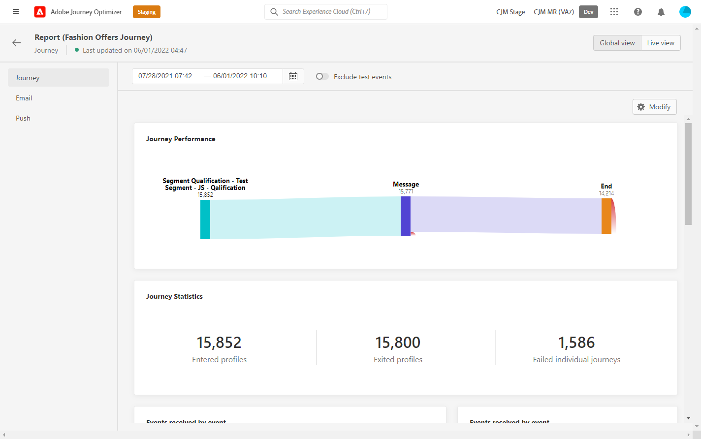

# Aggiornare l’ambiente di Journey Orchestration a Adobe Journey Optimizer{#ugrade-ajo}

## Cos&#39;è Adobe Journey Optimizer?

Adobe Journey Optimizer è un’applicazione agile e scalabile creata in modo nativo su Adobe Experience Platform per orchestrare e fornire percorsi di clienti personalizzati, collegati e puntuali in qualsiasi app, dispositivo, schermo o canale. &#x200B;

## Cos’è Journey Orchestration?

Journey Orchestration è un servizio basato su Adobe Experience Platform che consente di adattare i singoli percorsi per ogni cliente in base al suo comportamento e alle sue preferenze precedenti. Journey Orchestration è l&#39;applicazione precursore di Journey Optimizer.

## Perché dovrei passare a Adobe Journey Optimizer?

**Accesso a un’interfaccia semplificata** con funzionalità di Experience Platform che consentono un accesso rapido a percorsi, set di dati, profili, avvisi e altro ancora. Non è più necessario eseguire operazioni avanti e indietro tra Adobe Experience Platform e Journey Orchestration per accedere a schemi o set di dati, tutto è direttamente disponibile da Adobe Journey Optimizer. Per ulteriori informazioni, consulta [page](https://experienceleague.adobe.com/docs/journey-optimizer/using/get-started/user-interface.html).

<table>
<tr>
<th>Prima</th>
<th>Dopo</th>
</tr>
<tr>
<td>
Accesso a Percorsi, segmenti e sezione Amministratore (origini dati, eventi e azioni) nel Journey Orchestration. Segmenti e set di dati sono accessibili in Adobe Experience Platform. 
</td>
<td>
Accesso a Percorsi, segmenti, amministratori, segmenti e set di dati, <strong>tutti in Adobe Journey Optimizer</strong>. <strong>Funzionalità Adobe Experience Platform aggiuntive</strong> sono anche accessibili qui.
</td>
</tr>
</table>

**Nuova interfaccia di reporting** e accesso alle nuove funzioni di reporting:

<table>
<tr>
<th>Prima</th>
<th>Dopo</th>
</tr>
<tr>
<td></td>
<td>
<strong>Vista globale</strong> consente di misurare l’impatto dei percorsi e delle consegne su un periodo di tempo selezionato. Per ulteriori metriche in tempo reale, puoi accedere al <strong>Vista dal vivo</strong>. Per ogni canale di consegna utilizzato nei tuoi percorsi (e-mail, SMS, push), un <strong>sezione dedicata</strong> è disponibile nel rapporto per visualizzare le metriche. Questo vale solo se utilizzi <strong>Funzionalità di messaggistica Adobe Journey Optimizer</strong>. Per ulteriori informazioni, contatta il team del tuo account.
</td>
</tr>
</table>

Qualsiasi evoluzione per migliorare l’esperienza di reporting o per arricchirla a seguito di nuove versioni di funzioni è disponibile solo nella nuova interfaccia di reporting. Inizia a usarlo per ottenere un’esperienza Adobe Journey Optimizer più completa.

Ottieni il vantaggio di altri **Funzioni di Adobe Journey Optimizer** e nuove funzionalità in uscita, ad esempio Controllo accesso a livello di campo e Controllo accesso a livello di oggetto. Per ulteriori informazioni, contatta il team del tuo account.

## Come aggiornare l&#39;ambiente di Journey Orchestration?

1. Rivolgiti al team del tuo account per aggiornare il contratto con Adobe senza costi aggiuntivi.

1. Attendi che il nostro team ingegneristico completi la modifica.

1. Aggiorna le tue autorizzazioni utilizzando i profili di prodotto Journey Optimizer. Fai riferimento a questo [page](https://experienceleague.adobe.com/docs/journey-optimizer/using/administration/ootb-product-profiles.html?lang=it).

1. Ora hai accesso a Adobe Journey Optimizer!

## Domande frequenti

## Devo pianificare qualcosa per passare da Journey Orchestration a Adobe Journey Optimizer?

No, non c&#39;è migrazione, non c&#39;è lavoro necessario da te, niente tempi di inattività e nessun investimento aggiuntivo. Devi solo aggiornare il tuo accordo con Adobe e noi facciamo il resto. Per istruzioni su come avviare il processo, contatta il rappresentante commerciale di riferimento.

## Perderò qualcosa dopo il cambiamento?

No, manterrai tutti gli oggetti Journey Orchestration e Adobe Experience Platform esistenti: schemi, set di dati, percorsi, eventi, origini dati, azioni. Niente andrà perso, tutti i percorsi in diretta continueranno a lavorare senza interruzioni.

<table>
<tr>
<th>Prima</th>
<th>Dopo</th>
</tr>
<tr>
<td></td>
<td></td>
</tr>
</table>

### Vedo ancora il Journey Orchestration nello switcher dell&#39;applicazione, è normale?

Sì, è normale. L’accesso al Journey Orchestration verrà mantenuto per un mese dopo l’aggiornamento. Questo ti darà abbastanza tempo per aggiornare tutte le autorizzazioni degli utenti e acquisire più familiarità con Adobe Journey Optimizer. Dopo un mese, l’accesso verrà rimosso.

### Cosa succede se uso Journey Orchestration con Adobe Campaign Standard oggi?

Con il passaggio a Adobe Journey Optimizer, potrai comunque utilizzare l’integrazione tra Percorsi e Adobe Campaign Standard progettando il percorso dei clienti in Adobe Journey Optimizer e consentendo ad Adobe Campaign Standard di inviare la consegna.

Tuttavia, a causa del funzionamento dello stack di rapporti di Adobe Journey Optimizer, il reporting non combinerà dati di Percorso e Campaign Standard. Le informazioni sul percorso saranno disponibili nei rapporti di Adobe Journey Optimizer e nelle informazioni di consegna in Adobe Campaign Standard. È possibile configurare un Experience Platform per riportare i dati Adobe Campaign Standard in Adobe Experience Platform, rendendoli disponibili al Customer Journey Analytics ([ulteriori informazioni](https://business.adobe.com/products/experience-platform/customer-journey-analytics.html)) o altri strumenti di reporting di terze parti come Tableau o PowerBI.

I rapporti di Adobe Journey Optimizer funzionano meglio quando si utilizzano le funzionalità di messaggistica preconfigurate di Adobe Journey Optimizer (disponibili in offerte Adobe Journey Optimizer dedicate). Per ulteriori informazioni su come è possibile creare i messaggi nell’area di lavoro del percorso, consulta questo [page](https://experienceleague.adobe.com/docs/journey-optimizer/using/messages/messages-in-journeys.html).

Per ulteriori informazioni, contatta il team del tuo account.