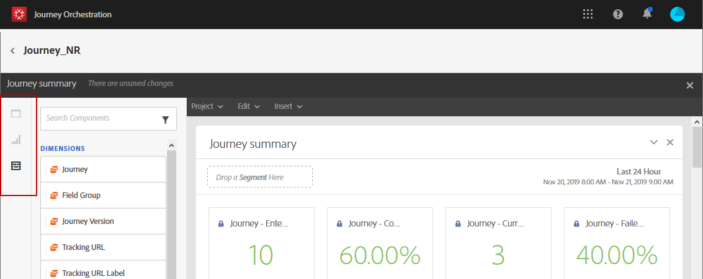

# Informazioni sui rapporti sui percorsi {#concept_rfj_wpt_52b}

>[!NOTE]
>
>I dati di consegna e il componente Segmenti verranno compilati solo se disponi di Adobe Campaign Standard.

Questa sezione illustra come accedere ai rapporti e utilizzarli per misurare l’efficacia dei percorsi.

## Interfaccia di reporting {#reporting-interface}

La barra degli strumenti superiore consente, ad esempio, di modificare, salvare o stampare il rapporto.

Utilizza la scheda **[!UICONTROL Project]** per:

* **[!UICONTROL Open]**: apre un report o un modello creato in precedenza.
* **[!UICONTROL Save As]**: duplica i modelli per poterli modificare.
* **[!UICONTROL Refresh project]**: aggiorna il rapporto in base ai nuovi dati e alle modifiche apportate ai filtri.
* **[!UICONTROL Download CSV]**: esporta i rapporti in un file CSV.
* **[!UICONTROL Print]**: stampa il rapporto.

La scheda **[!UICONTROL Edit]** ti consente di:

* **[!UICONTROL Undo]**: annulla l’ultima azione sul dashboard.
* **[!UICONTROL Redo]**: annulla l’ultima  **[!UICONTROL Undo]** azione sul dashboard.
* **[!UICONTROL Clear all]**: elimina tutti i pannelli presenti nel dashboard.

La tabella **[!UICONTROL Insert]** ti consente di personalizzare i rapporti aggiungendo grafici e tabelle al dashboard:

* **[!UICONTROL New Blank Panel]**: aggiunge un nuovo pannello vuoto al dashboard.
* **[!UICONTROL New Freeform]**: aggiunge una nuova tabella a forma libera al dashboard.
* **[!UICONTROL New Line]**: aggiunge un nuovo grafico a linee al dashboard.
* **[!UICONTROL New Bar]**: aggiunge un nuovo grafico a barre al dashboard.

Le schede a sinistra ti consentono di generare il rapporto e filtrare i dati in base alle esigenze.

Queste schede consentono di accedere ai seguenti elementi:

* **[!UICONTROL Panels]**: aggiungi un pannello vuoto o una forma libera al rapporto per iniziare a filtrare i dati. Per ulteriori informazioni, consulta la sezione [Aggiunta di pannelli](../reporting/creating-your-journey-reports.md#adding-panels) .
* **[!UICONTROL Visualizations]**: trascina e rilascia una selezione di elementi di visualizzazione per assegnare al rapporto una dimensione grafica. Per ulteriori informazioni, consulta la sezione [Aggiunta di visualizzazioni](../reporting/creating-your-journey-reports.md#adding-visualizations) .
* **[!UICONTROL Components]**: personalizzare i rapporti con dimensioni, metriche, segmenti e periodi di tempo diversi. Per ulteriori informazioni, consulta la sezione [Aggiunta di componenti](../reporting/creating-your-journey-reports.md#adding-components) .

## Modello di riepilogo del percorso {#ootb-template}

I rapporti sono suddivisi in due categorie: un modello preconfigurato e rapporti personalizzati.
Il modello preconfigurato **[!UICONTROL Journey summary]** offre una visualizzazione chiara dei dati di tracciamento più importanti.

Ogni tabella è rappresentata da numeri di riepilogo e grafici. Puoi modificare il modo in cui i dettagli vengono visualizzati nelle rispettive impostazioni di visualizzazione.

I KPI seguenti sono disponibili nella parte superiore del rapporto:

* **[!UICONTROL Journey - Entered]**: numero totale di persone che hanno raggiunto l&#39;evento di ingresso del percorso.
* **[!UICONTROL Journey - Completion rate]**: numero totale di individui che hanno raggiunto la fine del percorso (o nel caso di una persona che non soddisfa alcuna condizione) rispetto al numero totale di persone che sono entrate nel percorso.
* **[!UICONTROL Journey - Current]**: numero totale di individui attualmente nel percorso.
* **[!UICONTROL Journey - Failed rate]**: numero totale di percorsi che non sono stati eseguiti correttamente rispetto al numero di percorsi di esecuzione.
* **[!UICONTROL Delivery - Messages sent]**: numero totale di messaggi inviati.
* **[!UICONTROL Delivery rate]**: numero totale di messaggi recapitati correttamente rispetto ai messaggi inviati.
* **[!UICONTROL Delivery - Bounce rate]**: numero totale di messaggi rimbalzati rispetto ai messaggi inviati.
* **[!UICONTROL Delivery - Unsubscribed rate]**: numero totale di annullamenti di abbonamenti per destinatario rispetto ai messaggi consegnati.
* **[!UICONTROL Delivery - Open rate]**: numero totale di messaggi aperti rispetto al numero di messaggi inviati.
* **[!UICONTROL Delivery - Click rate]**: numero totale di clic in una consegna rispetto al numero di messaggi inviati.

La visualizzazione del flusso di Percorso ti consente di visualizzare il percorso dei profili di destinazione passo dopo passo nel percorso. Questa opzione è disponibile solo per il targeting di un percorso. Viene generato automaticamente e non può essere modificato.

La tabella **[!UICONTROL Journey summary]** contiene i dati disponibili per il percorso, ad esempio:

* **[!UICONTROL Entered]**: numero totale di persone che hanno raggiunto l&#39;evento di ingresso del percorso.
* **[!UICONTROL Completion rate]**: numero totale di individui che hanno raggiunto il controllo del flusso finale del percorso rispetto al numero totale di individui che sono entrati nel percorso.
* **[!UICONTROL Current]**: numero totale di individui attualmente nel percorso.
* **[!UICONTROL Failed]**: numero totale di percorsi non eseguiti correttamente.
* **[!UICONTROL Failed rate]**: numero totale di percorsi che non sono stati eseguiti correttamente rispetto al numero di percorsi di esecuzione.

La tabella **[!UICONTROL Top events]** visualizza gli eventi di maggior successo e le azioni di maggior successo dei percorsi **[!UICONTROL Top action]**.

La tabella **[!UICONTROL Delivery - Sending summary]** contiene i dati disponibili per le consegne del percorso, ad esempio:

* **[!UICONTROL Processed/sent]**: numero totale di messaggi inviati.
* **[!UICONTROL Delivered rate]**: numero totale di messaggi recapitati correttamente rispetto ai messaggi inviati.
* **[!UICONTROL Delivered]**: numero di messaggi inviati correttamente, in relazione al numero totale di messaggi inviati.
* **[!UICONTROL Bounce + error rate]**: numero totale di messaggi rimbalzati rispetto ai messaggi inviati.
* **[!UICONTROL Bounces + errors]**: totale degli errori cumulati durante la consegna e l’elaborazione automatica della restituzione in relazione al numero totale di messaggi inviati.

La tabella **[!UICONTROL Delivery - Tracking summary]** contiene i dati disponibili per tenere traccia del successo delle consegne dei percorsi, ad esempio:

* **[!UICONTROL Open Rate]**: percentuale dei messaggi aperti.
* **[!UICONTROL Open]**: numero di volte in cui un messaggio è stato aperto in una consegna.
* **[!UICONTROL Click trough rate]**: numero totale di clic in una consegna rispetto al numero di messaggi inviati.
* **[!UICONTROL Click]**: numero di volte in cui è stato fatto clic su un contenuto in una consegna.
* **[!UICONTROL Unsubscribe rate]**: percentuale di annullamenti degli abbonamenti per destinatario rispetto ai messaggi consegnati.
* **[!UICONTROL Unsubscribed]**: numero totale di annullamenti di abbonamenti per destinatario rispetto ai messaggi consegnati.
