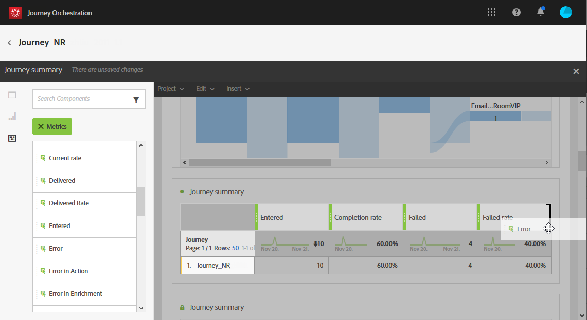
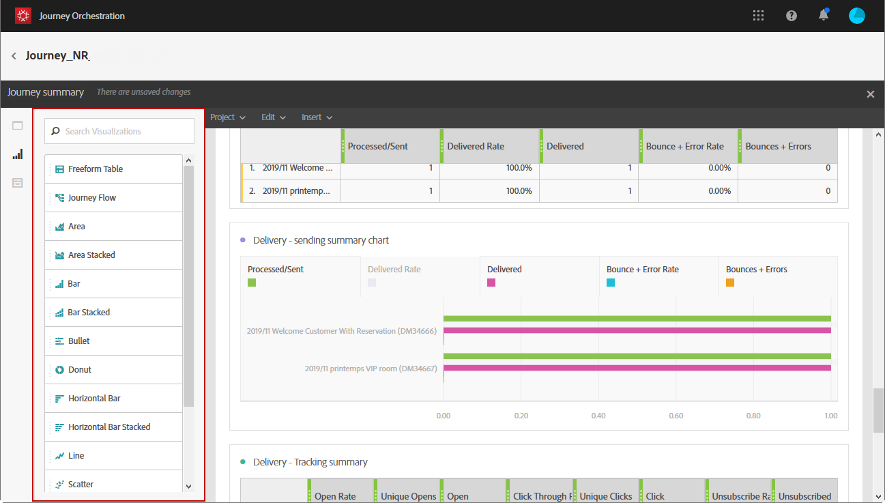
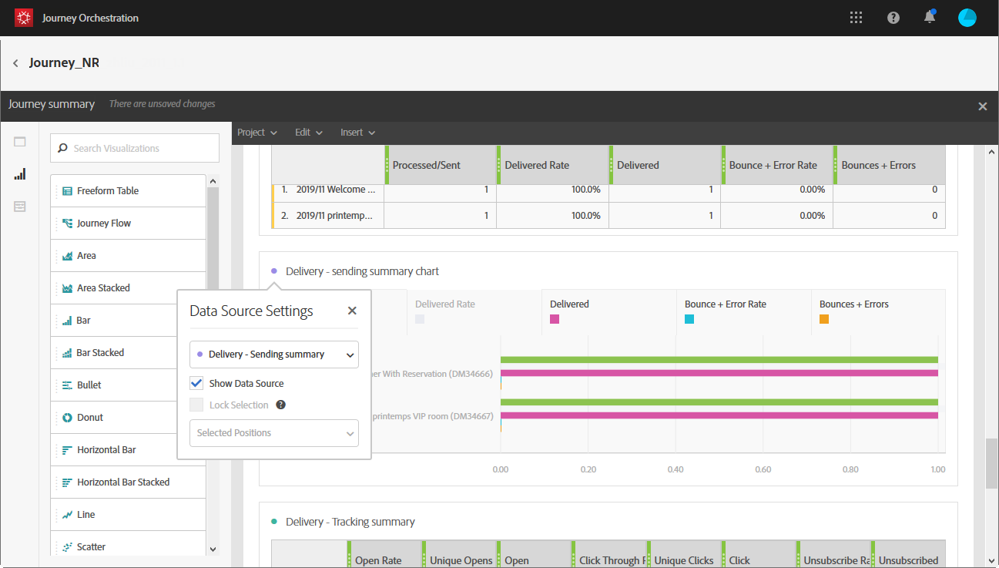

# Creazione dei rapporti sui percorsi {#concept_rfj_wpt_52b}

## Accesso e creazione dei rapporti {#accessing-reports}

>[!NOTE]
>
>Dopo l’eliminazione di un percorso, tutti i rapporti associati non saranno più disponibili.

Questa sezione illustra come creare o utilizzare rapporti predefiniti. Combina pannelli, componenti e visualizzazioni per tracciare meglio il successo dei tuoi percorsi.

Per accedere ai rapporti dei tuoi percorsi e iniziare a tenere traccia del successo delle consegne:

1. Nel menu principale, fai clic sulla scheda **[!UICONTROL Home]**.

1. Seleziona il percorso su cui desideri creare i rapporti.

   Per accedere ai rapporti, fai clic su **Report** mentre passi il mouse su un percorso nell&#39;elenco dei percorsi.

   

1. Fai clic sull’icona **[!UICONTROL Report]** in alto a destra dello schermo.

   

1. Il rapporto **[!UICONTROL Journey summary]** preconfigurato viene visualizzato sullo schermo. Per accedere ai rapporti personalizzati, fai clic sul pulsante **[!UICONTROL Close]** .

   

1. Fai clic su **[!UICONTROL Create new project]** per creare il rapporto da zero.

   

1. Dalla scheda **[!UICONTROL Panels]** , trascina e rilascia tutti i pannelli o le tabelle a forma libera necessari. Per ulteriori informazioni, consulta questa [sezione](#adding-panels).

   

1. Puoi quindi iniziare a filtrare i dati trascinando dimensioni e metriche dalla scheda **[!UICONTROL Components]** nella tabella a forma libera. Per ulteriori informazioni, consulta questa [sezione](#adding-components).

   

1. Per una visualizzazione più chiara dei dati, puoi aggiungere visualizzazioni dalla scheda **[!UICONTROL Visualizations]** . Per ulteriori informazioni, consulta questa [sezione](#adding-visualizations).

## Aggiunta di pannelli{#adding-panels}

### Aggiunta di un pannello vuoto {#adding-a-blank-panel}

Per avviare il rapporto, puoi aggiungere un set di pannelli a un rapporto predefinito o personalizzato. Ogni pannello contiene set di dati diversi ed è composto da tabelle a forma libera e visualizzazioni.

Questo pannello consente di generare i rapporti in base alle esigenze. Puoi aggiungere tutti i pannelli desiderati nei rapporti per filtrare i dati in base a periodi di tempo diversi.

1. Fai clic sull&#39;icona **[!UICONTROL Panels]** . Per aggiungere un pannello, fai clic su **[!UICONTROL Insert tab]** e seleziona **[!UICONTROL New Blank Panel]**.

   

1. Trascina **[!UICONTROL Blank Panel]** nel dashboard.

   

Ora puoi aggiungere una tabella a forma libera al pannello per avviare il targeting dei dati.

### Aggiunta di una tabella a forma libera {#adding-a-freeform-table}

Le tabelle a forma libera consentono di creare una tabella per analizzare i dati utilizzando le diverse metriche e dimensioni disponibili nella tabella **[!UICONTROL Component]** .

Ogni tabella e visualizzazione può essere ridimensionata e spostata per personalizzare meglio il rapporto.

1. Fai clic sull&#39;icona **[!UICONTROL Panels]** .

   

1. Trascina e rilascia l’elemento **[!UICONTROL Freeform]** nel dashboard.

   Per aggiungere una tabella, fai clic sulla scheda **[!UICONTROL Insert]** e seleziona **[!UICONTROL New Freeform]** oppure fai clic su **[!UICONTROL Add a freeform table]** in un pannello vuoto.

   

1. Trascina gli elementi dalla scheda **[!UICONTROL Components]** nelle colonne e nelle righe per creare la tabella.

   

1. Fai clic sull’icona **[!UICONTROL Settings]** per modificare la modalità di visualizzazione dei dati nelle colonne.

   

   Il **[!UICONTROL Column settings]** è composto da:

   * **[!UICONTROL Number]**: consente di visualizzare o nascondere i numeri di riepilogo nella colonna.
   * **[!UICONTROL Percent]**: consente di mostrare o nascondere le percentuali nella colonna.
   * **[!UICONTROL Interpret zero as no value]**: consente di mostrare o nascondere quando il valore è uguale a zero.
   * **[!UICONTROL Background]**: consente di mostrare o nascondere la barra di avanzamento orizzontale nelle celle.
   * **[!UICONTROL Include retries]**: consente di includere i nuovi tentativi nel risultato. Questa funzione è disponibile solo per **[!UICONTROL Sent]** e **[!UICONTROL Bounces + Errors]**.

1. Seleziona una o più righe e fai clic sull&#39;icona **[!UICONTROL Visualize]** . Viene aggiunta una visualizzazione per riflettere le righe selezionate.

   

Ora puoi aggiungere tutti i componenti necessari e anche aggiungere visualizzazioni per fornire rappresentazioni grafiche dei tuoi dati.

## Aggiunta di componenti{#adding-components}

I componenti consentono di personalizzare i rapporti con dimensioni, metriche e periodi di tempo diversi.

1. Fai clic sulla scheda **[!UICONTROL Components]** per accedere all’elenco dei componenti.

   

1. Ogni categoria presentata nella scheda **[!UICONTROL Components]** visualizza i cinque elementi più utilizzati, fai clic sul nome di una categoria per accedere al relativo elenco completo di componenti.

   La tabella dei componenti è divisa in tre categorie:

   * **[!UICONTROL Dimensions]**: Ottieni i dettagli dal registro delle consegne, ad esempio il browser o il dominio del destinatario, o il successo di una consegna.
   * **[!UICONTROL Metrics]**: Visualizza i dettagli sullo stato di un messaggio. Ad esempio, se un messaggio è stato recapitato e l’utente lo ha aperto.
   * **[!UICONTROL Time]**: Imposta un periodo di tempo per la tabella.

1. Trascina i componenti in un pannello per iniziare a filtrare i dati.

Puoi trascinare e rilasciare tutti i componenti necessari e confrontarli tra loro.

## Aggiunta di visualizzazioni{#adding-visualizations}

La scheda **[!UICONTROL Visualizations]** ti consente di trascinare e rilasciare elementi di visualizzazione, ad esempio area, anello e grafico. Le visualizzazioni ti forniscono rappresentazioni grafiche dei tuoi dati.

1. Nella scheda **[!UICONTROL Visualizations]** , trascina e rilascia un elemento di visualizzazione in un pannello.

   

1. Dopo aver aggiunto una visualizzazione al pannello, i rapporti rilevano automaticamente i dati presenti nella tabella a forma libera. Seleziona le impostazioni per la visualizzazione.
1. Se disponi di più tabelle a forma libera, scegli l’origine dati disponibile da aggiungere nel grafico nella finestra **[!UICONTROL Data Source Settings]**. Questa finestra è disponibile anche facendo clic sul punto colorato accanto al titolo della visualizzazione.

   

1. Fai clic sul pulsante **[!UICONTROL Visualization]** impostazioni per modificare direttamente il tipo di grafico o il contenuto visualizzato, ad esempio:

   * **[!UICONTROL Percentages]**: Visualizza i valori in percentuale.
   * **[!UICONTROL Anchor Y Axis at Zero]**: Forza l&#39;asse y a zero anche se i valori sono superiori a zero.
   * **[!UICONTROL Legend visible]**: Ti permette di nascondere la leggenda.
   * **[!UICONTROL Normalization]**: Forza la corrispondenza dei valori.
   * **[!UICONTROL Display Dual Axis]**: Aggiunge un altro asse al grafico.
   * **[!UICONTROL Limit Max Items]**: Limita il numero di grafici visualizzati.
   * **[!UICONTROL Threshold]**: Consente di impostare una soglia per il grafico. Appare come una linea puntata nera.

   

Questa visualizzazione ti consente di ottenere una visualizzazione più chiara dei dati nei rapporti.