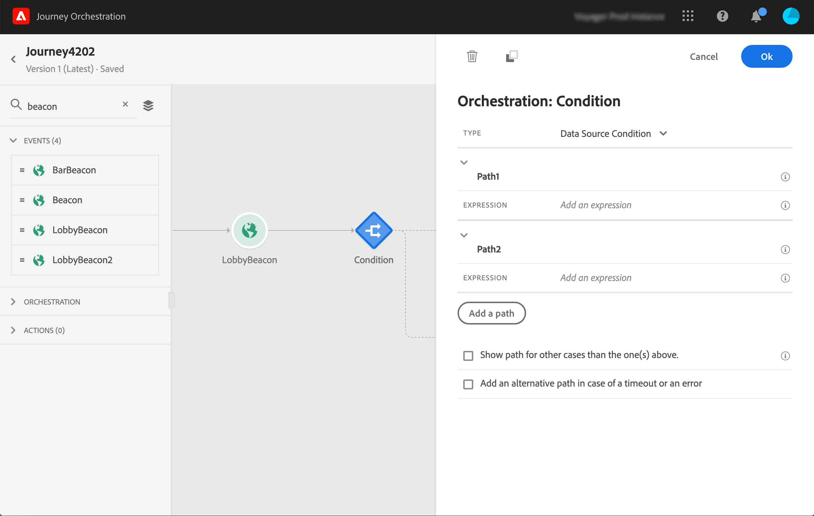

# Utilizzo di segmenti nelle condizioni {#using-a-segment}

In questa sezione viene illustrato come utilizzare un segmento in una condizione di viaggio. Per informazioni sull’utilizzo di un **[!UICONTROL Segment qualification]** evento nel percorso, consulta Attività Eventi.

Per utilizzare un segmento in una condizione di viaggio, attenetevi alla seguente procedura:

1. Apri un percorso, elimina un&#39; **[!UICONTROL Condition]** attività e scegli la condizione **origine**dati.
   

1. Fare clic **[!UICONTROL Add a path]** per ogni percorso aggiuntivo necessario. Per ciascun percorso, fare clic sul **[!UICONTROL Expression]** campo.

   

1. Sul lato sinistro, aprire **[!UICONTROL Segments]** il nodo. Trascina e rilascia il segmento da utilizzare per la condizione. Per impostazione predefinita, la condizione relativa al segmento è true.

   

Per ulteriori informazioni sulle condizioni di viaggio e su come utilizzare l&#39;editor di espressioni semplici, fare riferimento a Attività Condizione.
