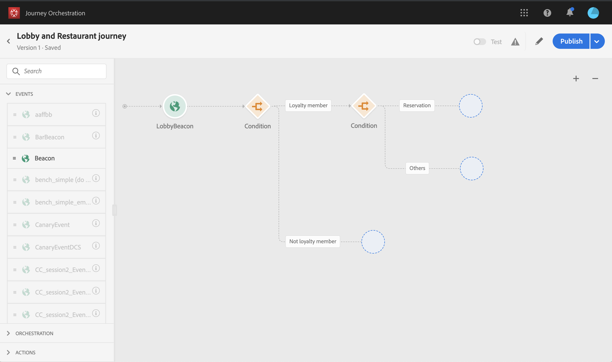
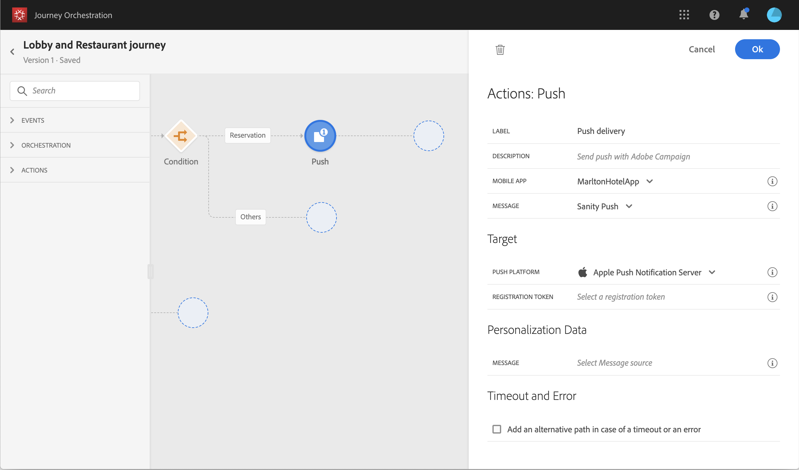

# Creazione di un percorso {#concept_owm_kdy_w2b}

Ora l’**utente aziendale** può costruire il percorso. Il percorso includerà le seguenti attività:

* due attività **[!UICONTROL Event]**: “LobbyBeacon” e “RestaurantBeacon”
* due attività **[!UICONTROL Condition]**
* tre attività **[!UICONTROL Push]** e un’attività **[!UICONTROL Email]** (utilizzando Adobe Campaign Standard)
* un’attività **[!UICONTROL Wait]**
* quattro attività **[!UICONTROL End]**

>[!NOTE]
>
>Le attività **[!UICONTROL Push]** e **[!UICONTROL Email]** sono disponibili nel riquadro solo se si dispone di Adobe Campaign Standard.

Per ulteriori informazioni sulla creazione di un percorso, consulta [](../building-journeys/journey.md).

## Primi passaggi{#section_ntb_ws1_ffb}

1. Nel menu principale, fai clic sulla scheda **[!UICONTROL Home]** e **[!UICONTROL Create]** per creare un nuovo percorso.

   

1. Modifica le proprietà del percorso nel riquadro di configurazione visualizzato sul lato destro. Aggiungi un nome e imposta la durata di un mese, dal 1° al 31 dicembre.

   

1. Inizia a progettare il percorso trascinando l’evento “LobbyBeacon” dal riquadro all’area di lavoro. Puoi anche fare doppio clic sull’evento nel riquadro per aggiungerlo all’area di lavoro.

   

1. Aggiungiamo ora una condizione per verificare che la persona non sia stata contattata nelle ultime 24 ore e verificare se è un membro fedeltà. Trascina un’attività condizione nel percorso.

   

1. Scegli il tipo di **[!UICONTROL Data Source Condition]** e fai clic nel campo **[!UICONTROL Expression]**. Puoi anche definire un’etichetta di condizione che verrà visualizzata sulla freccia nell’area di lavoro. Nel nostro esempio, sostituiamo “Condizione 1” con “Membro fedeltà”.

   

1. Fai clic su **[!UICONTROL Advanced mode]** e definisci la seguente condizione in base ai campi “timestamp” e “directMarketing.sends.value” provenienti dall’origine dati di Adobe Experience Platform. La sintassi dell’espressione è la seguente:

   ```
   count(#{ExperiencePlatformDataSource.MarltonExperience.experienceevent.all(
       currentDataPackField.directMarketing.sends.value > 0 and
       currentDataPackField.timestamp > nowWithDelta(-1, "days")).timestamp}) == 0
   and
       #{ExperiencePlatformDataSource.MarltonProfiles.Profile._customer.marlton.loyaltyMember}
   ```

   

1. Fai clic sul pulsante **[!UICONTROL Add a path]** e crea un secondo percorso per i clienti che non sono stati contattati nelle ultime 24 ore e non sono membri fedeltà. Denomina il percorso “Non membro fedeltà”. La sintassi dell’espressione è la seguente:

   ```
   count(#{ExperiencePlatformDataSource.MarltonExperience.experienceevent.all(
       currentDataPackField.directMarketing.sends.value > 0 and
       currentDataPackField.timestamp > nowWithDelta(-1, "days").timestamp}) == 0
   and not
       #{ExperiencePlatformDataSource.MarltonProfiles.Profile._customer.marlton.loyaltyMember}
   ```

   >[!NOTE]
   >
   >Nella seconda parte dell’espressione, “Profile” è facoltativo.

1. È necessario selezionare uno spazio dei nomi. In base alle proprietà dello schema, viene preselezionato uno spazio dei nomi. Puoi scegliere di utilizzare quest’ultimo. Per ulteriori informazioni sugli spazi dei nomi, consulta [](../event/selecting-the-namespace.md).

Nel nostro caso di utilizzo vogliamo solamente reagire a queste due condizioni, quindi non spuntiamo la casella **[!UICONTROL Show path for other cases than the one(s) above]** (Mostra percorso per casi diversi da quello/i mostrato/i sopra).

Dopo la condizione vengono creati due percorsi:

* _Clienti che non sono stati contattati nelle ultime 24 ore e che sono membri fedeltà._
* _Clienti che non sono stati contattati nelle ultime 24 ore e che non sono membri fedeltà._


## Primo percorso: il cliente è un membro fedeltà {#section_otb_ws1_ffb}

1. Nel primo percorso, aggiungiamo una condizione per verificare se il cliente ha una prenotazione. Trascina un’attività condizione nel percorso.

   

1. Scegli il tipo di **[!UICONTROL Data Source Condition]** e definisci la condizione in base alle informazioni sullo stato della prenotazione recuperate dal sistema di prenotazione:

   ```
   #{MarltonReservation.MarltonFieldGroup.reservation} == true
   ```

   

1. Quando selezioni un campo da un’origine dati esterna, nella parte destra della schermata viene visualizzato l’elenco dei parametri definiti al momento della configurazione dell’origine dati esterna (consulta [](../usecase/configuring-the-data-sources.md)). Fai clic sul nome del parametro e definisci il valore della chiave del sistema di prenotazione, l’ID Experience Cloud, nel nostro esempio:

   ```
   @{LobbyBeacon.endUserIDs._experience.mcid.id}
   ```

   

1. Dal momento che vogliamo reagire anche ai clienti che non hanno una prenotazione, dobbiamo spuntare la casella **[!UICONTROL Show path for other cases than the one(s) above]** (Mostra percorso per casi diversi da quello/i mostrato/i sopra).

   

   Vengono creati due percorsi:

   * _Clienti che hanno prenotato una stanza_
   * _Clienti che non hanno prenotato una stanza._

   

1. Nel primo percorso (stanza prenotata), rilascia un’attività **[!UICONTROL Push]**, seleziona la tua app mobile e il modello per dare il benvenuto.

   

1. Definisci i campi **[!UICONTROL Target]** richiesti dal sistema per inviare il push.

   * **[!UICONTROL Push platform]**: seleziona la piattaforma: **[!UICONTROL Apple Push Notification Server]** (Apple) o **[!UICONTROL Firebase Cloud Messaging]** (Android).
   * **[!UICONTROL Registration token]**: aggiungi la seguente espressione (basata sull’evento configurato) utilizzando la modalità avanzata:

      ```
      @{LobbyBeacon._experience.campaign.message.profileSnapshot.pushNotificationTokens.first().token}
      ```

1. Definisci i campi di personalizzazione delle notifiche push. Nel nostro esempio: nome e cognome.

1. Aggiungi un evento “RestaurantBeacon”.

   

1. Aggiungi una nuova attività **[!UICONTROL Push]**, seleziona il modello “Sconto sui pasti” e definisci i campi **[!UICONTROL Address]** e **[!UICONTROL Personalization]**. Aggiungi un’attività **[!UICONTROL End]**.

   

1. Vogliamo inviare una notifica push con uno sconto sui pasti solo se la persona entra nel ristorante entro le successive 6 ore dopo il messaggio push di benvenuto. Per farlo, dovremo utilizzare un’attività Attendi. Posiziona il cursore sull’attività push di benvenuto e fai clic sul simbolo “+”. Nel nuovo percorso, aggiungi un’attività Attendi e imposta una durata di 6 ore. Verrà scelta la prima attività idonea. Se l’evento del ristorante viene ricevuto meno di 6 ore dopo il messaggio push di benvenuto, l’attività push viene inviata. Se non viene ricevuto nessun evento del ristorante entro le 6 ore successive, viene scelta l’attività Attendi. Posiziona un’attività **[!UICONTROL End]** dopo l’attività Attendi.

   

1. Nel secondo percorso che segue la condizione di prenotazione (nessuna stanza prenotata), aggiungi un’attività **[!UICONTROL Push]** e seleziona il modello “Tariffe delle camere”. Aggiungi un’attività **[!UICONTROL End]**.

   

## Secondo percorso: il cliente non è un membro fedeltà{#section_ptb_ws1_ffb}

1. Nel secondo percorso che segue la prima condizione (il cliente non è un membro fedeltà), aggiungi un’attività **[!UICONTROL Email]** e seleziona il modello “Iscrizione fedeltà”.

   

1. Nel campo **[!UICONTROL Address]**, seleziona l’indirizzo e-mail dall’origine dati.

   

1. Definisci i campi di personalizzazione nome e cognome dall’origine dati.

   

1. Aggiungi un’attività **[!UICONTROL End]**.

Fai clic sull’interruttore **[!UICONTROL Test]** e verifica il percorso. In caso di errori, disattiva la modalità di test, modifica il percorso e verificalo di nuovo. Per ulteriori informazioni sulla modalità di test, consulta [](../building-journeys/testing-the-journey.md).


Quando il test va a buon fine, puoi pubblicare il percorso dal menu a discesa in alto a destra.


