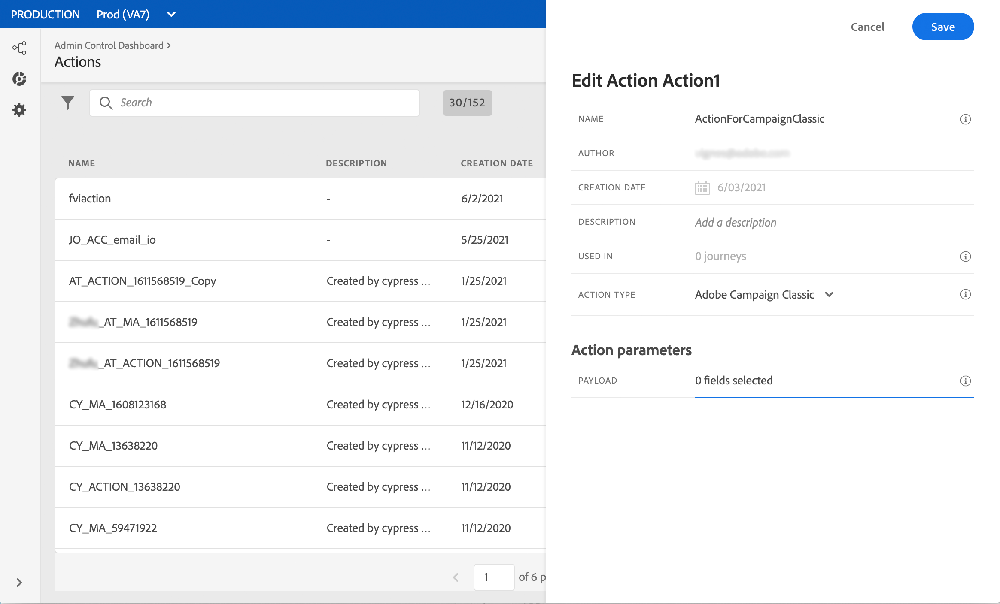

# Invio di un messaggio tramite Campaign Classic {#campaign-classic-use-case}

Questo caso d’uso illustra tutti i passaggi necessari per inviare un’e-mail utilizzando l’integrazione Adobe Campaign Classic.

In Campaign Classic verrà innanzitutto creato un modello di e-mail transazionale. Poi, al Journey Orchestration, creeremo l&#39;evento, l&#39;azione e progetteremo il percorso.

Per ulteriori informazioni sull’integrazione di Campaign Classic, consulta le pagine seguenti:

* [Creazione di un’azione Campaign Classic](../action/acc-action.md)
* [Utilizzo dell’azione in un percorso](../building-journeys/using-adobe-campaign-classic.md).

**Adobe Campaign Classic**

È necessario eseguire il provisioning dell’istanza Campaign Classic per questa integrazione. È necessario configurare la funzione Messaggistica transazionale.

1. Accedi alla tua istanza di controllo Campaign Classic.

1. In **Amministrazione** > **Piattaforma** > **Enumerazioni**, seleziona l&#39;enumerazione **Tipo evento** (eventType). Crea un nuovo tipo di evento (&quot;percorso-evento&quot;, nel nostro esempio). Sarà necessario utilizzare il nome interno del tipo di evento quando si scriverà il file JSON in un secondo momento.

   

1. Disconnetti e ricollegati all’istanza per rendere effettiva la creazione.

1. In **Centro messaggi** > **Modelli per messaggi transazionali**, crea un nuovo modello e-mail in base al tipo di evento creato in precedenza.

   

1. Progetta il tuo modello. In questo esempio, utilizziamo la personalizzazione sul nome del profilo e sul numero dell’ordine. Il nome si trova nell’origine dati Adobe Experience Platform e il numero dell’ordine è un campo dell’evento Journey Orchestration. Assicurarsi di utilizzare i nomi di campo corretti in Campaign Classic.

   

1. Pubblica il modello transazionale.

   

1. Ora devi scrivere il payload JSON corrispondente al modello.

```
{
     "channel": "email",
     "eventType": "journey-event",
     "email": "Email address",
     "ctx": {
          "firstName": "First name", "purchaseOrderNumber": "Purchase order number"
     }
}
```

* Per il canale, devi digitare &quot;email&quot;.
* Per eventType, utilizza il nome interno del tipo di evento creato in precedenza.
* L’indirizzo e-mail sarà una variabile e potrai quindi digitare qualsiasi etichetta.
* In ctx, i campi di personalizzazione sono anche variabili.

**Journey Orchestration**

1. Innanzitutto, devi creare un evento. Accertati di includere il campo &quot;purchaseOrderNumber&quot;.

   

1. Devi quindi creare, al Journey Orchestration, un’azione corrispondente al modello di Campaign Classic. Nel menu a discesa **Tipo azione**, seleziona **Adobe Campaign Classic**.

   

1. Fai clic sul **Campo payload** e incolla il JSON creato in precedenza.

   

1. Per l&#39;indirizzo e-mail e i due campi di personalizzazione, cambia **Costante** in **Variabile**.

   

1. Ora crea un nuovo percorso e inizia con l’evento creato in precedenza.

   

1. Aggiungi l’azione e mappa ogni campo nel campo corretto del Journey Orchestration.

   

1. Aggiungi un&#39;attività **End** e verifica il percorso.

   

1. Ora puoi pubblicare il tuo percorso.
