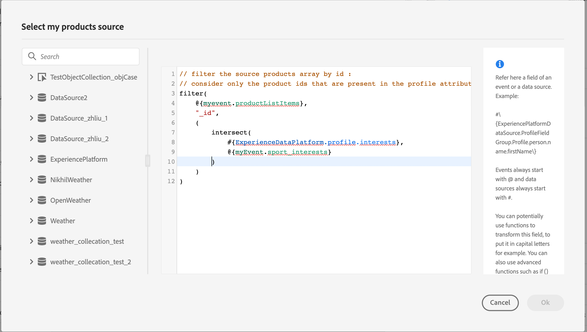

# Passaggio dinamico delle raccolte tramite azioni personalizzate{#passing-collection}

Puoi trasmettere una raccolta nei parametri delle azioni personalizzate che verranno compilati in modo dinamico in fase di esecuzione. Sono supportati due tipi di raccolte:

* raccolte semplici: array di tipi di dati semplici, ad esempio, con un listString:

  ```
  {
   "deviceTypes": [
       "android",
       "ios"
   ]
  }
  ```

* insiemi di oggetti: un array di oggetti JSON, ad esempio:

  ```
  {
  "products":[
     {
        "id":"productA",
        "name":"A",
        "price":20.1
     },
     {
        "id":"productB",
        "name":"B",
        "price":10.0
     },
     {
        "id":"productC",
        "name":"C",
        "price":5.99
     }
   ]
  }
  ```

## Limitazioni {#limitations}

* Gli array nidificati di oggetti all’interno di un array di oggetti non sono al momento supportati. Ad esempio:

  ```
  {
  "products":[
    {
       "id":"productA",
       "name":"A",
       "price":20,
       "locations": [{"name": "Paris"}, {"name": "London"}]
    },
   ]
  }
  ```

* Per testare le raccolte utilizzando la modalità di test, è necessario utilizzare la modalità di visualizzazione del codice. La modalità di visualizzazione codice non è al momento supportata per gli eventi di business. Puoi inviare una raccolta solo con un singolo elemento.

## Procedura generale {#general-procedure}

In questa sezione viene utilizzato il seguente esempio di payload JSON. Si tratta di un array di oggetti con un campo che è un insieme semplice.

```
{
  "ctxt": {
    "products": [
      {
        "id": "productA",
        "name": "A",
        "price": 20.1,
        "color":"blue",
        "locations": [
          "Paris",
          "London"
        ]
      },
      {
        "id": "productB",
        "name": "B",
        "price": 10.99
      }
    ]
  }
}
```

Si può vedere che &quot;prodotti&quot; è un array di due oggetti. Devi avere almeno un oggetto.

1. Crea l’azione personalizzata. Consulta [questa pagina](../action/about-custom-action-configuration.md).

1. Nella sezione **[!UICONTROL Action parameters]**, incolla l’esempio JSON. La struttura visualizzata è statica: quando si incolla il payload, tutti i campi sono definiti come costanti.

   

1. Se necessario, regola i tipi di campo. Per gli insiemi sono supportati i tipi di campo seguenti: listString, listInteger, listDecimal, listBoolean, listDateTime, listDateTimeOnly, listDateOnly, listObject

   >[!NOTE]
   >
   >Il tipo di campo viene dedotto automaticamente in base all’esempio di payload.

1. Se si desidera passare gli oggetti in modo dinamico, è necessario impostarli come variabili. In questo esempio impostiamo &quot;products&quot; come variabile. Tutti i campi oggetto inclusi nell&#39;oggetto vengono impostati automaticamente su variabili.

   >[!NOTE]
   >
   >Il primo oggetto dell’esempio di payload viene utilizzato per definire i campi.

1. Per ogni campo, definisci l’etichetta che verrà visualizzata nell’area di lavoro del percorso.

   

1. Crea il percorso e aggiungi l’azione personalizzata creata. Consulta [questa pagina](../building-journeys/using-custom-actions.md).

1. Nella sezione **[!UICONTROL Action parameters]**, definisci il parametro dell’array (&quot;products&quot; nel nostro esempio) utilizzando l’editor di espressioni avanzate.

   

1. Per ciascuno dei seguenti campi oggetto, digita il nome del campo corrispondente dallo schema XDM di origine. Se i nomi sono identici, non è necessario. Nel nostro esempio, dobbiamo solo definire &quot;id prodotto&quot; e &quot;colore&quot;.

   

Per il campo array, puoi anche utilizzare l’editor di espressioni avanzate per eseguire la manipolazione dei dati. Nell&#39;esempio seguente vengono utilizzate le funzioni [filter](../functions/functionfilter.md) e [intersect](../functions/functionintersect.md):



## Casi particolari{#examples}

Per tipi e array di array eterogenei, l’array è definito con il tipo listAny. È possibile mappare solo singoli elementi, ma non è possibile modificare la matrice in variabile.


Esempio di tipo eterogeneo:

```
{
    "data_mixed-types": [
        "test",
        "test2",
        null,
        0
    ]
}
```

Esempio di array:

```
{
    "data_multiple-arrays": [
        [
            "test",
            "test1",
            "test2"
        ]
    ]
}
```

**Argomenti correlati**

[Utilizzare azioni personalizzate](../building-journeys/using-custom-actions.md)
