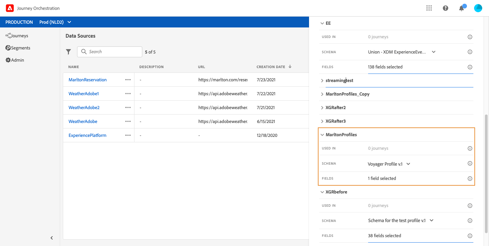
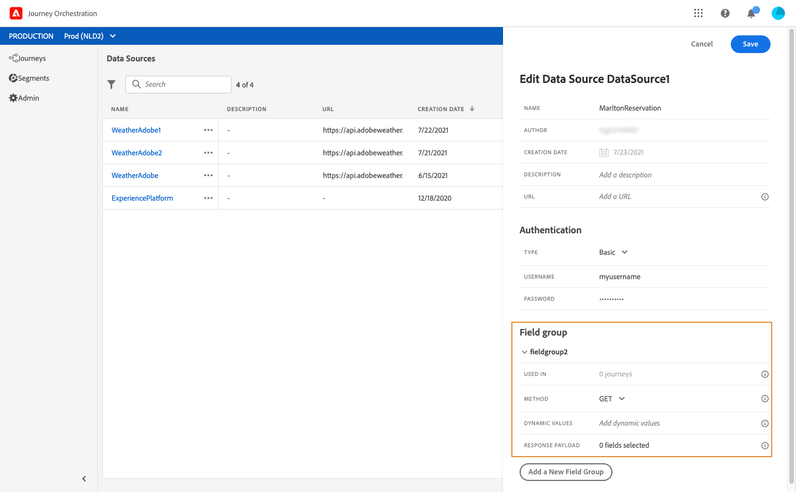

# Configurazione delle origini dati {#concept_vml_hdy_w2b}

Nel nostro caso d’uso, vogliamo utilizzare i dati di personalizzazione per i nostri messaggi. Dobbiamo anche verificare se la persona è un membro fedeltà e non è stata contattata nelle ultime 24 ore. Queste informazioni sono memorizzate nel database Profilo cliente in tempo reale. La **utente tecnico** deve configurare l’origine dati Adobe Experience Platform per recuperare tali campi.

Per ulteriori informazioni sulla configurazione dell’origine dati, consulta [questa pagina](../datasource/about-data-sources.md).

1. Nel riquadro dei menu, seleziona **[!UICONTROL Admin]**. In **[!UICONTROL Data sources]** sezione, fai clic su **[!UICONTROL Manage]**.
1. Seleziona l’origine dati integrata di Adobe Experience Platform.

   

1. Nei campi gruppo preconfigurati, verifica che siano selezionati i campi seguenti:

   * _person > name > firstName_
   * _person > name > lastName_
   * _personalEmail > indirizzo_

1. Fai clic su **[!UICONTROL Add a New Field Group]**, seleziona un **[!UICONTROL Profiles]** e aggiungi **Membro fedeltà** campo per la nostra condizione. La **Membro fedeltà** è un campo personalizzato ed è stato aggiunto in XDM: &quot;_customer > marlton > loyaltyMember&quot;

   

1. Fai clic su **[!UICONTROL Add a New Field Group]**, seleziona un **[!UICONTROL ExperienceEvent]** schema e scegli i campi necessari per la nostra condizione in base al numero di messaggi inviati in un dato periodo: _timestamp_ per la data e _directMarketing > invia > valore_ per il numero di messaggi inviati.

   

1. Fai clic su **[!UICONTROL Save]**.

Dobbiamo anche verificare se la persona ha una prenotazione nel sistema di prenotazione alberghiera. La **utente tecnico** deve configurare una seconda origine dati per recuperare questo campo.

1. Nell’elenco delle origini dati, fai clic su **[!UICONTROL Add]** per aggiungere una nuova origine dati esterna per definire la connessione al sistema di prenotazione alberghiera.

   

1. Immetti un nome per l’origine dati e l’URL del servizio esterno, ad esempio: _https://marlton.com/reservation_

   >[!CAUTION]
   >
   >Per motivi di sicurezza, è consigliabile utilizzare HTTPS.

1. Imposta l’autenticazione in base alla configurazione del servizio esterno: **[!UICONTROL No authentication]**, **[!UICONTROL Basic]**, **[!UICONTROL Custom]** o **[!UICONTROL API key]**. Nel nostro esempio, scegliamo &quot;Base&quot; per il tipo e specifica il nome utente e la password per la chiamata API.

   

1. Fai clic su **[!UICONTROL Add a New Field Group]** definire le informazioni da recuperare e i parametri API. Per il nostro esempio, esiste un solo parametro (l’id), quindi è necessario creare un gruppo di campi con le seguenti informazioni:

   * **[!UICONTROL Method]**: seleziona il metodo POST o GET. Nel nostro caso, scegliamo il metodo GET.
   * **[!UICONTROL Response Payload]**: fai clic all’interno del **[!UICONTROL Payload]** e incolla un esempio del payload. Verifica la correttezza dei tipi di campi. Ogni volta che viene chiamata l’API, il sistema recupererà tutti i campi inclusi nell’esempio di payload. Nel nostro esempio, il payload contiene solo lo stato di prenotazione:

   ```
   {
       "reservation" : true
   }
   ```

   * **[!UICONTROL Dynamic Values]**: inserisci il parametro corrispondente alla chiave utilizzata per identificare ogni cliente, nel nostro esempio &quot;id&quot;. Il valore di questo parametro sarà definito nel percorso.

   

1. Fai clic su **[!UICONTROL Save]**.

   Le origini dati sono ora configurate e pronte per essere utilizzate nel percorso.
