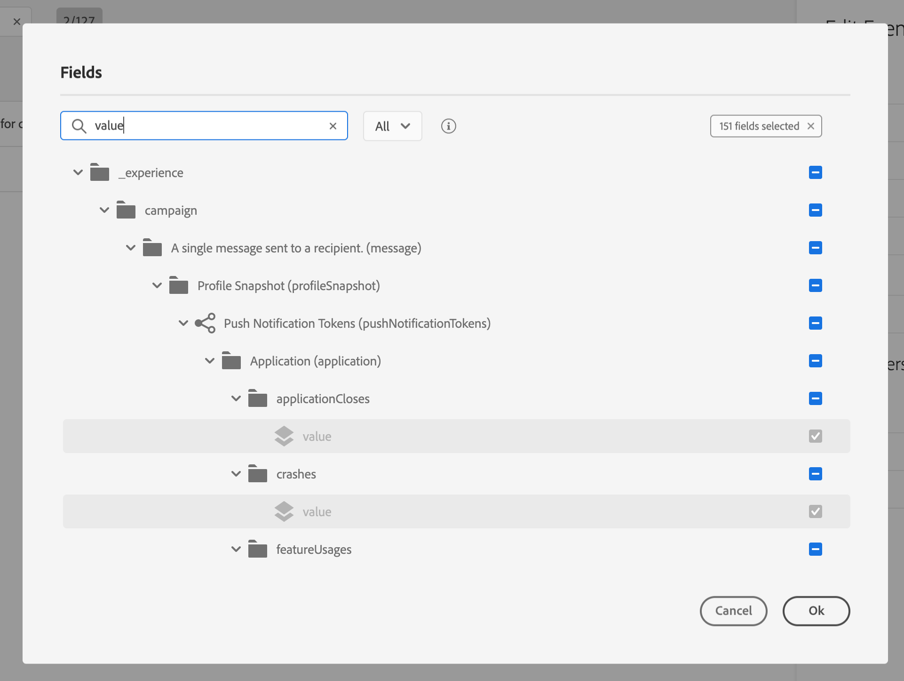

# Configurazione dell’evento{#concept_y44_hcy_w2b}

Nel nostro scenario, dobbiamo ricevere un evento ogni volta che una persona cammina vicino a un beacon posizionato accanto al centro benessere. L&#39;utente **** tecnico deve configurare l&#39;evento che il sistema ascolterà nel nostro viaggio.

Per ulteriori informazioni sulla configurazione dell&#39;evento, consultate .

1. In the top menu, click the **[!UICONTROL Events]** tab and click **[!UICONTROL Add]** to create a new event.

   

1. Il nome viene inserito senza spazi o caratteri speciali: &quot;SpaBeacon&quot;.

   

1. Quindi selezioniamo lo schema e definiamo il payload previsto per questo evento. Selezioniamo i campi necessari dal modello normalizzato XDM. Abbiamo bisogno dell&#39;ID Experience Cloud  per identificare la persona nel database Profilo cliente in tempo reale: _endUserIDs > experience > mcid > id_. Per questo evento viene generato automaticamente un ID. Questo ID è memorizzato nel **[!UICONTROL eventID]** campo (_esperienza > campagna > orchestrazione > eventID_). Il sistema che preme l&#39;evento non deve generare un ID, ma deve utilizzare quello disponibile nell&#39;anteprima del payload. Nel nostro caso d’uso, questo ID viene usato per identificare la posizione del beacon. Ogni volta che una persona cammina vicino al beacon spa, viene inviato un evento contenente questo ID evento specifico. Questo consente al sistema di sapere quale beacon ha attivato l&#39;invio dell&#39;evento.

   

   >[!NOTE]
   >
   >L&#39;elenco dei campi varia da uno schema all&#39;altro. In base alla definizione dello schema, alcuni campi possono essere obbligatori e preselezionati.

1. È necessario selezionare uno spazio dei nomi. In base alle proprietà dello schema, viene preselezionato uno spazio dei nomi. Puoi scegliere di utilizzare quest’ultimo. Per ulteriori informazioni sugli spazi dei nomi, consulta .

   

1. Una chiave viene preselezionata in base alle proprietà dello schema e allo spazio dei nomi selezionato. Può tenerla.

   

1. Fai clic su **[!UICONTROL Save]**.

1. Fate clic sull&#39; **[!UICONTROL View Payload]** icona per visualizzare l&#39;anteprima del payload previsto dal sistema e condividerlo con la persona responsabile dell&#39;invio dell&#39;evento. Questo payload dovrà essere configurato nel postback della console di amministrazione di Mobile Services.

   

   L&#39;evento è pronto per essere utilizzato nel vostro viaggio. È ora necessario configurare l&#39;applicazione mobile in modo che possa inviare il payload previsto all&#39;endpoint delle API di ingestione dello streaming. A questo proposito, consulta la sezione .