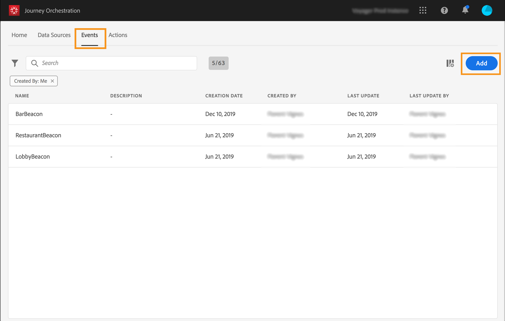
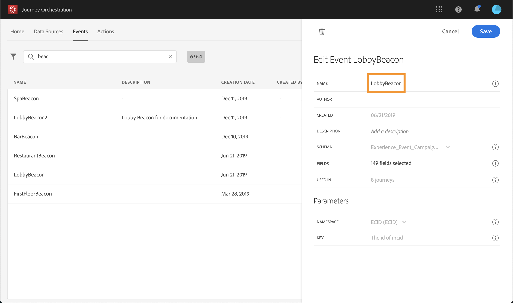
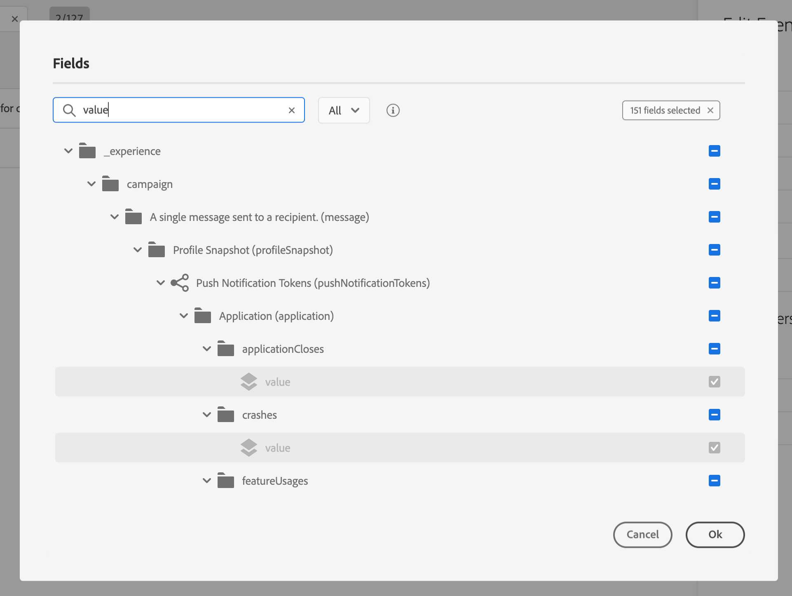
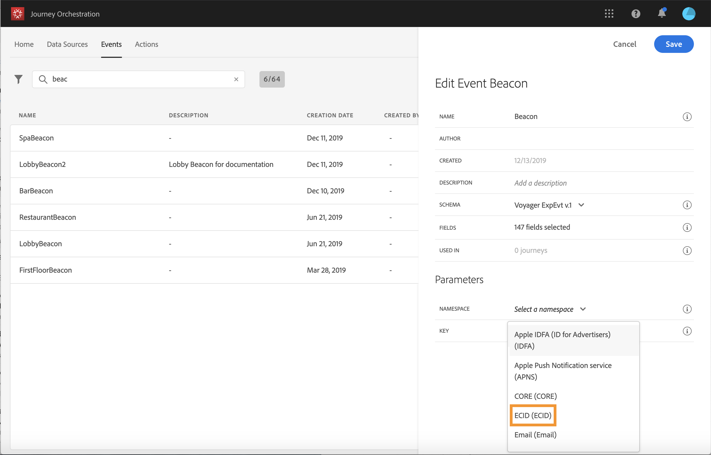
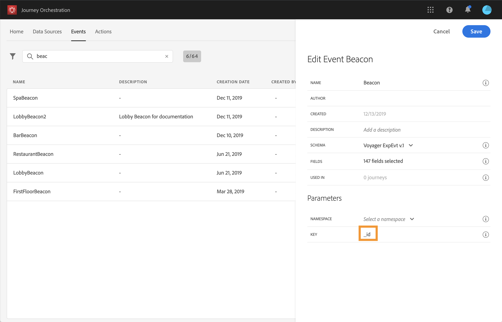
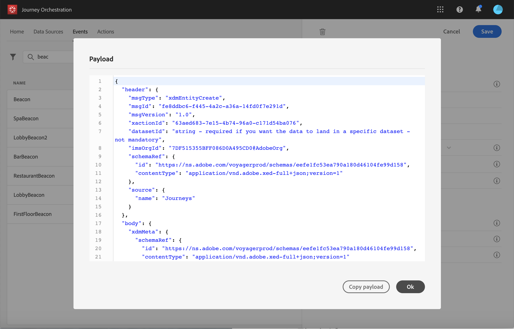

# Configurazione degli eventi {#concept_sbp_5cy_w2b}

>[!CAUTION]
>
>**Stai cercando Adobe Journey Optimizer**? Fai clic [qui](https://experienceleague.adobe.com/it/docs/journey-optimizer/using/ajo-home){target="_blank"} per la documentazione di Journey Optimizer.
>
>
>_Questa documentazione fa riferimento ai precedenti materiali su Journey Orchestration, che è stato sostituito da Journey Optimizer. In caso di domande sull’accesso a Journey Orchestration o Journey Optimizer, contatta il team del tuo account._

Nel nostro scenario, abbiamo bisogno di ricevere un evento ogni volta che una persona entra nell&#39;hotel Marlton e nel ristorante. L&#39;**utente tecnico** deve configurare i due eventi a cui il percorso deve prestare attenzione.

Per ulteriori informazioni sulla configurazione dell&#39;evento, consultare [questa pagina](../event/about-events.md).

1. Nel menu principale, fare clic sulla scheda **[!UICONTROL Events]** e su **[!UICONTROL Add]** per creare un nuovo evento.

   

1. Immettiamo il nome senza spazi o caratteri speciali: &quot;LobbyBeacon&quot;.

   

1. Quindi selezioniamo lo schema e definiamo il payload previsto per questo evento. Selezioniamo i campi necessari dal modello normalizzato XDM. Per identificare la persona nel database del profilo cliente in tempo reale, è necessario disporre dell’Experience Cloud ID: &quot;endUserIDs > _experience > mcid > id&quot;.

   È inoltre necessario il token di registrazione per inviare messaggi push: &quot;_experience > campagna > messaggio > profilo > pushNotificationTokens > token&quot;

   Per questo evento viene generato automaticamente un ID. Questo ID è memorizzato nel campo **[!UICONTROL eventID]** (&quot;_experience > campagna > orchestrazione > eventID&quot;). Il sistema che trasmette l’evento non deve generare un ID, deve utilizzare quello disponibile nell’anteprima del payload. Nel nostro caso di utilizzo, questo ID viene utilizzato per identificare la posizione del beacon. Ogni volta che una persona cammina vicino al beacon della lobby, viene inviato un evento contenente questo ID evento specifico. Lo stesso principio si applica agli eventi beacon del ristorante. Questo consente al sistema di sapere quale beacon ha attivato l’invio dell’evento.

   

   >[!NOTE]
   >
   >L’elenco dei campi varia da uno schema all’altro. In base alla definizione dello schema, alcuni campi possono essere obbligatori e preselezionati.

1. È necessario selezionare uno spazio dei nomi. In base alle proprietà dello schema, viene preselezionato uno spazio dei nomi. Puoi scegliere di utilizzare quest’ultimo. Per ulteriori informazioni sugli spazi dei nomi, vedere [questa pagina](../event/selecting-the-namespace.md).

   

1. Una chiave viene preselezionata in base alle proprietà dello schema e allo spazio dei nomi selezionato. Puoi tenerla.

   

1. Fai clic su **[!UICONTROL Save]**.

1. Fai clic sull&#39;icona **[!UICONTROL View Payload]** per visualizzare in anteprima il payload previsto dal sistema e condividerlo con la persona responsabile dell&#39;invio dell&#39;evento.  Questo payload dovrà essere configurato nel postback della console di amministrazione di Mobile Services.

   

Allo stesso modo, crea l’evento &quot;RestaurantBeacon&quot;. Ora è possibile utilizzare i due eventi beacon creati nel nostro percorso. Ora devi configurare l’app mobile in modo che possa inviare il payload previsto all’endpoint delle API Streaming Ingestion. Consulta [questa pagina](../event/additional-steps-to-send-events-to-journey-orchestration.md).
