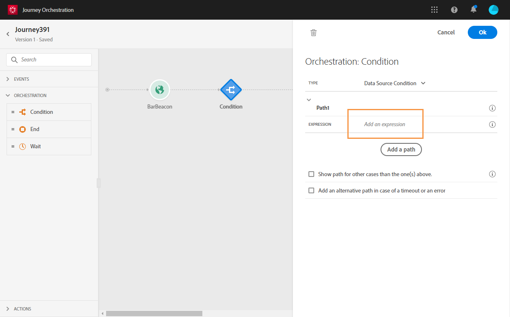
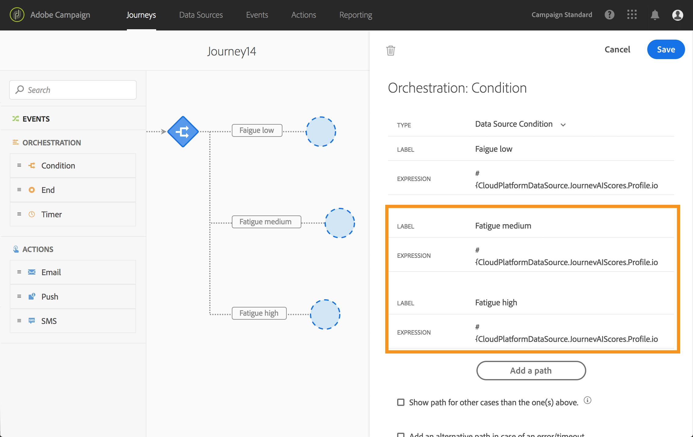

# Utilizzo di IA per l’analisi del Percorso {#concept_dsh_1ry_wfb}

Questo caso d’uso ti mostrerà come sfruttare i punteggi di fatica per evitare di sollecitare eccessivamente i clienti nei tuoi percorsi.

>[!NOTE]
>
>La funzionalità Punteggio di fatica predittivo è disponibile solo per i clienti che utilizzano il [Connettore dati Adobe Experience Platform](https://experienceleague.adobe.com/docs/campaign-standard/using/integrating-with-adobe-cloud/adobe-experience-platform/data-connector/aep-about-data-connector.html).

## Configurazione dell’evento {#section_ptb_ws1_ffb}

Segui i passaggi descritti in [questa pagina](../event/about-events.md).

## Configurazione dell’origine dati {#section_o3n_4yy_wfb}

Per selezionare i campi del punteggio di affaticamento nell’origine dati incorporata, effettua le seguenti operazioni:

1. Nel riquadro dei menu, selezionare **[!UICONTROL Admin]**. Nella sezione **[!UICONTROL Data sources]**, fare clic su **[!UICONTROL Manage]**.
1. Seleziona l’origine dati integrata di Adobe Experience Platform.

   

1. Verifica che i campi richiesti per il caso d’uso siano selezionati.
1. Fai clic su **[!UICONTROL Add a New Field Group]**, seleziona il modello **[!UICONTROL Profiles]** e aggiungi i campi **[!UICONTROL fatigueLevel]** e **[!UICONTROL fatigueScore]** (in _journeyAI > emailScore > fatigue_).

   

1. Fai clic su **[!UICONTROL Save]**.

## Creazione di un percorso {#section_uzm_pyy_wfb}

Per creare, convalidare e pubblicare il percorso, seguire i passaggi descritti in [questa pagina](../building-journeys/journey.md).

Nel nostro caso d&#39;uso, stiamo sfruttando il campo **[!UICONTROL fatigueLevel]**. È inoltre possibile utilizzare il campo **[!UICONTROL fatigueScore]**.

Per sfruttare il livello di affaticamento nel percorso, effettua le seguenti operazioni:

1. Aggiungi un evento e una condizione nel percorso.

   

1. Scegliere il tipo **[!UICONTROL Data Source Condition]** e fare clic nel campo **[!UICONTROL Expression]**.

   

1. Utilizzando l’editor di espressioni semplici, cerca il campo **[!UICONTROL fatigueLevel]** (_ExperiencePlatformDataSource > JourneyAIScores > Profile > journeyAI > emailScore > fatigue_), rilascialo a destra e crea la seguente condizione: &quot;fatigueLevel è uguale a &quot;Low&quot;. Fai clic su **[!UICONTROL Ok]**.

   

   L’espressione avanzata è:

   ```
   #{ExperiencePlatformDataSource.JourneyAIScores.Profile.journeyAI.emailScore.fatigue.fatigueLevel} == "low"
   ```

1. Nella condizione, creare altri due percorsi per livelli di affaticamento medi e alti.

   

1. Ora puoi aggiungere diverse azioni per ogni livello di affaticamento.

   
