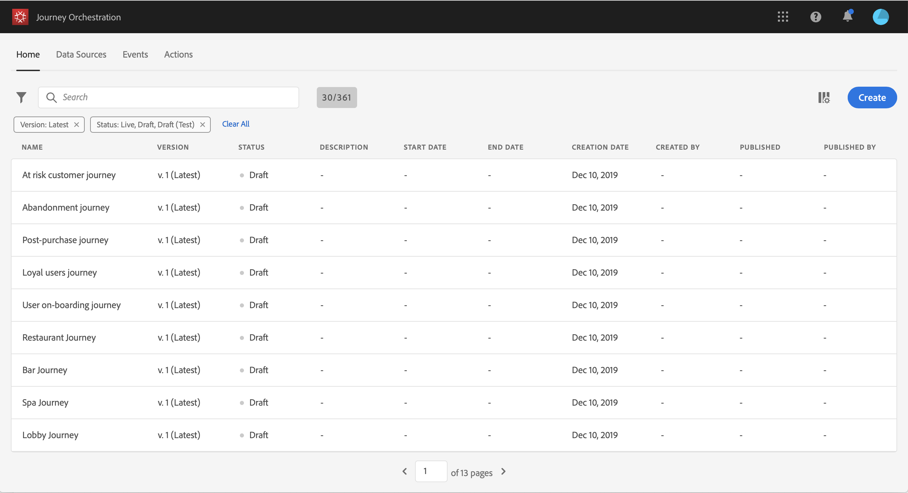

# Creazione di un percorso{#concept_eyw_mcy_w2b}

Ora l’**utente aziendale** può costruire il percorso. Il nostro viaggio includerà solo un percorso con le seguenti attività:

* &quot;SpaBeacon&quot; **[!UICONTROL Event]**: quando una persona cammina vicino al beacon termale, il sistema riceverà un evento e il viaggio inizierà per quella persona.
* un&#39;attività **[!UICONTROL Condition]** per verificare che la persona sia una donna
* un&#39;attività **[!UICONTROL Email]** (utilizzando  Adobe Campaign Standard)
* un&#39;attività **[!UICONTROL End]**

>[!NOTE]
>
>Le attività **[!UICONTROL Push]** e **[!UICONTROL Email]** sono disponibili nel riquadro solo se si dispone di Adobe Campaign Standard.

Per ulteriori informazioni su come creare un percorso, fare riferimento a [questa pagina](../building-journeys/journey.md).

1. Nel menu principale, fai clic sulla scheda **[!UICONTROL Home]** e **[!UICONTROL Create]** per creare un nuovo percorso.

   

1. Modifica le proprietà del percorso nel riquadro di configurazione visualizzato sul lato destro. Lo chiamiamo &quot;Spa&quot; e lo mettiamo a durare un mese, dal 1 al 31 dicembre.

   

1. Iniziate a progettare il viaggio trascinando e rilasciando l&#39;evento &quot;SpaBeacon&quot; dalla palette al quadro. Puoi anche fare doppio clic sull’evento nel riquadro per aggiungerlo all’area di lavoro.

   

1. Aggiungiamo ora una condizione per verificare che la persona sia una donna. Trascina un’attività condizione nel percorso.

   

1. Scegli il tipo di **[!UICONTROL Data Source Condition]** e fai clic nel campo **[!UICONTROL Expression]**. Puoi anche definire un’etichetta di condizione che verrà visualizzata sulla freccia nell’area di lavoro.

   

1. Utilizzando l&#39;editor di espressioni semplici, cercare il campo genere (_persona > genere_) e rilasciarlo a destra per creare la seguente condizione: &quot;genere è uguale a &quot;femmina&quot;.

   

1. Rilascia un&#39;attività **[!UICONTROL Email]** e seleziona il modello di messaggi transazionali &quot;Spa sconto&quot;. Questo modello è stato progettato utilizzando  Adobe Campaign. Fare riferimento a questa [pagina](https://docs.adobe.com/content/help/it-IT/campaign-standard/using/communication-channels/transactional-messaging/about-transactional-messaging.translate.html).

   

1. Fare clic all&#39;interno del campo **[!UICONTROL Email]** e selezionare l&#39;indirizzo e-mail dall&#39;origine dati.

   

1. Allo stesso modo, definisci i campi di personalizzazione del nome e del cognome dall&#39;origine dati.

   

1. Rilasciate un&#39;attività **[!UICONTROL End]**.

   

1. Fai clic sull&#39;interruttore **[!UICONTROL Test]** e verifica il percorso utilizzando i profili di prova. In caso di errori, disattiva la modalità di test, modifica il percorso e verificalo di nuovo. Per ulteriori informazioni sulla modalità di prova, fare riferimento a [questa pagina](../building-journeys/testing-the-journey.md).

   

1. Quando il test va a buon fine, puoi pubblicare il percorso dal menu a discesa in alto a destra.

   

La prossima volta che una donna cammina vicino al beacon termale, riceverà immediatamente un &quot;Spa sconto&quot; e-mail personalizzata.
