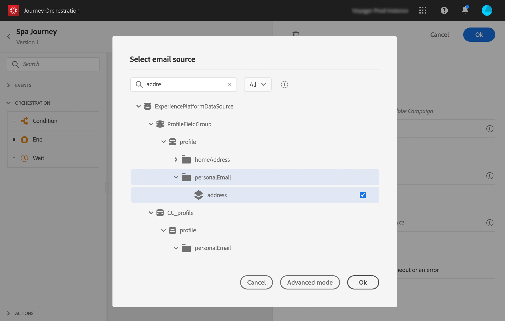

# Creazione di un percorso{#concept_eyw_mcy_w2b}

L&#39;utente **** aziendale ora può costruire il percorso. Il nostro viaggio includerà solo un percorso con le seguenti attività:

* &quot;SpaBeacon&quot; **[!UICONTROL Event]**: quando una persona cammina vicino al beacon termale, il sistema riceverà un evento e il viaggio inizierà per quella persona.
* un&#39; **[!UICONTROL Condition]** attività per verificare che la persona sia una donna
* un&#39; **[!UICONTROL Email]** attività (utilizzando  Adobe Campaign Standard)
* an **[!UICONTROL End]** activity

>[!NOTE]
>
>Le attività **[!UICONTROL Push]** e **[!UICONTROL Email]** sono disponibili nella palette solo se si dispone  Adobe Campaign Standard.

Per ulteriori informazioni su come costruire un viaggio, consulta .

1. Nel menu superiore, fai clic sulla **[!UICONTROL Home]** scheda e **[!UICONTROL Create]** crea un nuovo percorso.

   

1. Modifica le proprietà del viaggio nel riquadro di configurazione visualizzato sul lato destro. Lo chiamiamo &quot;Spa&quot; e lo mettiamo a durare un mese, dal 1 al 31 dicembre.

   

1. Iniziate a progettare il viaggio trascinando e rilasciando l&#39;evento &quot;SpaBeacon&quot; dalla palette al quadro. È inoltre possibile fare doppio clic sull&#39;evento nella palette per aggiungerlo al quadro.

   

1. Aggiungiamo ora una condizione per verificare che la persona sia una donna. Trascina e rilascia un’attività di condizione nel percorso.

   

1. Scegliete il **[!UICONTROL Data Source Condition]** tipo e fate clic nel **[!UICONTROL Expression]** campo. È inoltre possibile definire un&#39;etichetta di condizione che verrà visualizzata sulla freccia, nel quadro.

   

1. Utilizzando l’editor di espressioni semplici, cercate il campo genere (_persona > genere_) e rilasciatelo a destra per creare la seguente condizione: &quot;genere è uguale a &quot;femmina&quot;.

   

1. Rilascia un&#39; **[!UICONTROL Email]** attività e seleziona il modello di messaggi transazionali &quot;Spa sconto&quot;. Questo modello è stato progettato utilizzando  Adobe Campaign. Fare riferimento a questa [pagina](https://docs.adobe.com/content/help/it-IT/campaign-standard/using/communication-channels/transactional-messaging/about-transactional-messaging.translate.html).

   

1. Fare clic all&#39;interno del **[!UICONTROL Email]** campo e selezionare l&#39;indirizzo e-mail dall&#39;origine dati.

   

1. Allo stesso modo, definisci i campi di personalizzazione del nome e del cognome dall&#39;origine dati.

   

1. Rilasciate un&#39; **[!UICONTROL End]** attività.

   

1. Fai clic sull’ **[!UICONTROL Test]** interruttore e verifica il percorso utilizzando i profili di prova. In caso di errore, disattivate la modalità di prova, modificate il percorso e verificatene di nuovo il funzionamento. Per ulteriori informazioni sulla modalità di prova, vedere .

   

1. Quando il test è conclusivo, potete pubblicare il viaggio dal menu a discesa in alto a destra.

   

La prossima volta che una donna cammina vicino al beacon termale, riceverà immediatamente un &quot;Spa sconto&quot; e-mail personalizzata.
